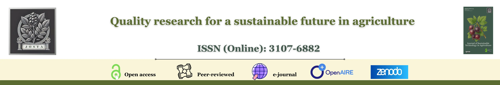
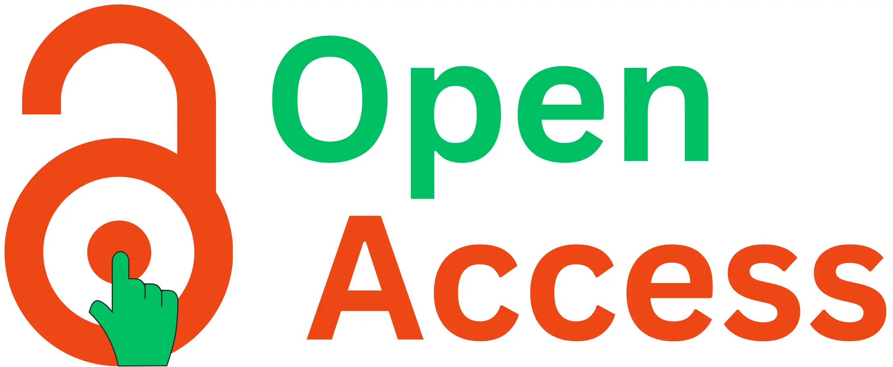
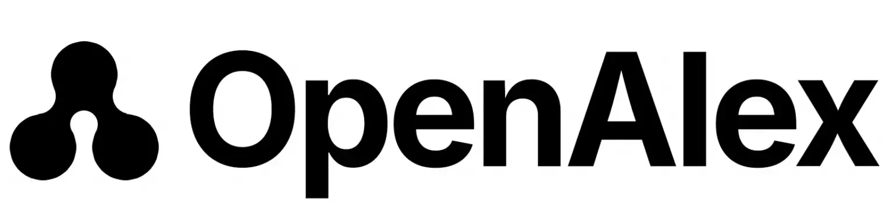

<!-- Horizontal Button Group -->

```{=html}
<!-- =====================================================
     JOSTA HOME HEADER + TRUST + ACTIONS
     (ONLY trust badges updated – rest unchanged)
===================================================== -->

<link rel="stylesheet"
      href="https://cdn.jsdelivr.net/npm/bootstrap-icons/font/bootstrap-icons.css" />

<style>
/* =====================================================
   PALETTE (UNCHANGED)
===================================================== */
:root{
  --j-navy:#1f345c;
  --j-brown:#8b6a3a;
  --j-ink:#325d88;
  --j-muted:#555b63;
  --j-rule:#e7e2d4;
  --j-beige:#fdf6ec;
}

/* =====================================================
   HERO
===================================================== */
.home-hero{
  text-align:center;
  padding:1.5rem 0 .75rem;
  border-bottom:2px solid var(--j-rule);
  background:linear-gradient(180deg,var(--j-beige) 0%, #fff 100%);
}

.home-title{
  font-weight:700;
  font-size:clamp(1.5rem,3.5vw,2rem);
  color:var(--j-ink);
  margin:0;
  letter-spacing:.5px;
}

/* =====================================================
   COVER IMAGE
===================================================== */
.hero-banner{
  text-align:center;
  margin:.9rem auto 1.2rem;
}

.hero-banner img{
  width:100%;
  max-height:240px;
  object-fit:cover;
  border-radius:10px;
  box-shadow:0 6px 18px rgba(0,0,0,.12);
}

/* =====================================================
   TRUST BADGES (ICON + TEXT, ANIMATED)
===================================================== */
.josta-trust{
  background:#f7f5f1;
  border-top:1px solid var(--j-rule);
  border-bottom:1px solid var(--j-rule);
  padding:1rem 0;
  overflow:hidden;
}

.trust-track{
  display:inline-flex;
  gap:1.4rem;
  animation:trust-scroll 26s linear infinite;
  will-change:transform;
}

.josta-trust:hover .trust-track{
  animation-play-state:paused;
}

.trust-badge{
  display:inline-flex;
  align-items:center;
  gap:.45rem;
  background:#ffffff;
  color:var(--j-navy);
  font-size:.92rem;
  font-weight:500;
  padding:.45rem 1.05rem;
  border-radius:999px;
  box-shadow:0 2px 6px rgba(0,0,0,.08);
  white-space:nowrap;
}

.trust-badge img{
  height:18px;
  width:auto;
  display:block;
}

.trust-badge i{
  font-size:1rem;
  color:var(--j-navy);
}

@keyframes trust-scroll{
  from{ transform:translateX(0); }
  to{ transform:translateX(-50%); }
}

@media (prefers-reduced-motion: reduce){
  .trust-track{ animation:none; }
}

/* =====================================================
   ICON STRIP
===================================================== */
.icon-strip{
  display:flex;
  flex-wrap:wrap;
  justify-content:center;
  gap:.9rem 1.1rem;
  background:linear-gradient(180deg,#fff 0%, var(--j-beige) 90%);
  border:1px solid var(--j-rule);
  border-radius:10px;
  padding:.6rem .9rem;
  margin:1.2rem auto 1rem;
  max-width:1100px;
}

.icon-strip a{
  width:38px;
  height:38px;
  border-radius:50%;
  background:#fff;
  border:1px solid var(--j-rule);
  color:var(--j-navy);
  display:flex;
  align-items:center;
  justify-content:center;
  font-size:1.25rem;
  text-decoration:none;
  transition:.2s ease;
}

.icon-strip a:hover{
  color:var(--j-brown);
  border-color:var(--j-brown);
  transform:translateY(-2px);
  box-shadow:0 2px 6px rgba(0,0,0,.08);
}

/* =====================================================
   PRIMARY ACTION BUTTONS
===================================================== */
.home-buttons{
  display:flex;
  flex-wrap:wrap;
  justify-content:center;
  gap:.75rem 1rem;
  background:#fff;
  border-top:1px solid var(--j-rule);
  border-bottom:1px solid var(--j-rule);
  padding:1rem;
  margin:0 auto 1.2rem;
  max-width:1100px;
}

.home-buttons .btn{
  min-width:130px;
  font-weight:500;
  border-radius:8px;
  transition:.2s ease;
}

.home-buttons .btn:hover{
  transform:translateY(-1px);
  box-shadow:0 2px 6px rgba(0,0,0,.08);
}

/* =====================================================
   RESPONSIVE
===================================================== */
@media (max-width:700px){
  .home-buttons{
    flex-direction:column;
    align-items:center;
  }
  .home-buttons .btn{
    width:88%;
  }
}
</style>

<!-- ===============================
     HERO
================================ -->
<section class="home-hero" aria-label="josta hero">
  <h1 class="home-title">Journal of Sustainable Technology in Agriculture</h1>
</section>

<!-- ===============================
     COVER IMAGE
================================ -->
<div class="hero-banner">
  
</div>

<!-- ===============================
     TRUST & INDEXING (WITH ICONS)
================================ -->
<section class="josta-trust" aria-label="journal indexing and trust badges">
  <div class="trust-track">

    <div class="trust-badge">
      
      <span>Open Access</span>
    </div>

    <div class="trust-badge">
      <i class="bi bi-patch-check-fill"></i>
      <span>Peer-Reviewed</span>
    </div>

    <div class="trust-badge">
      
      <span>Crossref DOI</span>
    </div>

    <div class="trust-badge">
      
      <span>Zenodo Archived</span>
    </div>

    <div class="trust-badge">
      
      <span>OpenAIRE Indexed</span>
    </div>

    <div class="trust-badge">
      
      <span>Google Scholar</span>
    </div>

    <div class="trust-badge">
      
      <span>Internet Archive</span>
    </div>

    <div class="trust-badge">
      <i class="bi bi-file-earmark-text-fill"></i>
      <span>CODEN: JSTACI</span>
    </div>
    
    <div class="trust-badge">
      
      <span>ROAD Indexed</span>
    </div>
    
    <div class="trust-badge">
      
      <span>OpenAlex Indexed</span>
    </div>

    <!-- duplicate for smooth loop -->
  <div class="trust-badge">
      
      <span>Open Access</span>
    </div>
    <div class="trust-badge">
      <i class="bi bi-patch-check-fill"></i>
      <span>Peer-Reviewed</span>
    </div>
    <div class="trust-badge">
      
      <span>Crossref DOI</span>
    </div>
    <div class="trust-badge">
      
      <span>Zenodo Archived</span>
    </div>
    <div class="trust-badge">
      
      <span>OpenAIRE Indexed</span>
    </div>
    <div class="trust-badge">
      
      <span>Google Scholar</span>
    </div>
    <div class="trust-badge">
      
      <span>Internet Archive</span>
    </div>
    <div class="trust-badge">
      <i class="bi bi-file-earmark-text-fill"></i>
      <span>CODEN: JSTACI</span>
    </div>
    <div class="trust-badge">
      
      <span>ROAD Indexed</span>
    </div>
    <div class="trust-badge">
      
      <span>OpenAlex Indexed</span>
    </div>
  </div>
</section>

<!-- ===============================
     QUICK LINKS
================================ -->
<nav class="icon-strip" aria-label="section shortcuts">
  <a href="#about" title="About"><i class="bi bi-info-circle-fill"></i></a>
  <a href="#journal-info" title="Journal info"><i class="bi bi-journal-text"></i></a>
  <a href="#journalmetrics" title="Metrics"><i class="bi bi-bar-chart-line-fill"></i></a>
  <a href="#peerpolicy" title="Peer policy"><i class="bi bi-people-fill"></i></a>
  <a href="#apc" title="APC"><i class="bi bi-cash-coin"></i></a>
  <a href="#copyright-info" title="Copyright"><i class="bi bi-c-circle-fill"></i></a>
  <a href="contact.qmd" title="Contact"><i class="bi bi-envelope-fill"></i></a>
</nav>

<!-- ===============================
     PRIMARY ACTIONS
================================ -->
<div class="home-buttons">
  <a href="submit.qmd" class="btn btn-outline-success"><i class="bi bi-upload"></i> Submit</a>
  <a href="published.qmd" class="btn btn-outline-info"><i class="bi bi-book"></i> Read</a>
  <a href="editorial.qmd" class="btn btn-outline-warning"><i class="bi bi-people"></i> Editorial</a>
  <a href="jostasubmission.qmd" class="btn btn-outline-primary"><i class="bi bi-person-lock"></i> Author login</a>
  <a href="https://zenodo.org/communities/josta/records" class="btn btn-outline-secondary">
    <i class="bi bi-cloud-arrow-down"></i> Zenodo
  </a>
</div>

<!-- =====================================================
     END – JOSTA HOME HEADER
===================================================== -->
```

```{=html}
<div class="josta-articles-header">
  <div>
    <h2 class="josta-articles-title">Recent Articles</h2>
    <p class="josta-articles-sub">Latest peer-reviewed research &mdash; click any title to read</p>
  </div>
  <div class="josta-articles-badges">
    <span class="jah-badge badge-oa">&#128275; Open Access</span>
    <span class="jah-badge badge-doi">DOI Registered</span>
    <span class="jah-badge badge-cc">CC BY-NC-ND 4.0</span>
  </div>
</div>

<style>
/* ---- section header ---- */
.josta-articles-header {
  display: flex;
  flex-wrap: wrap;
  align-items: flex-end;
  justify-content: space-between;
  gap: 1rem;
  padding: 1.2rem 0 .8rem;
  border-bottom: 2px solid #1a5fa8;
  margin-bottom: 1.1rem;
}
.josta-articles-title {
  font-family: Georgia, "Times New Roman", serif;
  font-size: 1.4rem;
  font-weight: 700;
  color: #1a5fa8;
  margin: 0 0 .2rem;
}
.josta-articles-sub { margin:0; font-size:.88rem; color:#6b7280; font-style:italic; }
.josta-articles-badges { display:flex; flex-wrap:wrap; gap:.35rem; align-items:center; }
.jah-badge { padding:3px 10px; border-radius:999px; font-size:.76rem; font-weight:600; letter-spacing:.03em; white-space:nowrap; }
.badge-oa  { background:#dff1e9; color:#135c38; border:1px solid #b2dece; }
.badge-doi { background:#dbeafe; color:#1e40af; border:1px solid #bfdbfe; }
.badge-cc  { background:#f3f0ff; color:#5b21b6; border:1px solid #ddd6fe; }
@media (max-width:600px){ .josta-articles-header { flex-direction:column; align-items:flex-start; } }

/* ---- palette ---- */
:root {
  --j-navy:#1f345c;
  --j-teal:#0b5a56;
  --j-brown:#8b6a3a;
  --j-muted:#555b63;
  --j-green:#007a4e;
  --j-rule:#e7e2d4;
  --j-beige:#fdf6ec;
  --j-blue:#006699;
  --j-grey:#7a7a7a;
}

/* ---- list ---- */
.pro-ul { margin:.25rem 0 0; padding:0; list-style:none; }
.pro-li { padding:16px 0; border-bottom:1px solid var(--j-rule); }

/* ---- TITLE: blue, clickable ---- */
.pro-title { margin:.15rem 0 .3rem; }
.pro-link,
.pro-link:link,
.pro-link:visited,
.pro-link:active {
  font-family:Georgia,"Times New Roman",serif;
  font-weight:700;
  font-size:1.16rem;
  line-height:1.3;
  color:#1a5fa8!important;
  text-decoration:none;
}
.pro-link:hover {
  color:#0e3f73!important;
  text-decoration:underline;
  text-underline-offset:3px;
}

/* ---- DOI ---- */
.pro-doi { margin:.15rem 0 .3rem; font-size:.9rem; color:var(--j-muted); }
.pro-doi a { color:var(--j-blue); text-decoration:none; font-weight:600; }
.pro-doi a:hover { text-decoration:underline; }

/* ---- categories ---- */
.pro-cats { list-style:none; padding:0; margin:.25rem 0 .45rem; display:flex; flex-wrap:wrap; gap:.4rem; }
.pro-chip { padding:4px 10px; border-radius:999px; border:none; color:#fff; font-weight:600; font-size:.82rem; font-family:Georgia,"Times New Roman",serif; }
.pro-chip:first-child { background:var(--j-green); }
.pro-chip:not(:first-child) { background:var(--j-grey); }

/* ---- authors ---- */
.pro-authors { color:var(--j-muted); font-size:.95rem; margin:.1rem 0 .35rem; }

/* ---- status ---- */
.pro-status { display:inline-block; padding:3px 8px; border:1px solid var(--j-green); border-radius:999px; background:transparent; color:var(--j-green); font-weight:600; font-size:.82rem; margin:.15rem 0 .35rem 0; }

/* ---- date ---- */
.pro-date { display:block; color:#6b7280; font-size:.92rem; margin-top:.05rem; }

/* ---- view all ---- */
.pro-more-wrap { text-align:center; margin-top:.9rem; }
.pro-more { display:inline-block; padding:8px 16px; border:1px solid #d8c9ab; border-radius:999px; background:linear-gradient(180deg,#fff 0%,var(--j-beige) 100%); color:var(--j-navy); font-weight:700; text-decoration:none; }
.pro-more:hover { color:var(--j-teal); border-color:#c7b896; }

/* ---- dark mode ---- */
@media (prefers-color-scheme:dark){
  .pro-li { border-bottom-color:#3b4352; }
  .pro-link { color:#7eb8f7!important; }
  .pro-link:hover { color:#aed4ff!important; }
  .pro-chip:first-child { background:#009a64; color:#fff; }
  .pro-chip:not(:first-child) { background:#5b5b5b; color:#fff; }
  .pro-status { border-color:#57d097; color:#57d097; }
  .pro-more { border-color:#4b5565; background:linear-gradient(180deg,#222 0%,#1b1f28 100%); color:#cfe4ff; }
  .pro-more:hover { color:#7fe3c4; }
}
</style>
```

::: {#articles}
:::  

<hr style="border: 2px solid #e7e2d4; margin-top: 2em; margin-bottom: 1em; border-radius: 2px;" />  

## About the journal {#about .unnumbered}

The Journal of Sustainable Technology in Agriculture (JOSTA) is a peer-reviewed, open-access e-journal dedicated to publishing high-quality research that fosters innovation and sustainability in agriculture. Founded by a collaborative group of scientists and professionals, JOSTA serves as a reliable and inclusive platform for sharing advancements that enhance agricultural practices through responsible technology use, practical innovation, and applied research.

We are committed to academic integrity and scientific excellence. All manuscripts submitted to JOSTA undergo a rigorous peer-review process to ensure validity, relevance, and quality. Our [open-access model](#open-access) ensures that published research is freely available to researchers, practitioners, educators, and policymakers around the world-promoting broad dissemination and knowledge sharing.  

We are also a registered member of [Crossref](https://www.crossref.org/) 
, the global scholarly infrastructure that connects research publications through persistent Digital Object Identifiers (DOIs). Every article published in JOSTA is assigned a unique Crossref DOI, ensuring permanent identification, reliable citation linking, and global discoverability across academic databases such as Google Scholar and OpenAIRE.

Article metadata and publication records are preserved in [Zenodo](https://zenodo.org), with all full-text PDFs permanently stored in the [Internet Archive](https://archive.org/details/@josta_open-access_journal). Website pages are version-controlled through `GitHub` to ensure transparent version history and long-term preservation. JOSTA maintains a dedicated [Zenodo community](https://zenodo.org/communities/josta/records?q=&l=list&p=1&s=10&sort=newest), providing secure, long-term archiving of published articles in CERN’s data centre for as long as CERN exists. 

The journal is indexed in the [ROAD Directory of Open Access Scholarly Resources](https://road.issn.org/) maintained by the ISSN International Centre and is also indexed in [OpenAlex](https://openalex.org/sources/s5407053301), which enhances global discoverability and integration with scholarly knowledge graphs used by research analytics platforms.

Through [OpenAIRE indexing](https://www.openaire.eu/), JOSTA’s publications are integrated into global research infrastructures, ensuring broad visibility, discoverability, and compliance with open-science mandates. For further information, see the [Archiving & Digital Preservation page](#archive.qmd).  

The journal encourages interdisciplinary contributions from agricultural sciences, engineering, social sciences, and environmental studies that align with its mission of promoting sustainable agricultural development.

JOSTA is managed by [PAPAYA](https://www.statoberry.com/papaya.html), Academic Press of [Statoberry LLP](https://www.statoberry.com/) and supported by domain experts in agriculture and allied sciences, ensuring both technical accuracy and contextual relevance in all published content. Technical support for JOSTA is provided by [Department of Agricultural Statistics](https://coavellayani.kau.in/institution/department-agricultural-statistics-0), College of Agriculture, Vellayani, Kerala Agricultural University, Kerala, India.   

 

```{=html}
<section class="openaire-line">
  <div class="container oa-line-wrap">
    <span class="oa-text">
      Articles published in <strong>JOSTA</strong> will be having <strong>crossref DOI</strong> and are archived in <strong>Zenodo</strong>, 
      indexed in <strong>OpenAIRE</strong>, <strong>ROAD</strong> (ISSN International Centre), 
      and discoverable through <strong>OpenAlex</strong>.
    </span>
  
    
    
    
    

  </div>
</section>

<style>
  .openaire-line {
    background: #fdf6ec; /* Sandstone beige */
    border-top: 1px solid #e2d8c8;
    border-bottom: 1px solid #e2d8c8;
    font-family: Georgia, "Times New Roman", serif;
    padding: 12px 0;
  }

  .oa-line-wrap {
    display: flex;
    align-items: center;
    justify-content: center;
    flex-wrap: wrap;
    gap: 10px 12px;
    text-align: center;
    font-size: 1rem;
    color: #325d88; /* Sandstone navy */
    font-weight: 500;
  }

  .oa-logo {
    height: 24px;
    width: auto;
    display: inline-block;
    vertical-align: middle;
    filter: drop-shadow(0 0.5px 1px rgba(0,0,0,0.08));
  }

  .oa-text strong {
    color: #0b5a56; /* Sandstone teal accent */
  }

  @media (max-width: 600px) {
    .oa-line-wrap {
      flex-direction: column;
      gap: 6px;
      font-size: 0.95rem;
    }

    .oa-logo {
      height: 22px;
    }

    .oa-text {
      max-width: 90%;
      line-height: 1.4;
    }
  }
</style>
```

```{=html}
<section class="josta-meta" id="journal-info" aria-labelledby="journal-info-title">
  <div class="container josta-wrap">
    <h2 class="josta-title" id="journal-info-title">Journal information</h2>

    <ul class="josta-grid" role="list">

      <li class="josta-item sandstone1">
        <span class="josta-k">
          <svg viewBox="0 0 24 24" class="josta-ic"><path d="M7 2v2M17 2v2M3 9h18M5 6h14a2 2 0 0 1 2 2v12a2 2 0 0 1-2 2H5a2 2 0 0 1-2-2V8a2 2 0 0 1 2-2z"/></svg>
          Starting year
        </span>
        <span class="josta-v">2025</span>
      </li>

      <li class="josta-item sandstone2">
        <span class="josta-k">
          <svg viewBox="0 0 24 24" class="josta-ic"><path d="M3 6h18M3 12h12M3 18h6"/></svg>
          Frequency
        </span>
        <span class="josta-v">Quarterly-Online</span>
      </li>

      <li class="josta-item sandstone3">
        <span class="josta-k">
          <svg viewBox="0 0 24 24" class="josta-ic"><path d="M4 5h16v10H4zM8 21h8"/></svg>
          Format
        </span>
        <span class="josta-v">Online</span>
      </li>

      <li class="josta-item sandstone4">
        <span class="josta-k">
          <svg viewBox="0 0 24 24" class="josta-ic"><path d="M20 4c-7 0-12 5-12 12 0 2 0 4-2 4 6 0 16-6 16-16h-2z"/></svg>
          Subject
        </span>
        <span class="josta-v">Agriculture</span>
      </li>

      <li class="josta-item sandstone5">
        <span class="josta-k">
          <svg viewBox="0 0 24 24" class="josta-ic"><path d="M12 3a9 9 0 1 0 0 18a9 9 0 0 0 0-18zm0 0c3 3 3 15 0 18m0-18C9 6 9 18 12 21M3 12h18"/></svg>
          Language
        </span>
        <span class="josta-v">English</span>
      </li>

      <li class="josta-item sandstone6">
        <span class="josta-k">
          <svg viewBox="0 0 24 24" class="josta-ic"><path d="M4 5v14M7 5v14M11 5v14M13 5v14M17 5v14M20 5v14"/></svg>
          ISSN
        </span>
        <span class="josta-v">3107-6882 (Online)</span>
      </li>

      <!-- CODEN -->
      <li class="josta-item sandstone7">
        <span class="josta-k">
          <svg viewBox="0 0 24 24" class="josta-ic">
            <rect x="3" y="6" width="18" height="12" rx="2" fill="none"/>
            <path d="M7 10h10M7 14h6" stroke-width="1.6"/>
          </svg>
          CODEN
        </span>
        <span class="josta-v">JSTACI</span>
      </li>

      <!-- DOI prefix -->
      <li class="josta-item sandstone8">
        <span class="josta-k">
          <svg viewBox="0 0 24 24" class="josta-ic">
            <path d="M3 6h18M8 6v12M3 18h18" stroke-width="1.6"/>
          </svg>
          DOI Prefix
        </span>
        <span class="josta-v">10.65287/josta</span>
      </li>

    </ul>

    <div class="josta-publisher sandstone-accent">
      <span class="josta-k">
        <svg viewBox="0 0 24 24" class="josta-ic"><path d="M3 21h18M6 21V7l6-4 6 4v14M9 10h2m2 0h2m-6 4h2m2 0h2"/></svg>
        Publisher
      </span>
      <span class="josta-v"><strong>PAPAYA Academic Press</strong>, KP-16/876(A), Kalliyoor P.O., Thiruvananthapuram, Kerala — 695523</span>
    </div>

  </div>
</section>

<style>
  .josta-meta {
    font-family: Georgia, "Times New Roman", serif;
    background: #fff;
    padding: 32px 0;
  }

  .josta-title {
    font-size: 1.25rem;
    font-weight: 700;
    color: #325d88;
    text-align: center;
    margin-bottom: 20px;
  }

  .josta-grid {
    list-style: none;
    margin: 0;
    padding: 0;
    display: grid;
    grid-template-columns: repeat(auto-fit, minmax(200px, 1fr));
    gap: 16px;
  }

  .josta-item {
    border-radius: 8px;
    padding: 14px 16px;
    box-shadow: 0 2px 3px rgba(0,0,0,0.05);
    color: #2c2c2c;
    text-align: center;
    transition: transform 0.2s ease, box-shadow 0.2s ease;
  }
  .josta-item:hover {
    transform: translateY(-2px);
    box-shadow: 0 4px 8px rgba(0,0,0,0.08);
  }

  /* existing sandstone tones */
  .sandstone1 { background: #fdf6ec; }
  .sandstone2 { background: #f9f3e8; }
  .sandstone3 { background: #f5f0e2; }
  .sandstone4 { background: #f1ebdd; }
  .sandstone5 { background: #ece5d5; }
  .sandstone6 { background: #e8dfcd; }

  /* new tones for CODEN & DOI */
  .sandstone7 { background: #e4d8c4; }
  .sandstone8 { background: #ded2bd; }

  .josta-k {
    display: inline-flex;
    align-items: center;
    justify-content: center;
    gap: 6px;
    color: #5b646c;
    font-size: 0.9rem;
    margin-bottom: 4px;
  }

  .josta-v {
    font-weight: 600;
    font-size: 1rem;
    color: #2c2c2c;
  }

  .josta-ic {
    width: 15px;
    height: 15px;
    stroke: #5b646c;
    fill: none;
    stroke-width: 1.6;
  }

  .josta-publisher {
    margin-top: 22px;
    border-radius: 8px;
    padding: 16px;
    background: #fdf6ec;
    text-align: center;
    box-shadow: 0 1px 3px rgba(0,0,0,0.05);
    font-size: 0.95rem;
    color: #333;
  }

  .josta-publisher strong {
    color: #325d88;
  }

  @media (max-width: 576px) {
    .josta-item { padding: 12px; font-size: 0.95rem; }
    .josta-v { font-size: 0.95rem; }
  }
</style>
```

## Aim & scope {#vision .unnumbered}

The *Journal of Sustainable Technology in Agriculture (JOSTA)* is committed to publishing high-quality, peer-reviewed research that advances scientific understanding, technological innovation, and sustainable development within the agricultural sciences. As a multidisciplinary platform positioned at the intersection of biological, environmental, technological, and socio-economic disciplines, JOSTA supports research that drives resilience, productivity, and sustainability in global food and farming systems. Modern agriculture requires integrated and innovative solutions, and JOSTA therefore welcomes submissions that bridge plant science, soil ecology, biotechnology, engineering, data science, economics, rural development, and knowledge management to address challenges in food security, climate resilience, ecological sustainability, and rural livelihoods.

The journal publishes contributions across a wide spectrum of thematic domains. In **Crop and Plant Science**, JOSTA welcomes research in crop improvement, physiology, stress biology, agronomy, horticultural innovations, plant health, entomology, disease management, pest dynamics, and integrated pest and disease management (IPDM). Within **Soil Science and Agroecology**, the journal features work on soil health, nutrient management, soil microbiology, land degradation, carbon dynamics, regenerative agriculture, restorative practices, and ecological approaches to sustainable farming systems.

Research in **Animal Science and Fisheries** includes livestock production, animal nutrition, health management, aquaculture systems, and breeding strategies that enhance productivity and sustainability. The **Biotechnology & Molecular Biology** section focuses on genetic engineering, genomics, molecular markers, transgenic technologies, tissue culture, and molecular approaches that advance agricultural innovation.

JOSTA also supports the rapidly growing domain of **Agricultural Engineering and Technology**, covering machinery innovations, irrigation systems, automation, sensors, robotics, precision agriculture, drones, and farm energy technologies. In **Data Science and Statistics in Agriculture**, the journal encourages submissions in statistical modelling, AI and machine learning, big-data analytics, remote sensing, GIS applications, computational biology, and evidence-based decision-support systems.

The journal places strong emphasis on socio-economic and policy dimensions. The **Agricultural Economics and Policy** section includes research on farm economics, market analysis, price policy, value-chain studies, resource economics, climate economics, agribusiness systems, and rural livelihood strategies. Complementing this, the **Extension Education and Rural Development** section includes studies on outreach methodologies, participatory learning, knowledge transfer, innovation ecosystems, rural sociology, capacity building, gender inclusion, youth engagement, and community-level resilience.

JOSTA also addresses the post-production spectrum through the **Post-Harvest Technology and Food Science** section, covering post-harvest handling, storage technologies, value addition, food processing, food safety, and quality evaluation. Research in **Climate Change and Sustainable Agriculture** includes climate adaptation and mitigation strategies, carbon farming, climate-smart agriculture, emission reduction approaches, and sustainability metrics. The **Forestry and Agroforestry** section highlights agroforestry systems, biodiversity conservation, forest management, ecological services, and tree-based livelihood models.

Recognizing the essential role of information systems in modern science, JOSTA includes a dedicated section on **Library and Information Science**, focusing on digital libraries, metadata standards, bibliometrics, open-access ecosystems, information literacy, and agricultural knowledge management.

Through rigorous double-anonymous peer review and a fully open-access publishing model, JOSTA ensures that research outputs remain freely accessible to the global community. The journal encourages interdisciplinary perspectives, methodological transparency, and collaborative innovation to support the sustainable transformation of agricultural systems and contribute to solving emerging environmental and developmental challenges.  
```{=html} 
<div class="josta-info-card" style="
  background:#faf8f4;
  border:1px solid #d7c7a3;
  border-radius:10px;
  padding:1rem 1.2rem;
  margin-top:0.8rem;
">
  <h3 style="margin:0 0 .4rem 0; color:#1f345c; font-weight:600; font-size:1.05rem;">
    Publication model
  </h3>

  <p style="margin:.2rem 0; color:#333; line-height:1.6; font-size:0.95rem;">
    The <strong>JOSTA</strong> follows an 
    <strong>online, Open-access, continuous publication model</strong>. Accepted articles are published immediately 
    after final editorial processing to ensure rapid dissemination of research.
  </p>

  <p style="margin:.4rem 0 0 0; color:#333; line-height:1.6; font-size:0.95rem;">
    For organisational clarity, articles published throughout the year are grouped into four issues 
    corresponding to:
  </p>

  <ul style="margin:.4rem 0 0 1.2rem; color:#333; line-height:1.55; font-size:0.95rem;">
    <li><strong>January – March</strong></li>
    <li><strong>April – June</strong></li>
    <li><strong>July – September</strong></li>
    <li><strong>October – December</strong></li>
  </ul>

  <p style="margin:.6rem 0 0 0; color:#333; line-height:1.6; font-size:0.95rem;">
    This system ensures both timely publication and structured indexing of articles.
  </p>

</div>
```  


## Journal metrics {#journalmetrics .unnumbered}

```{=html}
<section class="josta-metrics" id="journal-metrics" aria-labelledby="journal-metrics-title">
  <div class="container jm-wrap">
    <h2 class="jm-title" id="journal-metrics-title">Journal metrics</h2>

    <ul class="jm-grid" role="list">
      <li class="jm-card tone-1">
        <span class="jm-k">Average time to first decision</span>
        <span class="jm-v">10–15 days</span>
      </li>

      <li class="jm-card tone-2">
        <span class="jm-k">Average time to publication</span>
        <span class="jm-v">30–35 days</span>
        <span class="jm-badge">Fast track: 14 days</span>
      </li>

      <li class="jm-card tone-3">
        <span class="jm-k">Rejection rate</span>
        <span class="jm-v">40%</span>
      </li>

      <li class="jm-card tone-4">
        <span class="jm-k">Articles per issue</span>
        <span class="jm-v">10–12</span>
      </li>

      <li class="jm-card tone-5">
        <span class="jm-k">Issues per year (Quarterly)</span>
        <span class="jm-v">4</span>
      </li>

      <li class="jm-card tone-6">
        <span class="jm-k">Citations (after indexing &amp; first cycle)</span>
        <span class="jm-v">To be updated</span>
      </li>
    </ul>
  </div>
</section>

<style>
  /* --- Journal Metrics (Sandstone-friendly, mobile-first, no section borders) --- */
  .josta-metrics {
    font-family: Georgia, "Times New Roman", serif;
    background: #fff;
    padding: 32px 0;
  }
  .jm-wrap { padding-left: 12px; padding-right: 12px; }

  .jm-title {
    font-size: 1.25rem;
    font-weight: 700;
    color: #325d88; /* sandstone navy */
    text-align: center;
    margin: 0 0 20px;
    letter-spacing: .2px;
  }

  .jm-grid {
    list-style: none;
    margin: 0;
    padding: 0;
    display: grid;
    grid-template-columns: repeat(auto-fit, minmax(200px, 1fr));
    gap: 16px;
  }

  .jm-card {
    border-radius: 10px;
    padding: 16px 18px;
    text-align: center;
    color: #2c2c2c;
    box-shadow: 0 2px 3px rgba(0,0,0,.05);
    transition: transform .2s ease, box-shadow .2s ease;
  }
  .jm-card:hover {
    transform: translateY(-2px);
    box-shadow: 0 6px 14px rgba(0,0,0,.08);
  }

  .jm-k {
    display: block;
    color: #5b646c;   /* muted sandstone text */
    font-size: .92rem;
    margin-bottom: 6px;
  }
  .jm-v {
    display: block;
    font-weight: 700;
    font-size: 1.15rem;
    color: #2c2c2c;
    letter-spacing: .1px;
  }

  .jm-badge {
    display: inline-block;
    margin-top: 10px;
    padding: 6px 12px;
    font-weight: 700;
    font-size: .88rem;
    border-radius: 999px;
    background: #e2f2e4;  /* soft success tint */
    color: #155724;
  }

  /* Sandstone-tinted card backgrounds (no borders) */
  .tone-1 { background: #fdf6ec; } /* vanilla sandstone */
  .tone-2 { background: #f9f3e8; }
  .tone-3 { background: #f5f0e2; }
  .tone-4 { background: #f1ebdd; }
  .tone-5 { background: #ece5d5; }
  .tone-6 { background: #e8dfcd; }

  /* small screens */
  @media (max-width: 576px) {
    .jm-card { padding: 14px; }
    .jm-v { font-size: 1.05rem; }
  }
</style>
```

::: {style="margin-top: 1em; text-align: center;"}
<small>*Note: Metrics are provisional and will be refined as the journal grows and indexing data becomes available.*</small>
:::

## Peer review policy {#peerpolicy .unnumbered}

All submissions undergo an initial assessment by the managing editors. Suitable manuscripts are then assigned to the appropriate section editors, who identify independent experts in the relevant field to serve as reviewers. JOSTA follows a double-blind peer review process, where both authors and reviewers remain anonymous to ensure fairness and objectivity. Based on the reviewers' feedback, authors may be requested to revise their manuscripts.

For a detailed description of the review process, see [Peer review process](peerReview.qmd).

## 🔓Open access {.unnumbered}

JOSTA is a fully open-access journal. All articles are freely available online immediately upon publication without subscription or payment barriers, ensuring maximum visibility and global accessibility. Authors retain copyright of their work [(see copyright info)](#copyright-info), and articles are published under a Creative Commons license that permits broad dissemination while protecting author rights. Read our open access statement below.  

```{=html}
<div class="josta-callout josta-callout-oa" aria-label="open access policy">
  <h3 class="josta-callout-title">Open access statement</h3>
  <p class="josta-callout-text">
    JOSTA provides immediate open access to its content in order to support the 
    global exchange of knowledge in sustainable technology and agricultural research. 
    All articles published in the journal are freely available online without 
    subscription charges or access fees to readers worldwide.
  </p>
  <p class="josta-callout-text">
    Authors retain the copyright of their work. Articles are published under the 
    <a href="https://creativecommons.org/licenses/by-nc-nd/4.0/" target="_blank" rel="noopener">
      Creative Commons Attribution–NonCommercial–NoDerivatives 4.0 International License (CC BY-NC-ND 4.0)
    </a>. This license permits users to read, download, copy, distribute, print, 
    search, and link to the full texts of articles for non-commercial purposes, 
    provided appropriate credit is given to the authors and the journal, and the 
    original work is not modified.
  </p>
  <p class="josta-callout-text">
    The journal’s open access policy follows the principles of the 
    <a href="https://www.budapestopenaccessinitiative.org/" target="_blank" rel="noopener">
      Budapest Open Access Initiative (BOAI)
    </a>, ensuring that scholarly literature is freely accessible to the public and 
    can be used to advance research, education, and innovation.
  </p>
</div>

<style>
  .josta-callout {
    border-left: 4px solid #8b6a3a; /* sandstone brown */
    background: #f8f3ea;            /* soft beige */
    padding: 1rem 1.25rem;
    margin: 1.5rem 0;
    border-radius: 0.5rem;
  }

  .josta-callout-title {
    margin: 0 0 0.5rem;
    font-size: 1.1rem;
    font-weight: 600;
    color: #1f345c; /* josta navy */
  }

  .josta-callout-text {
    margin: 0 0 0.5rem;
    font-size: 0.95rem;
    line-height: 1.5;
    color: #333;
  }

  .josta-callout a {
    text-decoration: underline;
  }
</style>
```


## Article processing charges (APC) {#apc .unnumbered}

At JOSTA, we uphold the principle that research quality should never be compromised by publication costs.

✅ No submission fees\
✅ No charges for figures, tables, or page limits\
✅ Online publication with permanent open-access availability\
✅ No subscription fees

We are committed to supporting high-quality, impactful research and promoting affordable, accessible publishing for all. By removing financial barriers, we aim to encourage meaningful contributions to sustainable technology in agriculture. For more detailed description on APCs, see [Article Processing Charges (APCs)](APC.qmd).

::: callout-note
## Commitment to transparency

In the spirit of openness, JOSTA maintains complete transparency about its operational costs.\
Our current running expenses include:

-   Crossref membership\
-   Website hosting and domain maintenance\
-   Server and infrastructure costs for the submission and review portal\
-   Editorial, copy-editing, and technical support services

**How we sustain this model**

JOSTA is proudly supported by our online data analysis platform [**RAISINS**](https://www.raisins.live/) and the revenue generated by [**Statoberry LLP**](https://www.statoberry.com/).

This allows us to offer **APC free publication** and maintain **high editorial standards** as a service to the global research community.
:::

## 🔑 Author login {.unnumbered}

Authors and researchers are welcome to submit their articles to **JOSTA** through our secure online submission portal.\
You can **register as a new author** or **log in** using your registered email ID and password to access your submission dashboard.

👉 [**Access author portal**](https://www.jostapubs.com/jostasubmission.html){target="_blank" rel="noopener"}

Once registered, you can: - Submit the articles directly online\
- Track your submission status in real time\
- Respond to editorial or reviewer feedback\
- Upload revised versions or additional files

This platform is open to all researchers worldwide helping us ensure a seamless, transparent, and efficient publication process.

## 🍃Greener publishing {.unnumbered}

As a digital-only journal, JOSTA embraces environmentally responsible publishing. By eliminating print processes, we reduce paper use, energy consumption, and carbon footprint-aligning our commitment to open access with a sustainable future for scholarly communication.

```{=html}
<section id="copyright-info" style="background:#fdf6ec; border:1px solid #e2d8c8; border-radius:8px; padding:1.25rem 1.5rem; margin-top:1.5rem;">

  <h3 style="margin-top:0; color:#1f345c; font-family:Georgia, 'Times New Roman', serif;">
    Copyright information
  </h3>

  <p style="font-size:1rem; line-height:1.6; color:#333;">
    All <strong>articles published in the Journal of Sustainable Technology in Agriculture (JOSTA)</strong> remain the copyright of their respective authors and are distributed under the
    <a rel="license" href="http://creativecommons.org/licenses/by-nc-nd/4.0/" style="color:#006699; font-weight:600; text-decoration:none;">
      Creative Commons Attribution-NonCommercial-NoDerivatives 4.0 International License
    </a>.
    <strong>This license applies to the full text of all published articles.</strong>
  </p>

  <p style="text-align:center; margin:1rem 0;">
    <a rel="license" href="http://creativecommons.org/licenses/by-nc-nd/4.0/">
      
    </a>
  </p>

  <div style="background:#fff; border-left:4px solid #8b6a3a; padding:0.75rem 1rem; border-radius:4px; margin-bottom:1rem;">
    <ul style="margin:0; padding-left:1.2rem; line-height:1.7;">
      <li><strong>Attribution</strong> – Appropriate credit must be given to the original authors and to <strong>JOSTA</strong> as the source of publication.</li>
      <li><strong>Non-commercial</strong> – The material may not be used for commercial purposes.</li>
      <li><strong>No derivatives</strong> – The material may not be remixed, transformed, or built upon without explicit permission.</li>
    </ul>
  </div>

  <p style="font-size:0.95rem; line-height:1.6; color:#444;">
    © 2025 <strong>PAPAYA Academic Press, Statoberry LLP</strong>. All rights reserved for the <strong>JOSTA</strong> website design, layout, and journal branding.
  </p>

  <p style="font-size:0.95rem; line-height:1.6; color:#444;">
    For commercial reuse, translation, or distribution of printed copies of the journal’s formatted versions, prior written permission from <strong>PAPAYA Academic Press</strong> is required.
    These restrictions do not apply to the article content itself, which remains available under the terms of the
    <a rel="license" href="http://creativecommons.org/licenses/by-nc-nd/4.0/" style="color:#006699; font-weight:600; text-decoration:none;">
      CC BY-NC-ND 4.0 license
    </a>.
  </p>

  <!-- Added "Read full policy" section -->
  <div style="margin-top:1.25rem; padding:0.75rem 1rem; background:#fff; border-left:4px solid #1f345c; border-radius:4px;">
    <p style="margin:0; font-size:0.95rem; line-height:1.5; color:#1f345c; font-weight:600;">
      Also read the full Copyright & Licensing Policy:
      <a href="https://www.jostapubs.com/license.html" style="color:#0b3c91; text-decoration:none; font-weight:600;">
       here
      </a>
    </p>
  </div>

</section>
```
