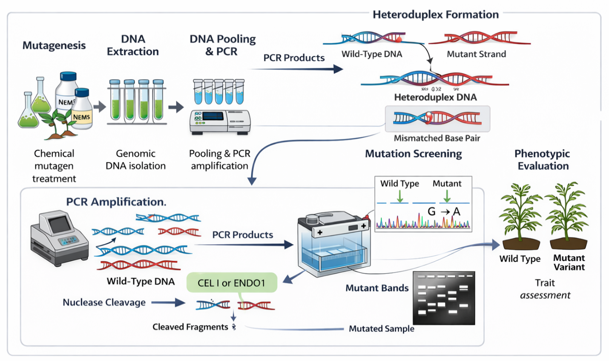

## Introduction

Global agriculture is facing challenges due to changing climate conditions, declining soil health, a rising human population, and increasing incidence of pests, diseases, and environmental stresses [@Prajapati2024]. Addressing these challenges requires the development of high-yielding, climate-resilient crop varieties supported by efficient identification and utilization of genetic variation. While conventional breeding remains essential, its reliance on phenotypic selection and long breeding cycles limits the rapid deployment of improved cultivars. Similarly, transgenic technologies, despite their effectiveness, face regulatory constraints and public acceptance issues in many regions [@Ahmar2020; @Bhattacharya2023].

In this context, reverse genetics approaches such as Targeting Induced Local Lesions IN Genomes (TILLING) and Eco-TILLING have emerged as practical, non-transgenic alternatives for functional genomics and crop improvement [@Selvakumar2023; @Siddique2023]. These methods allow precise identification of nucleotide-level variation without foreign DNA integration, making them socially and regulatorily acceptable. TILLING is particularly valuable for species with large, polyploid, or poorly annotated genomes, whereas Eco-TILLING enables the exploration of naturally occurring variation in landraces, wild relatives, and germplasm collections [@Cheng2021; @Mohapatra2023].

Earlier reviews have established the conceptual and methodological foundations of TILLING and Eco-TILLING as reverse genetics platforms [@Till2007a]. However, substantial advances have occurred in both detection technologies and applied breeding contexts since those syntheses. In particular, the adoption of high-resolution melting (HRM) analysis and next-generation sequencing-assisted TILLING has improved mutation detection efficiency, scalability, and precision. At the same time, recent studies have demonstrated the application of these approaches in underutilized, polyploid, and climate-sensitive crops, where regulatory or technical constraints may limit genome editing strategies.

This review extends prior syntheses by incorporating recent methodological advances alongside crop-specific case studies and by positioning TILLING-based approaches within the broader context of climate-resilient and resource-efficient breeding. By linking technological innovation with contemporary breeding priorities, this review offers an updated perspective on the sustained relevance of TILLING and Eco-TILLING in modern crop improvement strategies

## Tilling

Targeting Induced Local Lesions in Genomes (TILLING) is a reverse genetics approach that enables systematic identification of induced point mutations within specific target genes through enzymatic mismatch cleavage. The foundational framework of TILLING was established in the early 2000s with the development of population-based mutagenesis and heteroduplex-based detection systems in Arabidopsis thaliana [@McCallum2000; @Till2004]. Subsequent reviews consolidated these principles and formalized TILLING and Eco-TILLING as broadly applicable reverse genetics platforms for crop improvement [@Till2007b]. These early studies defined the core methodological workflow while also identifying practical constraints, including optimization of mutation density, nuclease specificity, and throughput limitations.

The approach combines chemical or physical mutagenesis with high-throughput molecular screening to detect sequence variation in target loci [@Khan2018; @Siddique2023]. Mutant populations are generated, genomic DNA is extracted, and pooled samples are screened following PCR amplification of the region of interest. Denaturation and re-annealing steps produce heteroduplex DNA, which is subsequently cleaved by single-strand–specific nucleases such as CEL I (Celery Extract Nuclease I) and ENDO1 (Endonuclease I) at sites of single-base mismatches or small insertions/deletions [@Till2004]. While CEL I is widely used for its broad mismatch recognition and high sensitivity, non-specific cleavage may occur under suboptimal conditions. ENDO1 can offer improved specificity in certain systems, although enzyme performance may vary depending on reaction parameters [@Till2007b]. A schematic representation of the TILLING workflow, from mutagenesis to mutation detection, is presented in @fig-figure1.

Associated seed stocks and DNA libraries are typically preserved to support long-term functional genomics and breeding applications [@Jiang2022].

{#fig-figure1 width="80%" height="auto"}

Unlike conventional mutation breeding, which often recovers a limited subset of desirable alleles, TILLING enables systematic detection of a wide spectrum of induced variants. In EMS-based populations, mutation densities generally range from approximately 1 per 200–1000 kb, depending on mutagen dosage, genome size, and ploidy level. Effective recovery of functional alleles for a single gene typically requires screening populations of 1,000–5,000 M2 individuals, with larger populations needed for polyploid species or rare knockout variants [@Cooper2008]. By linking induced nucleotide variation to phenotypic outcomes, TILLING provides a non-transgenic platform for targeted trait discovery and incorporation of beneficial alleles into breeding pipelines [@Cheng2021; @Sun2024].

### Innovative techniques derived from TILLING

Several mutation detection methods have evolved from the original TILLING platform by exploiting structural differences between homoduplex and heteroduplex DNA. These include Single-Strand Conformation Polymorphism (SSCP), Denaturing Gradient Gel Electrophoresis (DGGE), Conformation-Sensitive Gel Electrophoresis (CSGE), Temperature Gradient Capillary Electrophoresis (TGCE), Denaturing High-Performance Liquid Chromatography (dHPLC), and High-Resolution Melting (HRM) analysis [@Till2007b; @SzurmanZubrzycka2017; @Selvakumar2023].

Among these, HRM has gained prominence for its rapid detection of sequence variation based on the differential melting behavior of PCR amplicons. Unlike nuclease-based approaches, HRM eliminates enzymatic cleavage steps and enables scalable, high-throughput screening [@Selvakumar2023]. It has been successfully applied in crops such as tomato, pepper, potato, and broccoli [@Mohan2016].

The integration of next-generation sequencing (NGS) has fundamentally reshaped TILLING workflows, transitioning the approach from gel-dependent mutation detection to scalable genomic platforms. In NGS-assisted TILLING, pooled PCR amplicons or targeted genomic regions are directly sequenced, enabling digital identification of induced nucleotide variants at single-base resolution [@Fanelli2021; @Jiang2022]. Compared with enzymatic mismatch cleavage and fragment analysis methods [@Till2007a], sequencing-based platforms enhance sensitivity, support multiplexed screening of multiple loci within large mutant populations, and reduce reliance on capillary or gel-based systems.

Reference-guided amplicon sequencing platforms have demonstrated improved mutation discovery efficiency and reduced manual processing in crops such as barley and sunflower [@Fanelli2021; @Jiang2022]. Beyond targeted amplicon sequencing, targeted resequencing and exome-capture approaches allow simultaneous interrogation of broader gene sets, particularly in species with available reference genomes. Although initial sequencing infrastructure may require higher investment, per-sample costs decrease substantially at scale, making NGS-assisted TILLING increasingly cost-effective for large breeding programs. Moreover, digital variant datasets facilitate allele frequency estimation, precise validation, and integration with genomic databases, thereby improving data interpretation and traceability. Collectively, these advances position sequencing-assisted TILLING as a central component of contemporary reverse genetics and crop improvement strategies.

| Technique | Developed for | Advantage | Disadvantage | Reference |
|-----------|---------------|-----------|--------------|-----------|
| iTILLING (individualized TILLING) | Arabidopsis reduces cost and time to carry out mutation screening | low cost | can be performed only for a small number of genes because the population used for screening is of short duration. | [@Bush2010] |
| DeTILLING (Deletion TILLING) | This technique employs the spectrum of available reverse genetic, molecular tools for the functional characterization of genes. | overcomes the shortage of null mutations and exclusively detects knockout mutations. | disruption of multiple genes, complicating gene-function analysis. | [@Rogers2009] |
| EcoTILLING (Ecotypic TILLING) | to evaluate naturally occurring variations | Enables low-cost discovery of natural genetic variants in wild crops unsuitable for induced mutagenesis. | Limited to existing natural variation, making it less effective in species with low genetic diversity. | [@Comai2004] |

: Techniques developed from TILLING {#tbl-techniques}

TILLING has evolved from a basic chemical mutagenesis approach into a versatile platform adapted to a wide range of crop species and breeding systems. Its modern variants support both functional genomics research and applied crop improvement across diverse agricultural contexts. @tbl-crop provides a comparative overview of key TILLING approaches, highlighting their applications, advantages, and limitations in contemporary breeding strategies.

| TILLING type | Target crops/species | Key features | Advantages | Limitations | Reference |
|-------------|----------------------|--------------|------------|-------------|-----------|
| Traditional TILLING | Autogamous, seed-producing crops | Uses chemical mutagenesis, M1/M2 population development, DNA pooling, endonuclease-based mutation screening | Broad applicability across crops, long-term seed storage | Time-intensive; low mutation frequency | [@Borevitz2003; @Till2007a; @Till2007b] |
| techTILLING | Lotus, tomato, pepper, pea, melon, lettuce, etc. | Platform integrating forward genetics and reverse genetics for crop screening | Applied to various vegetable crops via centralized platforms | Requires infrastructure and genomic resources | [@Perry2003; @Perry2009] |
| mutTILLING | General crop species | Uses diverse mutagens to induce mutations for reverse genetics | Allows customized mutation spectrum targeting specific alleles | Variability in mutation recovery | [@McCallum2000] |
| proTILLING | Tomato, capsicum, melon, potato, tobacco, etc. | Utilizes non-GM, proven mutagenesis methods suitable for breeders | Bypasses GMO regulations; directly applicable in breeding programs | Slower than transgenic approaches; may lose functional alleles | [@Piron2010; @Blomstedt2012] |
| polyTILLING | Polyploids (potato, sweet potato, leek) | Exploits high mutation rates in polyploid genomes for gene discovery | Suitable for high-throughput allele mining despite genetic redundancy | High mutation loads; potential sterility in some polyploids | [@Lawrence2003; @Bush2010] |
| VeggieTILLING | Vegetatively propagated crops (cassava, yams, etc.) | Mutagenizes vegetative parts (e.g., apical meristems); screens for mutations via phenotypic/genotypic tools | Enables TILLING in crops without seeds; useful for perennial and asexually propagated vegetables | Lack of meiosis limits classical breeding approaches; chimeras can occur | [@Mba2009] |

: Comparison of traditional and modern TILLING variants used in crop improvement {#tbl-crop}

## Eco TILLING

Eco-TILLING, first described by [@Comai2004], is a modification of the original TILLING platform designed to detect naturally occurring nucleotide polymorphisms within populations. Unlike induced mutagenesis-based TILLING, Eco-TILLING relies on heteroduplex formation between reference and test DNA samples to identify sequence variation such as single nucleotide polymorphisms and small insertions or deletions.

Early implementations of Eco-TILLING utilized LI-COR gel-based detection systems for visualization of nuclease cleavage products [@Comai2004]. However, many laboratories have transitioned toward capillary electrophoresis and, more recently, sequencing-based detection platforms, which provide higher throughput, improved resolution, and reduced dependence on specialized gel imaging systems [@SzurmanZubrzycka2017; @Selvakumar2023]. Integration with next-generation sequencing now allows more precise haplotype identification and improved scalability in diverse germplasm collections.

Eco-TILLING has proven particularly valuable for allele mining in landraces, wild relatives, and pre-breeding materials. By identifying naturally occurring variation in candidate genes, it supports the introgression of favorable alleles into elite backgrounds without induced mutation load. Applications include the discovery of functional polymorphisms associated with nutritional traits, stress tolerance, and disease resistance [@Upadhyaya2017; @Mohapatra2023]. Because Eco-TILLING does not involve mutagenesis, it is especially suitable for crops with high natural diversity and for breeding programs focused on broadening the genetic base. In contrast to induced TILLING, which generates novel alleles, Eco-TILLING primarily facilitates characterization and deployment of existing variation. Together, the two approaches provide complementary strategies for functional genomics and crop improvement.

## Applications 

TILLING has been applied successfully to improve disease resistance, metabolic composition, and quality traits in several crop species. Representative case studies are summarized in @tbl-crops, and selected examples are discussed below to illustrate practical outcomes. In tomato, a proTILLING approach identified mutations in the eIF4E gene that conferred resistance to two potyviruses [@Piron2010]. Because these alleles were generated through chemical mutagenesis rather than transgenic modification, they were directly incorporated into breeding programs without regulatory constraints. This study demonstrated the effectiveness of TILLING in translating molecular knowledge of host–virus interactions into deployable resistance traits.

[@Blomstedt2012] combined biochemical screening with TILLING to target genes involved in cyanogenic glucoside biosynthesis in sorghum. Mutant lines with reduced cyanogenic potential were identified, resulting in improved forage safety while maintaining agronomic performance. This study highlights the use of TILLING to modify complex metabolic pathways relevant to crop utilization. Oil quality improvement has also been achieved through TILLING. In soybean, mutations in fatty acid desaturase genes were detected using TILLING, leading to altered fatty acid composition and increased oleic acid content [@Cooper2008]. Such modifications improve oxidative stability and nutritional quality, demonstrating the role of TILLING in compositional trait improvement.

Recent advances integrating next-generation sequencing with TILLING have improved mutation detection efficiency and scalability, as demonstrated in barley through amplicon-based TILLING-by-sequencing platforms [@Jiang2022]. Eco-TILLING has further enabled identification of natural allelic variation within germplasm collections, supporting allele mining and biofortification strategies, such as folate enhancement in tomato [@Upadhyaya2017]. Together, these studies confirm that TILLING and Eco-TILLING function as practical platforms for functional allele discovery and direct trait improvement within conventional breeding systems.

| Crop species | Target gene | Target trait / improvement | Methodology | Reference |
|--------------|------------|-----------------------------|-------------|-----------|
| Rice (*Oryza sativa*) | Wx (Waxy gene) | Reduced amylose content; improved grain quality | Traditional TILLING | [@Till2007b] |
| Tomato (*Solanum lycopersicum*) | eIF4E | Resistance to potyviruses | proTILLING | [@Piron2010] |
| Soybean (*Glycine max*) | FAD2-1A / FAD2-1B | Increased oleic acid content | Traditional TILLING | [@Cooper2008] |
| Barley (*Hordeum vulgare*) | HvCslF6 | Modified β-glucan content | TILLING-by-Sequencing (NGS-assisted) | [@Jiang2022] |
| *Brassica rapa* | Multiple flowering genes | Flowering time modification | Traditional TILLING | [@Stephenson2010] |
| *Lotus japonicus* | Symbiosis-related genes | Improved nodulation efficiency | techTILLING | [@Perry2009] |
| Sorghum (*Sorghum bicolor*) | Cyanogenic glucoside pathway genes | Reduced cyanogenic potential | proTILLING | [@Blomstedt2012] |

: Applications of TILLING and Eco-TILLING in crop improvement {#tbl-crops}

## Comparison of TILLING and Eco-TILLING with other reverse genetics tools

TILLING and Eco-TILLING operate alongside other reverse genetics and allele discovery tools such as CRISPR-based genome editing and genome-wide association studies (GWAS). CRISPR technologies enable precise, targeted modification of specific loci but often require efficient transformation systems, and efficient tissue culture regeneration systems may be subject to regulatory constraints [@Pacesa2024]. In contrast, TILLING generates allelic variation through mutagenesis without introducing foreign DNA, making it broadly applicable and regulatorily simpler in many breeding contexts. GWAS-based approaches rely on existing natural variation to identify trait-associated loci, whereas TILLING can create novel alleles, including rare loss-of-function variants not present in germplasm collections [@Park2025]. Consequently, TILLING remains particularly valuable in orphan, polyploid, and transformation-recalcitrant crops, while also functioning complementarily with genome editing and genomic selection in integrated breeding pipelines.

## Challenges 

Despite their advantages, TILLING and Eco-TILLING face limitations. Most induced mutations are silent or result in partial functional changes, making true knockout alleles relatively rare [@Kashtwari2019]. Mutation detection requires specialized equipment, such as LI-COR systems and capillary electrophoresis platforms, which may be inaccessible in resource-limited settings [@Siyal2024]. Additionally, Eco-TILLING may have limited power to detect rare alleles in highly diverse populations [@Gunnaiah2023]. Successful implementation in orphan crops often depends on genomic resources, technical expertise, and infrastructure availability [@Kumari2024].

## Future directions

The continued relevance of TILLING and Eco-TILLING will depend not only on methodological refinement but also on strategic implementation within national breeding systems. For developing countries, investment in shared mutation screening and sequencing facilities can substantially reduce costs while expanding access to high-throughput platforms. Prioritizing regionally important, climate-resilient, and underutilized crops, particularly those lacking efficient transformation systems, would enhance the impact of these approaches. Integration of mutant populations with existing germplasm collections and pre-breeding resources can strengthen allele discovery and minimize redundancy. Furthermore, building bioinformatics capacity, standardized data management frameworks, and coordinated training programs will be essential for sustainable deployment. When aligned with national crop improvement priorities, TILLING-based platforms offer cost-effective, non-transgenic tools for accelerating trait discovery and varietal development.

## Conclusion

In conclusion, TILLING and Eco-TILLING stand out as cost-effective, reliable, and non-transgenic approaches for detecting genetic variation, with great potential for application across a wide range of plant species, including underutilized and non-model crops. These techniques offer significant promise for crop improvement, particularly in species where traditional mutagenesis methods have proven challenging. However, realizing their full potential requires overcoming key obstacles, such as optimizing protocols for orphan crops, building local capacity, and integrating advanced genomic tools like next-generation sequencing. As technological advancements continue to lower costs and improve accessibility, TILLING is ready to become a central component in functional genomics and breeding programs, ultimately contributing to enhanced crop productivity and food security, especially for resource-limited farming communities.



## References {.unnumbered}

::: {#refs}
<!-- References will be rendered here -->
:::



::: {.callout-important title="Publication & Reviewer Details"}
**Publication Information**

-   **Submitted:** *30 January 2026*\
-   **Accepted:** *11 February 2026*\
-   **Published (Online):** *12 February 2026*

------------------------------------------------------------------------

**Reviewer Information**

- **Reviewer 1:**\
  **Dr. Gayathri G**  
  *Assistant Professor*  
  *Kerala Agricultural University*  

-   **Reviewer 2:**\
    *Anonymous*
:::

::: {.callout-note appearance="simple"}

## Disclaimer/Publisher’s Note  

The statements, opinions and data contained in all publications are solely those of the individual author(s) and contributor(s) and not of the publisher and/or the editor(s).  
The publisher and/or the editor(s) disclaim responsibility for any injury to people or property resulting from any ideas, methods, instructions or products referred to in the content.  

:::  

>© Copyright (2025): Author(s). The licensee is the journal publisher. This is an Open Access article distributed under the terms of the [Creative Commons Attribution-NonCommercial-NoDerivatives 4.0 International License](https://creativecommons.org/licenses/by-nc-nd/4.0/), which permits non-commercial use, sharing, and reproduction in any medium, provided the original work is properly cited and no modifications or adaptations are made. 