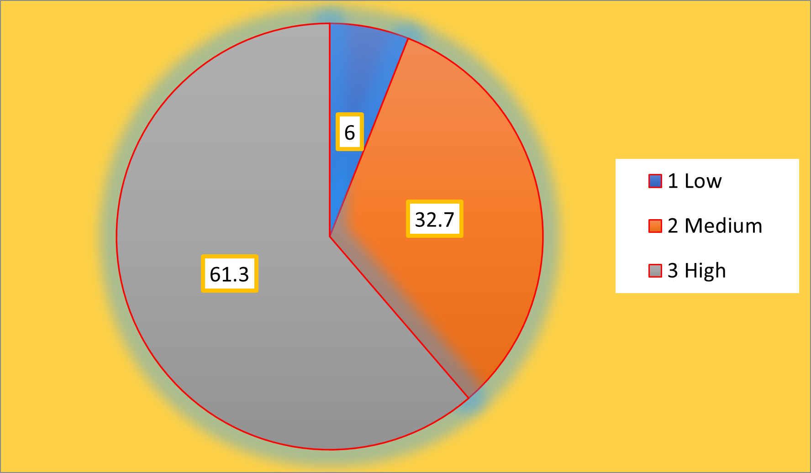
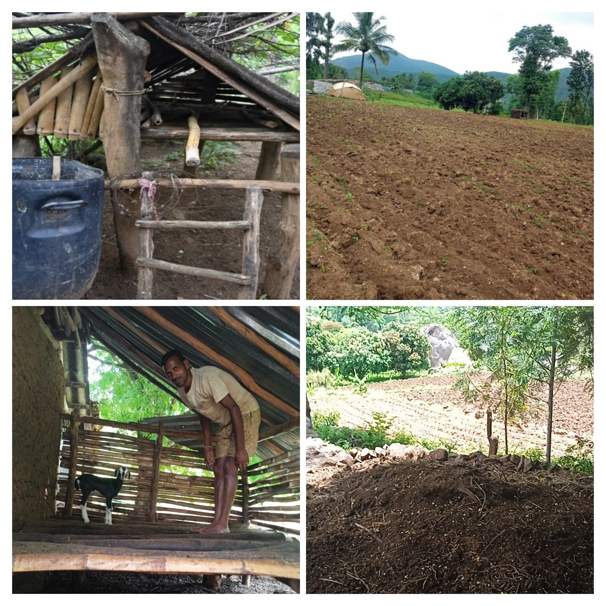

## Introduction

Ethno-agriculture and ethnoveterinary science encompass the study of traditional, region-specific knowledge related to the use of plants and animals by indigenous and tribal communities for agricultural and livestock management. The term “ethno” was first introduced by J. W. Harshberger in 1895 to describe the systematic study of plants and domesticated animals used by primitive and aboriginal societies [@Vivekanandan1994; @Kumari2018]. Although such knowledge systems have existed since the early stages of human civilization, ethno-agriculture and ethnoveterinary science emerged as recognized academic disciplines within environmental and agricultural sciences during the twentieth century.

Ethno-agricultural and ethnoveterinary practices are intrinsically linked to food and nutritional security, healthcare, livelihood sustenance, cultural beliefs, cottage industries, economic upliftment, biodiversity conservation and the sustainable utilization of natural resources. These practices, commonly referred to as Indigenous Technical Knowledge (ITK), reflect the deep-rooted cultural, spiritual and ecological relationships between tribal communities and their surrounding environment [@Kumar2016a; @Palanikumar2025]. Indigenous knowledge systems are embedded within local languages, social structures, value systems, institutions and customary laws and are largely based on experiential learning and naturalistic worldviews that differ significantly from formal scientific knowledge systems [@IUCN1997].

Human civilization has progressed from the Stone Age to the modern technological era through continuous observation, experimentation and adaptation. Agriculture and animal domestication form the foundation of early human societies, wherein communities gradually identified, domesticated and improved crops and livestock to meet subsistence requirements. Over successive generations, tribal communities refined ethno-agricultural and ethnoveterinary practices through trial and error, guided by intimate interactions with their local ecological conditions and resource availability [@Kumar2012; @Patel2018].

Ethno-agricultural and ethnoveterinary practices play a vital role in the conservation of plant and animal genetic resources, which are essential for ecological balance and long-term sustainability [@Banerjee2014]. These knowledge systems comprise locally evolved perceptions, information, and practices that enable tribal communities to manage land, crops, livestock and natural resources to fulfil their needs related to food, shelter, health, spiritual well-being and economic security. Indigenous knowledge is location-specific, dynamic, adaptive and continuously evolving in response to ecological, socio-economic and political changes.

Despite their significance, many indigenous agricultural and ethnoveterinary practices remain inadequately documented, scientifically validated and integrated into formal agricultural development and extension systems. Rapid urbanization, modernization of agriculture, environmental degradation, and socio-economic transitions have posed serious threats to the continuity and transmission of traditional knowledge [@Kumar2016a]. Therefore, systematic documentation, analysis, and promotion of indigenous practices are essential to preserve this valuable heritage and to enhance sustainable and climate-resilient farming systems.

Agriculture constitutes the primary livelihood of the tribal population in the Kalrayan Hills of Tamil Nadu. The region’s varied topography, altitude and agro-climatic conditions support a diverse range of agricultural and horticultural crops, along with indigenous livestock species. The Kalrayan Hills represent one of the prominent regions in the state where ethno-agricultural and ethnoveterinary practices continue to be widely practiced for crop production, animal healthcare and livelihood generation. In particular, Villupuram district is known for its rich repository of indigenous knowledge related to agriculture and animal husbandry [@Bashir2015; @Callaby2016].

## Materials and methods

The present study was conducted in the Kalrayan Hills region of Villupuram district, Tamil Nadu, which is predominantly inhabited by tribal communities practicing traditional agriculture and livestock rearing. An ex-post facto research design was adopted, as the variables under investigation had already occurred and were beyond the control of the researcher. The study area was selected purposively due to the prevalence of indigenous agricultural and ethnoveterinary practices among tribal farmers.

A multistage sampling technique was employed for the selection of respondents. In the first stage, villages with a high concentration of tribal households were identified. In the subsequent stage, tribal farmers actively engaged in farming and livestock rearing were selected randomly from the identified villages. A total of 300 tribal farmers were selected as respondents for the study, ensuring adequate representation of the tribal farming population in the selected villages. The sample size was considered statistically sufficient for behavioural research studies to generate reliable and generalizable findings.

Data were collected using a well-structured and pre-tested interview schedule developed based on relevant literature and expert consultation. The schedule covered personal, socio-economic, psychological and communication characteristics of the respondents, along with their extent of adoption of indigenous agricultural and ethnoveterinary practices.

Adoption behaviour was measured by assessing the extent to which respondents practiced selected indigenous agricultural and ethnoveterinary techniques. Scores were assigned based on the level of adoption, and respondents were categorized into low, medium and high adoption groups using appropriate statistical measures such as mean and standard deviation. The collected data were coded, tabulated and analyzed using suitable statistical tools such as frequency, percentage, mean and standard deviation to draw meaningful inferences.

## Results

The results of the study revealed that a majority of the tribal farmers exhibited a medium level of adoption of indigenous agricultural and ethnoveterinary practices, followed by high and low adoption categories [@Chandrasekar2017; @Patel2018]. The continued reliance on traditional practices indicates their practical relevance, cultural acceptance and economic feasibility in tribal farming systems. Practice-wise analysis showed a high level of adoption in indigenous agricultural practices, particularly those related to soil fertility management, seed treatment, crop protection and post-harvest operations [@Balamurugan2017; @Patel2018]. Practices such as application of green leaf manure and farmyard manure, incorporation of crop residues, sun drying of harvested produce, use of neem-based pest control measures and indigenous storage methods recorded higher adoption percentages. Similarly, adoption of ethnoveterinary practices was observed for the treatment of common livestock ailments such as fever, wounds, digestive disorders, parasitic infestations and post-calving care. Indigenous remedies using locally available medicinal plants, household materials and traditional preparations were widely practiced by the respondents [@Avhad2015; @Raina2016].

Overall adoption categorization indicated that a substantial proportion of respondents belonged to the medium to high adoption groups, reflecting the continued prevalence of indigenous knowledge systems among tribal farmers in the Kalrayan Hills region (@tbl-paddy, @fig-figure1 and @fig-figure2).

| S. No. | Agriculture Practices | No. of Respondents | Per cent |
|---------|----------------------------------------------|---------|---------|
| **I.** | **Paddy** |  |  |
| 1 | Soaking seeds for 24 hours in water and covering with paddy straw and bamboo leaves for early sprout | 215 | 71.66 |
| 2 | Seed rate \@ 20-25 kg per acre | 226 | 75.33 |
| 3 | Burning of farm waste and trash on the nursery for better germination | 189 | 63.00 |
| 4 | Summer ploughing | 195 | 65.00 |
| 5 | Applying of green leaf manure and FYM | 251 | 83.66 |
| 6 | Incorporating crop residue and leaves of a tree as a manure | 258 | 86.00 |
| 7 | Sun drying of harvested paddy for one or two days in the field it self | 268 | 89.33 |
| 8 | Threshing by hitting the paddy bundles with wooden blocks | 261 | 87.00 |
| 9 | Parboiling of paddy for improving the edible quality of the rice | 248 | 82.66 |
| 10 | Irrigating from the channels when the well completely dries up | 236 | 78.66 |
| 11 | Grounding of rice in a heavy weight wooden grinder (Urral) | 263 | 87.66 |
| 12 | Using stingy bugs against caseworm | 164 | 54.66 |
| 13 | Bradcasting the crushed neem leaves in the paddy to reduce insect attack | 266 | 88.66 |
| 14 | Coating of cow dung solution in paddy grains for protection of pest and diseases | 269 | 89.66 |
| 15 | Covering rat holes with mud | 248 | 82.66 |
|  | Mean |  | **79.04** |
| **II.** | **Tapioca** |  |  |
| 16 | Selecting a setts with shorter internodes for planting | 268 | 89.33 |
| 17 | Cultivating banana as a inter crop between the rows | 123 | 41.00 |
| 18 | Application of pig manure for increased tuber size | 222 | 74.00 |
| 19 | Irrigating once in 15 days | 257 | 85.66 |
| 20 | Spraying of neem oil mixed with soap solution to control the pest and diseases | 242 | 80.66 |
| 21 | Tapioca is cultivated in bench terrace | 256 | 85.33 |
| 22 | Selecting disease- free setts for propagation | 261 | 87.00 |
| 23 | Planting the setts within three hours after cutting | 248 | 82.66 |
| 24 | About 6-8 cuttings of 20 cm are obtained from mature stem, leaving the top tender shoot and woody bottom | 248 | 82.66 |
| 25 | The setts are planting the setts vertically at one inch depth in the soil | 246 | 82.00 |
| 26 | Cultivating Dolicho sp (India Been) as a smoother/cover crop in between the rows as an inter-crop. | 224 | 74.66 |
| 27 | Storage setts are cut and sun dried for a week and stored with 16% of moisture content | 218 | 72.66 |
| 28 | Mixing jatropha leaves with hot water (100 °C)is used to control aphids and white flies in tapioca | 190 | 63.33 |
|  | Mean |  | **76.99** |
| **III.** | **Cumbu** |  |  |
| 29 | Spreading of cumbu ear heads circularly to a height of 1 foot and cattle threshed | 178 | 59.33 |
| 30 | Drying of cumbu until a metallic sound is produced | 188 | 62.66 |
| 31 | Storing the cumbu in earthen pots covered with and tied cloth. | 257 | 85.66 |
| 32 | Spreading of Nochi leaves over the storage container to control pest | 258 | 86.00 |
| 33 | Mixing of seed purpose cumbu with dried neem leaves | 257 | 85.66 |
| 34 | Springing turmeric powder and ash solution (2Kg of turmeric powder + 8 Kg of ash + 200 litre of water per acre) to control sucking pests like aphids, hoppers etc., | 162 | 54.00 |
| 35 | Cumbu ear heads are sun dried for two days and stored without seed separation by building a storage structure called 'Kudhir'. | 256 | 85.33 |
| 36 | Soaking the cumbu seeds in common salt solution before sowing to secure good germination under adverse conditions | 262 | 87.33 |
| 37 | Soaking the cumbu seeds in cow urine for half-an-hour and sun drying them before sowing to control head smut and to induce drought tolerance. | 256 | 85.33 |
| 38 | Sprinkling boiled water in the next day and immersed in ordinary water for some time before sowing in the filed give better in the filed better germination. | 248 | 82.66 |
| 39 | Country plough is run at the early stage of cumbu crop to ensure optimum plant population. | 194 | 64.66 |
| 40 | Sowing cumbu during the tamil months Vaikasi - Aani (May-June) to avoid shoot fly and stem borer. | 215 | 71.66 |
| 41 | Sowing cowpea as an intercrop in cumbu to minimize stem borer attack due to its repellent smell. | 161 | 53.66 |
| 42 | Sowing lab-lab as an intercrop to reduce stem borer damage in cumbu. | 193 | 64.33 |
| 43 | Pouring neem cake extract drop by drop on the cumbu shoot to control shoot borer. | 192 | 64.00 |
| 44 | Dusting ash on the infected leaves of cumbu to prevent the pest incidence. | 222 | 74.00 |
| 45 | Dusting ash at milking stage to control ear head bugs. | 192 | 64.00 |
| 46 | Growing coriander as a mixed crop in cumbu to control the parasitic weed (Strigalutea). | 146 | 48.66 |
| 47 | A red / yellow/ dark cloth is tied to a long pole and fixed in the centre of the field to scare away the crows. | 268 | 89.33 |
| 48 | Mixing cumbu seeds with ash to prevent storage pests. | 272 | 90.66 |
| 49 | Local varieties are cultivate in dry lands to avoid more water coinciding with the harvesting stage. | 276 | 92.00 |
| 50 | Treating the cumbu seed treated with cow urine at 1:10 ratio to enhance germination. | 267 | 89.00 |
| 51 | Clewing dried cumbu grain gives, metallic sound and dryness. | 248 | 82.66 |
| 52 | Pounding cumbu into course powdery form and consumed | 238 | 79.33 |
| 53 | Dusting Chula ash in pearl millet fields to control green leaf hoppers sitting on inner side of leaves. | 148 | 49.33 |
| 54 | Storing cumbu seeds by mixing with ash. | 257 | 85.66 |
|  | Mean |  | **59.90** |
| **IV.** | **General practices agriculture** |  |  |
| 55 | Tying of polythene sheets to scare away the birds | 266 | 88.66 |
| 56 | Dusting of ash to control the pest | 262 | 87.33 |
| 57 | Sheep penning | 267 | 89.00 |
| 58 | Fumigating in closed container for ripening of fruits | 273 | 91.00 |
| 59 | Using neem seed kernel to control pest | 258 | 86.00 |
| 60 | Broadcasting enriched silt in the fields | 150 | 50.00 |
| 61 | Using of green chille and garlic extract to control aphid and jassid | 218 | 72.66 |
| 62 | Using of mounds, ridges and raised beds to reduce root rot problem. | 252 | 84.00 |
| 63 | Using mixture of gypsum and sugar for rodent birds | 258 | 86.00 |
| 64 | Broadcasting of cooked rice with milk to attract birds | 252 | 84.00 |
| 65 | Spraying or tobacco extract to kill pest in crops | 183 | 61.00 |
| 66 | Soil and water conservation by use of stone terracing | 207 | 69.00 |
| 67 | Allowing pigs into the paddy field to control the nut sedge. | 221 | 73.66 |
|  | Mean |  | **65.56** |
|  | **Ethno practices under cow animal husbandry** |  |  |
| **I.** | **Cow - Foot and mouth disease (FMD)** |  |  |
| 68 | Giving local liquor or wine | 188 | 62.66 |
| 69 | Rubbing of jaggery in the mouth | 170 | 56.66 |
| 70 | Applying salt solution inside the mouth and between the hooves of the animal | 121 | 40.33 |
|  | Mean |  | **53.21** |
| **II.** | **Selection of breed and feeding** |  |  |
| 71 | Selecting of indigenous breed | 232 | 77.33 |
| 72 | Feeding dry roughages such as straw and hay to calving cows | 167 | 55.66 |
| 73 | Feeding all types of fodder to crows | 265 | 88.33 |
| 74 | Giving drinking water adequately to the cattle | 261 | 87.00 |
|  | Mean |  | **77.08** |
| **III.** | **Care and management of dairy and pregnant cow** |  |  |
| 75 | Isolating a pregnant cows from the rest house | 266 | 88.66 |
| 76 | Stopping milking 50 to 60 days before expected date of calving | 252 | 84.00 |
| 77 | Feeding roughages to pregnant cows | 247 | 82.33 |
|  | Mean |  | **84.99** |
| **IV.** | **Ulcer on neck of the bullock** |  |  |
| 78 | Applying boiled and cooled edible oil is applied over the neck to control rashes | 190 | 63.33 |
| 79 | Applying powdered coal paste on the ulcer part to minimize the pain | 147 | 49.00 |
|  | Mean |  | **56.16** |
| **V.** | **Respiratory tract infection** |  |  |
| 80 | Mixing a leaves of Thulasi (Ocimumcanum), arusha (Adhatodavasica), ginger, pepper, jaggery with water to make decoction and feed 2-3 times daily | 125 | 41.66 |
| 81 | Quashing the fruits of Kantakari (Solanum surattense) are soaked in goat urine overnight and filtered and squeezing into few drops the nostril | 118 | 39.33 |
|  | Mean |  | **52.16** |
| **VI.** | **Dropping of placenta** |  |  |
| 82 | Giving or three seeds of vellaikoundumani given with boiled bajra to the animal for immediate delivery | 114 | 38.00 |
| 83 | Giving bambusa leaves for feeding to easy release of placenta | 116 | 38.66 |
|  | Mean |  | **38.33** |
| **VII.** | **Mastistis in dairy animals** |  |  |
| 84 | Applying Gheekumari (Aloe vera) – 1 or 3 petals Haldi (Turmeric) powder – 50gm Chunna (Lime stone) – 10 gm are made it paste and apply over the udder thrice a day | 122 | 40.66 |
| **VIII.** | **Treatment for the dislocated / fractured part of cow** |  |  |
| 85 | Applying mixture of honey and pure ghee in the featured part | 188 | 61.66 |
| 86 | Applying of perandai pulp on the fractured part | 121 | 40.33 |
| 87 | Applying of mixture of salt, jaggery and turmeric powder in the featured part | 120 | 40.00 |
| 88 | Applying two vilvam fruits of partially burnt and ground water and make as paste to apply in the featured part | 108 | 36.00 |
| 89 | Applying fenugreek seed paste and bandaged in dislocated part. | 152 | 50.66 |
|  | Mean |  | **57.16** |
|  | **Sheep and goats** |  |  |
| **I.** | **Blue tongue disease** |  |  |
| 90 | Smearing a banana fruits with sesame oil for feed to animals for 2 to 3 times | 122 | 40.66 |
| 91 | Feeding leaf pulp of Aloe vera 100gm has to be administered daily. | 115 | 38.33 |
|  | Mean |  | **39.49** |
| **II.** | **Eradication of the ecto – parasite** |  |  |
| 92 | Applying of tobacco powder and edible oil mixture over the entire body of the animal | 171 | 57.00 |
| **III.** | **Flatulence** |  |  |
| 93 | Feeding a mixture of onion and aerial root of banyan tree to the animal before | 118 | 39.33 |
| 94 | Applying salt in the tongue of the animal feeding tuber plant with onion mixture | 114 | 38.00 |
| 95 | Feeding of suspension of edible oil (100g), water and kerosene oil to the animals | 122 | 40.66 |
|  | Mean |  | **39.33** |
| **IV.** | **Skin diseases** |  |  |
| 96 | Applying of used engine oil over the skin | 114 | 38.00 |
| **V.** | **Cold** |  |  |
| 97 | Dropping of bhoyrognijuice in the nose | 94 | 31.33 |
| **VI.** | **Diarrhea** |  |  |
| 98 | Oral administration of charcoal powder | 168 | 56.00 |
| 99 | Feeding leaf extract hupai | 147 | 49.00 |
| 100 | Feeding 3kg of steamed varagu grains | 118 | 39.33 |
|  | Mean |  | **48.11** |
| **VII.** | **Unsuccessful conception** |  |  |
| 101 | Feeding 200 – 300 ml of castor oil | 148 | 49.33 |
| 102 | Feeding of banana leaf extract | 122 | 40.66 |
|  | Mean |  | **44.99** |
| **VIII.** | **Post – calving care** |  |  |
| 103 | Feeding of 1- 2 kg jaggery dissolved in water to the animal immediately after calving | 175 | 58.33 |
| **I.** | **Poultry disease management** |  |  |
| 104 | Spreading crushed leaves of sithapal (Annonasquamosa) inside poultry nest and lice collected over the leaves can be disposed hygienically | 215 | 71.66 |
| 105 | Applying garlic, tulasi, neem leaves, seethapal seeds, haldi each 10-20 gm are grounded together and boiled in 250ml of neem oil over the surface of the body of 10-15 birds | 218 | 72.66 |
|  | Mean |  | **72.16** |
| **I.** | **Constipation** |  |  |
| 106 | Giving castor oil, raw in seed oil can be given for 1-2 days according to species and body weight of animal. | 218 | 72.66 |
| 107 | Giving a decoction of 100 g of haldi (turmeric rhizome) in a litre of water may be given once for 1-3 days to age old animals. | 116 | 38.66 |
|  | Mean |  | **55.66** |
|  | **General diseases of animal husbundary** |  |  |
| 108 | Pressing slightly heated local sword in the tooth for toothache control | 108 | 36.00 |
| 109 | Feeding little amount of cumin seeds for the gastroenteritis problem | 151 | 50.33 |
| 110 | Feeding well-grounded neem leaves, flowers and bark well and the cows for deworming | 120 | 40.00 |
| 111 | Applying Caetus (Carnegieagiganta) fluid is on the eyelieds to control common eye disease | 115 | 38.33 |
| 112 | Giving salt mixed water control in digestion ( tympany) | 106 | 35.33 |
| 113 | Feeding tea waste powder in case of blood in urine | 103 | 34.33 |
| 114 | Applying turmeric paste against the fracture area | 120 | 40.00 |
| 115 | Pasting lime, garlic and turmeric paste to control open wounds | 148 | 49.33 |
| 116 | Pasting neem paste to control wounds of the animals | 120 | 40.00 |
| 117 | Applying ghee in case of crack of udder | 118 | 39.33 |
| 118 | Applying Doorva (Calendula dactylon Linn.) paste for bleeding of blood from any injury | 103 | 34.33 |
| 119 | Smearingof powder of Calamus (Acoruscalamus) and the leaf extract of tulasi (Ocimum sanctum) mix on the body of animal prevent like and bovine flies | 108 | 36.00 |
|  | Mean |  | **39.44** |

: Distribution of respondents according to their practice wise adoption on recommended ethno agricultural and veterinary practices {#tbl-paddy}

{#fig-figure1 width="384"}

{#fig-figure2 width="384"}

## Discussion

The predominance of medium to high adoption levels among tribal farmers highlights the continued relevance of indigenous agricultural and ethnoveterinary practices in tribal livelihood systems. These findings suggest that traditional practices remain deeply embedded in the cultural and farming traditions of the study area. Higher adoption of indigenous agricultural practices may be attributed to their cost-effectiveness, eco-friendliness, easy availability of local resources and minimal dependence on external inputs. The results also indicate that indigenous practices are well adapted to the local agro-climatic conditions of the Kalrayan Hills.

The preference for ethnoveterinary practices can be explained by limited access to modern veterinary services in remote tribal areas, along with the trust developed through generations of experiential learning. Indigenous remedies are often perceived as safer, affordable and culturally acceptable alternatives to modern veterinary medicines. Factors such as age, farming experience, inheritance of traditional knowledge, social participation and access to indigenous resources were found to influence adoption behaviour. Older and more experienced farmers exhibited higher adoption levels, which underscores the role of experiential knowledge and intergenerational transmission in sustaining indigenous practices. These findings are in agreement with earlier studies emphasizing the importance of traditional knowledge systems in tribal agriculture.

The study reinforces the need for systematic documentation, scientific validation and integration of indigenous practices into formal agricultural extension programmes to ensure their preservation and effective utilization in sustainable and climate-resilient farming systems.

## Conclusion

The study concluded that indigenous agricultural and ethnoveterinary practices remain an integral component of the livelihood systems of tribal farmers in the Kalrayan Hills of Tamil Nadu. A substantial proportion of respondents demonstrated medium to high levels of adoption, highlighting the continued relevance of traditional knowledge in sustainable agriculture and livestock management. Despite increasing exposure to modern agricultural technologies, tribal farmers continue to rely on indigenous practices due to their cost-effectiveness, eco-friendliness and cultural compatibility.

The findings underscore the need for systematic documentation, scientific validation, and integration of indigenous agricultural and ethnoveterinary practices into formal agricultural extension and development programmes. Strengthening participatory extension approaches and promoting knowledge-sharing platforms can enhance the preservation and effective utilization of indigenous knowledge systems. Such efforts would contribute to sustainable agricultural development, biodiversity conservation and improved livelihood security among tribal communities in the Kalrayan Hills of Tamil Nadu.



## References {.unnumbered}

::: {#refs}
<!-- References will be rendered here -->
:::



::: {.callout-important title="Publication & Reviewer Details"}
**Publication Information**

-   **Submitted:** *05 February 2026*\
-   **Accepted:** *02 March 2026*\
-   **Published (Online):** *03 March 2026*

------------------------------------------------------------------------

**Reviewer Information**

-   **Reviewer 1:**\
  **Dr. Manobharathi K**  
  *Assistant Professor*  
  *Mother Terasa College of Agriculture*  
  *Pudukkottai, Tamil Nadu*  
  
-   **Reviewer 2:**\
  **Dr. Mathuabirami V**  
  *Assistant Professor*  
  *Kaveri University*  

:::

::: {.callout-note appearance="simple"}

## Disclaimer/Publisher’s Note  

The statements, opinions and data contained in all publications are solely those of the individual author(s) and contributor(s) and not of the publisher and/or the editor(s).  
The publisher and/or the editor(s) disclaim responsibility for any injury to people or property resulting from any ideas, methods, instructions or products referred to in the content.  

:::  

>© Copyright (2025): Author(s). The licensee is the journal publisher. This is an Open Access article distributed under the terms of the [Creative Commons Attribution-NonCommercial-NoDerivatives 4.0 International License](https://creativecommons.org/licenses/by-nc-nd/4.0/), which permits non-commercial use, sharing, and reproduction in any medium, provided the original work is properly cited and no modifications or adaptations are made. 