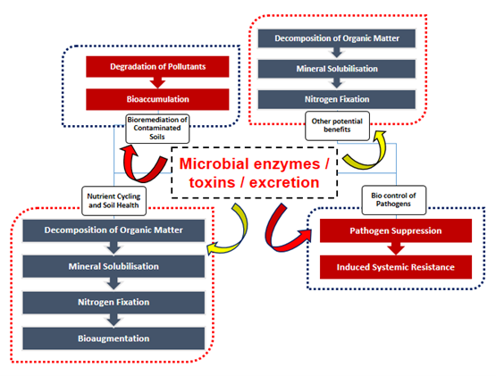
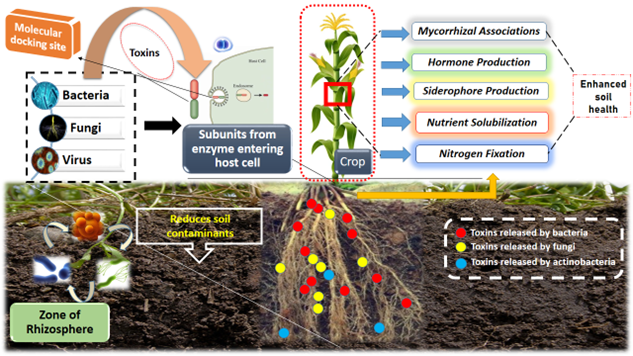
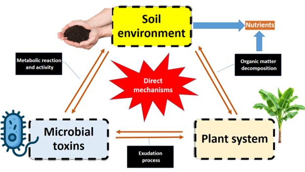
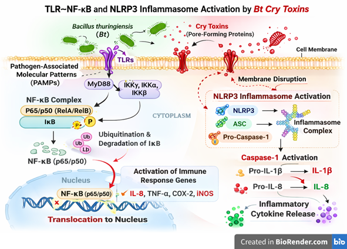



## Introduction

Soil is a complex ecosystem that supports a vast diversity of organisms essential for ecological functioning and plant growth [@Muhilan2026b; @Ilakkia2025; @Lobmann2022]. Soil dynamics play a crucial role in supplying nutrients to crops and supporting microbial nutrient acquisition and transformation processes  [@Akash2025]. The soil environment encodes soil physical, chemical and biological properties which acts as a foundation for crop growth and several other soil factors like soil pH, nutrient transfer, SMC (soil moisture content) etc., which cumulatively helps in better performance of crop and yield [@Hu2024]. The intricating relationship between soil, plants and microorganism which emphasize crop resilience, health of soil and ecosystem services [@Xing2025]. Many scientist had reported that the soil is just a base for cultivation of crops indeed it is a reservoir for many interactive diversified surface and sub-surface species like bacteria, fungi, actinobacteria, rhizobia, virus molecule, etc. [@Bonkowski2009]. These microbial family had a direct and indirect benefits to soil ecosystem [@Muhilan2025c].

Soil drivers including soil bacteria, fungi, actinobacteria supports rhizospheric continuum with above surface plants and atmosphere aiding in nutrient transformation, mineral mobilization, and nutrient solubilisation [@Muhilan2025a; @Wei2024]. But recent practices of long term application of inorganic fertilizers into soil system makes soil microbes to kills and make less efficiency in soil properties. Also this toxins or enzymes released from microbes helps in solubilisation of nutrient especially phosphorus (P) since it is an only element getting fixed in soil mostly at acidic range of soil pH. During decomposition, the produced toxins fasters the rate of decomposition helps in production of organic matter and thus stabilize soil buffering capacity [@Koushal2025].

Traditionally, the term ‘toxin’ refers to biologically produced poisonous compounds; however, in microbial ecology many toxin-like metabolites can also function as signaling molecules or ecological regulators [@Muhilan2025a]. But still it has practical application in agriculture and plant-root interface. Some of the microbial toxins were prone to suppress the rhizosphere activity but some notably releases valuable toxins from microbes which have considerable positive effect or beneficial effect towards crop growth and soil health. The current study of toxins not only restricted to plants, but also to human medical research and medical consortium preparation. Hence utilizing this as a positive relation towards soil health will aid in managing soil borne diseases and pest. Other than soil microbial toxins, various factors including rhizospheric environment influence crop growth like flavonoids [@Kumar2024], plant volatile organic compounds [@Sugimoto2014; @Ninkovic2019; @Ninkovic2021; @Zhang2022], amino acids [@Canarini2019], mucilage substances [@Oades1978; @Bacic1986; @Read2003; @Jones2009; @Carminati2013; @Holz2018], sterols [@Hassan2019] and many rhizodeposits stimulates the plant growth and maintenance of soil health. The well-known distinguishing microbes which releases toxins helps in cleaning up of soil contaminants such as heavy metals, pesticides, and hydrocarbons thereby reducing the entry of such compounds into plant systems [@Maqsood2023]. Hence, the utilization of microbial remediation practices aids in restoration of ecosystem and maintaining soil, ecosystem stability [@Lu2023; @Saeed2023].

Having a deeper understanding of interaction between soil microbes, toxins and plant nutrient uptake is significant for good crop yield and optimization of soil ecosystem. Although various significant research had overlooked the importance of toxins in soil system, but the gap between how it influence on rhizospheric environment, ionic balance, stress mitigation and plant protection measures is still unknown and will integrates the crop dynamics behavior into unified platform. This review majorly focuses on through understanding with deep insight into how different toxins released from various microbial population and its synergistic effect over soil health and plant nutrient uptake. Through thorough understanding the microbial dynamics in different soil system, management of soil health and encountering various precision farming practices led to discovery of optimizing soil-plant-microbes interaction and its effect on ecosystem practices. The target goal emphasizes to provide sustainable agriculture with better crop production, safer soil health, good microbial population in soil with summation of toxins released by microbes towards soil health and contributing better farming practices.

Furthermore , increasing attention has been given to the soil-plant interactions of Bacillus thuringiensis (Bt) Cry proteins within agro-ecosystems. Cry proteins released from Bt crops or biopesticide applications can enter the rhizosphere through root exudates, plant residues, or microbial activity, where they interact with soil particles, organic matter, and microbial communities. Experimental studies have shown that Cry proteins may bind strongly to clay minerals and humic substances, which can influence their persistence and ecological behavior in soil environments. For example, field studies have reported detectable levels of Cry proteins in rhizosphere soils during crop growth stages, although they generally degrade after harvest and do not accumulate significantly over multiple cultivation cycles [@Jones2009].

Recent research has also demonstrated that Cry proteins in the rhizosphere may influence soil enzymatic activities and microbial community dynamics, highlighting their broader ecological significance beyond pest control. A field study on transgenic Bt oilseed rape reported correlations between Cry1Ac protein levels and variations in soil enzyme activities during different plant growth stages, indicating potential interactions between Bt proteins and rhizosphere biochemical processes. Therefore, understanding the dynamics of Cry proteins in the soil–plant interface, including their persistence, transformation, and interaction with soil microbiota, is essential for evaluating their ecological implications and ensuring their sustainable use in modern agriculture.

## Soil microorganism

Soil is known for abundant microbial population and its intellectual benefits to soil environment [@Ruan2026; @Venkatesan2024]. The produce or substance released from such organisms are potent beneficial or harmful is under questionnaire still now. It includes wide range of bacterial colonies, fungal wide spread growth, actinobacteria population and virus strain which directly also indirectly getting benefits on various mechanisms on soil which includes like nutrient cycling [@Yadav2021], bio controlling harmful pathogens, insecticide and nematicide [@Chalivendra2021; @Chaudhary2024] and most importantly bioremediation of contaminated soils including toxic metal cations [@White1998; @Odukkathil2013; @Abioye2021; @Ayilara2023] [@fig-figure1; @tbl-major]. On one scale, micro-organisms were practically utilized in field condition through application of biofertilizers to achieve good crop yield with harmless condition to soil eco-system. Sometime, it may called as ‘Bio-engineers’, where their active performance eventually generate various secondary metabolites which will be helpful in stress detection among the plant system.

{#fig-figure1 width="384"}

| Sl. No | Microorganism used | Protein or toxins or metabolite or enzymes released | Function or advantages on soil - plant interphase | References |
|-------|----------------|-------------------|-------------------|----------|
|  |  | **In-vitro plant protection** |  |  |
| 1 | *Bacillus thuringiensis* subsp. *kurstaki* | Cry toxins (also known as delta-endotoxins) | Cry1Ac protein concentration gets decreased in plant system | [@Li2007] |
|  |  | **Nutrient Solubilisation and Mobilization** |  |  |
| 2 | *Rhizobium* and *Bradyrhizobium* | nitrogenase | Reduce the need for nitrogen fertilizers and promote soil health | [@Kiprotich2025] |
| 3 | *Burkholderia* and *Pseudomonas* | Rhamnolipids; phospholipases, and chitinases | Phosphate solubilization | [@Suarez2012] |
| 4 | *Purpureocillium* and *Duddingtonia flagrans* | proteases and chitinases, as well as (SSPs) like CyrA | suppress harmful nematodes | [@Lozano2024] |
| 5 | *Bacillus cereus* | Aggressins and proteases, lipases, and amylases | mitigate salt stress on plants | [@Liang2025] |
| 6 | *Bacillus subtilis* | proteases, lipases, and amylases | need for synthetic pesticides and promote natural disease suppression |  |
|  |  | **Metabolites production** |  |  |
| 7 | *Bacillus* species and fungi like *Trichoderma* \[*Paenibacillus*, *Stenotrophomonas*\] | Exopolysaccharide production | Improve Soil Structure, Salinity protection, Nutrient retention, Moisture retention | [@Mishra2020] |
| 8 |  | Siderophore Production | Unlock Iron and Bio fertilization |  |
| 9 |  | ACC-D | Reduce Negative Effects of Stress, Pathogen protection, Salinity protection, Drought protection |  |
| 10 |  | (SA) production | Plant Stress Response Regulation, Salinity protection, Alleviate heavy metal stress, Drought protection |  |
| 11 | \[*Enterobacter*, and *P. fluorescens*\] | (ABA) production | Plant Growth and Stress Response Regulation, Growth regulation, Plant resistance to pathogens | [@Scales2014] |
|  |  | **Bioremediation** |  |  |
| 12 | *Burkholderia* species | chitinase, protease, cellulase, amylase and glucanase | Degrade recalcitrant xenobiotics, making them useful for bioremediation | [@Suarez2012] |
|  |  | **Fungal role** |  |  |
| 13 | Helminthophagous fungi (*Duddingtonia flagrans*, *Pochonia chlamydosporia*, *Arthrobotrys oligospora*, *Monacrosporium thaumasium*, *Mucor circinelloides* and *Purpureocillium lilacinum*) | proteases, chitinases, and lipases | 1\. It can act in a complementary and synergistic way in the biological control of helminths, increasing their effectiveness in reducing parasitic infections   2. Emerging as a new approach to nematode control.   3. parasite management in horses (animal oriented pathogen management) | [@doCarmo2025] |
| 14 | AMF species (*Rhizophagus irregularis*, *Rhizophagus clarus*, and *Rhizophagus proliferus*) | Glomalin - an endo-glycol protein or GRSP | 1\. circumvent plant defenses   2. Soil aggregate stability   3. Increases soil moisture holding capacity   4. Enhances nutrient mobilization especially P | [@Sedzielewska2016] |

: Microbial metabolites, enzymes and bioactive compounds involved in soil–plant interactions and crop growth {#tbl-major}

## Microbial toxin

Microbial toxins are structurally diverse bioactive compounds synthesized by soil microorganisms such as bacteria, fungi, and actinomycetes [@Rogowska2023]. These compounds include phytotoxins, mycotoxins, antibiotics, siderophores, lipopeptides, and various secondary metabolites that influence plant growth and soil ecological balance [@Gan2022]. Their production is strongly regulated by environmental factors including soil pH, moisture, nutrient availability, temperature, and microbial population dynamics [@Ghorbani2024]. In the rhizosphere, microbial toxins function not only as pathogenicity determinants but also as ecological mediators [@Chinthala2025]. At low or regulated concentrations, several toxins act as signalling molecules that modulate plant hormonal pathways, induce systemic resistance, and enhance tolerance to abiotic stresses such as salinity, drought, and heavy metal toxicity. Conversely, excessive toxin accumulation may disrupt membrane integrity, inhibit enzymatic activity, and suppress plant physiological processes, ultimately leading to disease development and yield reduction. Therefore, the ecological role of microbial toxins is concentration-dependent and context-specific within the soil-plant system.

Microbial toxins derived from *Bacillus thuringiensis* represent one of the most successful examples of biologically based pest control however, emerging evidence indicates that their biological activity extends beyond intended insect targets [@Fichant2024]. Cry toxins, while requiring specific gut activation and receptor binding, can interfere with conserved cellular pathways such as cadherin-mediated adhesion and Notch signaling, thereby altering intestinal homeostasis in non-target organisms. Additionally, Bt spores harbor enterotoxin genes homologous to those found in *Bacillus cereus*, raising concerns regarding food safety and opportunistic pathogenicity under certain exposure conditions. Environmental persistence, cumulative field application, and interactions with soil components further complicate ecological risk assessment. These findings emphasize the necessity of re-evaluating microbial toxin safety within integrated ecological and One Health frameworks.

## Role of microbial toxin in plant pathogenesis

Certain soil microorganisms produce toxins that function as virulence factors during host infection [@Soni2024]. These phytotoxins interfere with cellular metabolism [@Cai2023], photosynthesis, ion transport, and cell wall integrity [@Geng2022], thereby facilitating pathogen colonization. Necrosis-inducing toxins promote tissue degradation, while host-selective toxins determine pathogen specificity toward particular plant species or cultivars. However, not all toxin-producing microbes are detrimental. Beneficial rhizobacteria and fungi synthesize antimicrobial compounds that suppress pathogenic organisms through competitive exclusion, antibiosis, and induced systemic resistance [@Pastor2023]. Such toxin-mediated biocontrol mechanisms reduce reliance on synthetic pesticides and contribute to sustainable disease management strategies. The dual nature of microbial toxins pathogenic versus protective highlights the importance of understanding microbial community balance in agricultural soils.

## Effects of microbial toxins on soil ecosystem

Microbial toxins significantly influence soil ecological processes beyond plant-pathogen interactions [@Muhilan2025a; @Chaudhary2023]. They regulate microbial community composition through antagonistic interactions [@Nagrale2023], thereby contributing to soil suppressiveness against diseases. Many toxin-producing microbes also release extracellular enzymes that accelerate organic matter decomposition [@Khan2025], enhance nutrient mineralization, and improve soil structural stability. The potential benefits attributing from bacterial toxin was given in @fig-figure2. The region of rhizosphere were abundant with microorganism including bacteria, fungi and action-bacteria which releases mucilage substances, VOCs, and most importantly toxins in soil. The toxin excrete adhere to host exogenous tissue (cortical cell of root) and penetrate inside root zone (Red, blue and yellow signifies level of toxins produced by each microbes; level of exudates depends upon population level in soil; (bacteria\>fungi\>actinobacteria\>virus).

{#fig-figure2 width="384"}

In addition, microbial metabolites such as siderophores improve micronutrient availability [@Gangadaran2025b], while exopolysaccharides enhance soil aggregation, moisture retention [@Naseem2024], and resistance to erosion [@Singh2022]. Some microorganisms participate in bioremediation [@Wang2022] by transforming or immobilizing toxic pollutants, including heavy metals and xenobiotic compounds, reducing their bioavailability to plants and groundwater systems. Consequently, microbial toxins and associated metabolites play an integral role in maintaining soil health, ecosystem resilience, and long-term agricultural sustainability [@Sethi2025]. The mechanistic overview of soil environment regulation of plant-microbial interactions was given in @fig-figure3.

{#fig-figure3 width="384"}

## Cry proteins in agro-ecosystems

Cry proteins produced by *Bacillus thuringiensis* (Bt) are among the most widely used microbial toxins in agricultural pest management. These δ-endotoxins are synthesized during sporulation and act specifically against insect pests by forming pores in the midgut epithelial cells after receptor binding. Transgenic crops expressing Cry proteins have significantly reduced reliance on chemical insecticides and contributed to integrated pest management strategies. In the soil environment, Cry proteins may enter the rhizosphere through root exudation, decaying plant residues, or repeated Bt applications. Once in soil, Cry proteins can bind to clay minerals and organic matter, which may prolong their persistence. Although generally considered environmentally safe, studies have indicated possible sub-lethal effects on non-target organisms and shifts in microbial community composition under long-term exposure. Therefore, understanding the ecological behavior of Cry proteins in the soil-plant system is essential for evaluating their sustainability in agro-ecosystems.

## Molecular basis of microbial toxin activity and off-target effects

Microbial toxins produced by *Bacillus thuringiensis* represent a sophisticated example of host-specific biochemical targeting [@Kumar2022]. Cry toxins are synthesized as protoxins during sporulation and become activated upon ingestion in alkaline insect midgut conditions. Proteolytic cleavage generates the active toxin, which binds to conserved epithelial receptors including cadherins, aminopeptidases (APN), alkaline phosphatases (ALP), and ABC transporters. Subsequent oligomerization enables insertion into the enterocyte membrane, forming transmembrane pores that disrupt osmotic balance and induce epithelial lysis [@Mitchell1984]. However, emerging evidence suggests that receptor conservation across taxa challenges the strict “one toxin-one target” paradigm. Cry1A toxins have been shown to interact with E-cadherin homologs in non-target organisms, weakening adherens junctions and attenuating Notch signaling pathways. This signalling disruption alters intestinal stem cell fate, promoting differentiation toward enteroendocrine lineages at the expense of absorptive enterocytes [@Gangadaran2025c]. Such imbalance can modify neuropeptide secretion, metabolism, immune regulation, and feeding behavior [@Gangadaran2025b].

Beyond Cry toxins, Bt strains share genetic similarities with the *Bacillus cereus* group and harbor genes encoding pore-forming enterotoxins such as non-hemolytic enterotoxin (Nhe), hemolysin BL (Hbl), and cytotoxin K (CytK). These toxins can activate inflammasome pathways, including NLRP3, leading to pro-inflammatory cytokine release. The presence of these virulence determinants in commercial biopesticide strains raises important food safety considerations, particularly under conditions of high exposure or immunocompromised hosts [@Yan2024]. Environmental persistence further modulates toxin impact. Cry proteins can bind to soil clay particles and organic matter, reducing degradation and prolonging biological activity [@Muhilan2026a]. Repeated agricultural applications may therefore result in cumulative exposure, potentially affecting soil microbiota, aquatic invertebrates, and pollinators through chronic sublethal mechanisms rather than acute toxicity [@Robert2025]. Collectively, these findings indicate that Bt-derived microbial toxins operate through conserved molecular pathways influencing epithelial integrity, immune signaling, and microbial-host interactions. A comprehensive risk assessment should thus integrate molecular toxicodynamics, environmental persistence, and host physiological context within a One Health framework. The major microbial toxin components of *Bacillus thuringiensis*, along with their molecular targets, non-target effects, and ecological implications, are summarized in @tbl-molecular and the molecular mechanisms underlying Cry toxin-mediated immune activation, including TLR-NF-κB signaling and NLRP3 inflammasome assembly, are illustrated in @fig-figure4.

| Sl. No | Microbial Component | Toxin Type | Molecular Mechanism | Non-Target Effects Reported | Ecological / Health Implication |
|------------|------------|------------|------------|------------|------------|
| 1 | *Bacillus thuringiensis* spores | Cry δ-endotoxins (Cry1A, Cry2A, Cry3A) | 1\. Activation of Cry protoxin in the alkaline midgut environment   2. Proteolytic cleavage into the active toxin form | Increased gut epithelial turnover; altered stem cell differentiation; developmental delay in *Drosophila*; behavioral changes in bees and parasitoids | Sublethal chronic impacts; ecological imbalance in beneficial insects |
| 2 | Bt vegetative cells | Secreted toxins & metabolites | 1\. Induction of inflammatory mediators   2. Activation of epithelial immune responses   3. Stimulation of the NF-κB/Relish signaling pathway | Gut inflammation; increased intestinal permeability; oxidative stress markers | Potential chronic gut dysregulation in exposed organisms |
| 3 | Bt (Bc-group related strains) | Enterotoxins: Nhe, Hbl, CytK | 1\. Production of pore-forming enterotoxins (Nhe, Hbl, CytK)   2. Disruption of host cell membrane integrity   3. Activation of the NLRP3 inflammasome pathway | Diarrheal symptoms; inflammatory response; foodborne outbreak association | Food safety concerns; opportunistic pathogenicity |
| 4 | Transgenic Cry proteins (in GM crops) | Modified Cry toxins | 1\. Increased structural stability of the toxin   2. Extended persistence in soil environments | Persistence in soil up to \~120–175 days; possible microbiome shifts | Long-term soil ecological effects |
| 5 | Bt spores (environmental persistence) | Spore coat resistance factors | 1\. Resistance to ultraviolet radiation   2. Tolerance to pH extremes   3. Stability under temperature stress | Accumulation after repeated applications; exposure via fresh produce | Dose-dependent cumulative exposure risk |

: Molecular mechanisms and non-target effects of Bacillus thuringiensis-derived microbial toxins {#tbl-molecular}

{#fig-figure4 width="384"}

## Current research and future trend

Recent advances in molecular biology, metagenomics, transcriptomics, and metabolomics have substantially improved understanding of toxin-mediated interactions in the rhizosphere. High-throughput sequencing now enables identification of toxin-producing microbial communities and their functional genes, while isotopic and imaging techniques allow visualization of toxin transport and transformation within soil-plant systems. Such approaches will support environmentally safe crop production and improved nutrient-use efficiency under changing climatic conditions.

## Conclusion

Microbial toxins represent a critical yet underexplored component of the soil-plant interphase. While traditionally associated with pathogenicity, growing evidence demonstrates their multifunctional roles in nutrient cycling, stress tolerance, microbial competition, disease suppression, and bioremediation. The ecological outcome of toxin activity depends on concentration, environmental conditions, and microbial community structure. A comprehensive understanding of toxin-mediated interactions will enable effective utilization of beneficial microorganisms, reduction of chemical inputs, and enhancement of soil resilience. Integrating microbial toxin research with modern biotechnological and precision-farming approaches offers promising pathways toward sustainable agriculture, improved crop productivity, and long-term ecosystem stability. Importantly, chronic sublethal exposure scenarios, shifts in rhizosphere microbiota, and possible food chain transfer underscore the need for integrative risk assessments. Future research should prioritize long-term field-based studies, molecular ecotoxicology approaches, and soil microbiome profiling to better understand the ecological footprint of Cry proteins in agro-ecosystems. A balanced perspective that integrates pest control efficiency with environmental stewardship, and soil health management is essential for ensuring the sustainable use of Bt-derived technologies within the soil-plant continuum.



## References {.unnumbered}

::: {#refs}
<!-- References will be rendered here -->
:::



::: {.callout-important title="Publication & Reviewer Details"}
**Publication Information**

-   **Submitted:** *24 February 2026*\
-   **Accepted:** *16 March 2026*\
-   **Published (Online):** *19 March 2026*

------------------------------------------------------------------------

**Reviewer Information**

-   **Reviewer 1:**\
    *Anonymous*

-   **Reviewer 2:**\
    *Anonymous*
:::

::: {.callout-note appearance="simple"}

## Disclaimer/Publisher’s Note  

The statements, opinions and data contained in all publications are solely those of the individual author(s) and contributor(s) and not of the publisher and/or the editor(s).  
The publisher and/or the editor(s) disclaim responsibility for any injury to people or property resulting from any ideas, methods, instructions or products referred to in the content.  

:::  

>© Copyright (2025): Author(s). The licensee is the journal publisher. This is an Open Access article distributed under the terms of the [Creative Commons Attribution-NonCommercial-NoDerivatives 4.0 International License](https://creativecommons.org/licenses/by-nc-nd/4.0/), which permits non-commercial use, sharing, and reproduction in any medium, provided the original work is properly cited and no modifications or adaptations are made. 
