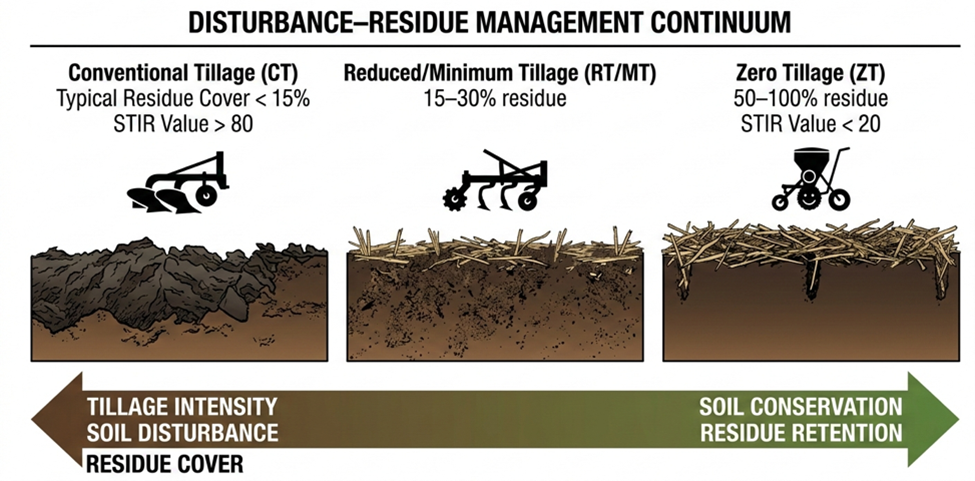
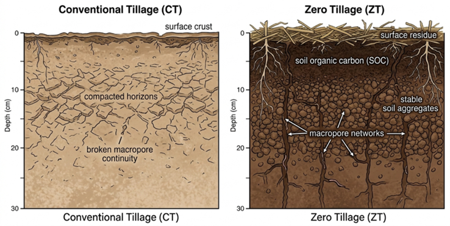
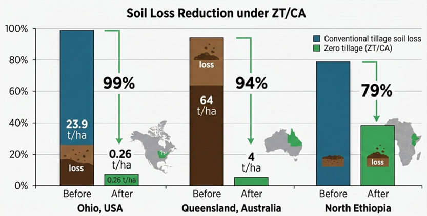
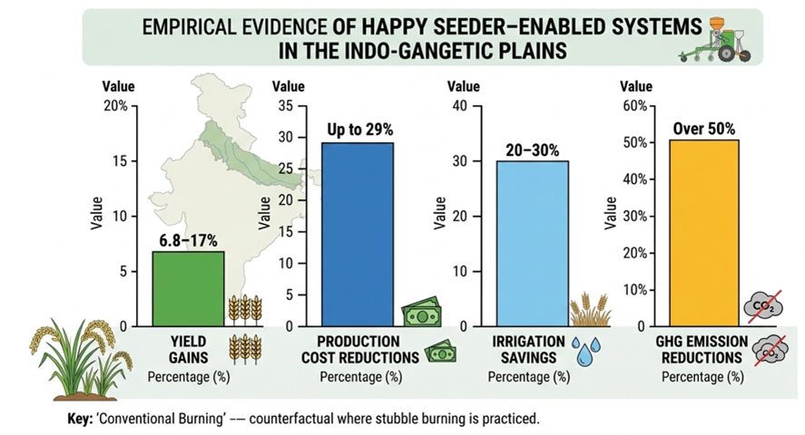
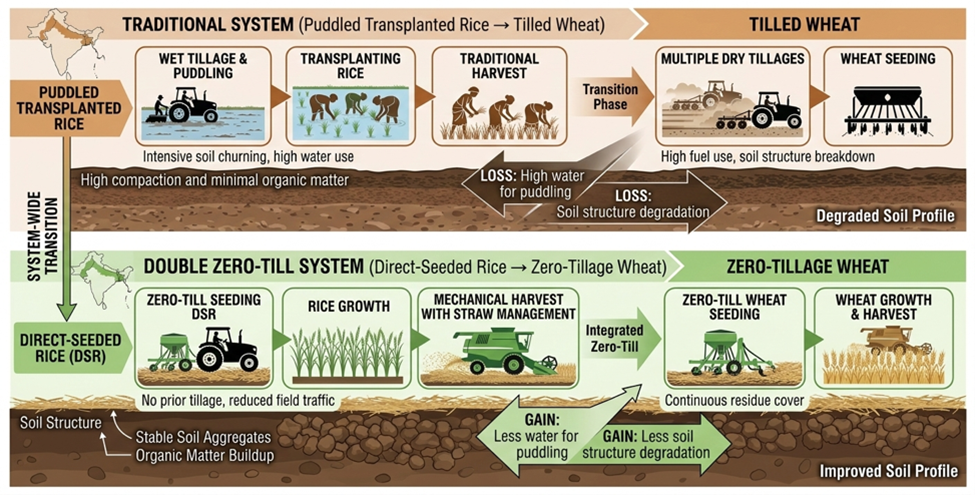
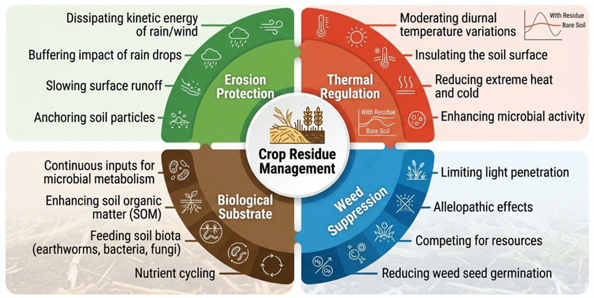
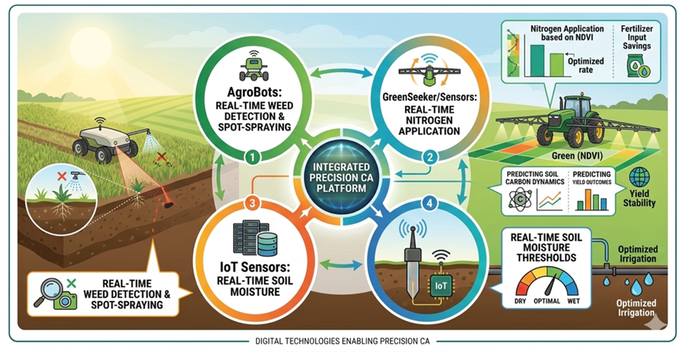

## Historical evolution and the conceptual paradigm shift in global tillage systems

Tillage, or the mechanical manipulation of soil, has been the main biophysical intervention that has made sedentary agriculture possible for about five thousand years. The first signs of this can be found in the fertile crescent areas of Mesopotamia and the alluvial systems of the Nile, Tigris, and Indus river valleys [@Farooq2014]. The shift from nomadic subsistence methods to organized crop cultivation was closely linked to the practical realization that loosening the soil improved seed-soil contact, aeration, and moisture infiltration, which in turn made germination and crop establishment more efficient. By about 3000 BC, simple handheld tools had changed into animal-drawn ard and moldboard plows. This made soil inversion a common farming practice [@Farooq2014]. For hundreds of years, the goals of tillage stayed the same: to make a friable seedbed, suppress weeds mechanically, mix in crop residues and organic amendments, and speed up the mineralization of nutrients by increasing aerobic microbial activity and oxidation processes.

The mechanized traction and steel plow technologies that came about during the industrial revolution in the 1800s allowed for deep and wide soil inversion on a scale that had never been seen before. These new technologies made farming more productive, but they also made the soil less stable, more prone to erosion, and more likely to lose organic matter. The ecological effects became very clear during the Dust Bowl of the 1930s in the Midwest US, where heavy plowing and a long drought caused severe wind erosion and permanent loss of topsoil [@Farooq2014]. This crisis led to a major rethinking of traditional plow-based systems. For example, Edward H. Faulkner's Plowman's Folly (1943) questioned the agronomic orthodoxy of inversion tillage and stressed the importance of soil biological integrity.

In the years that followed, soil management began to focus more on conservation. In the middle of the twentieth century, direct seeding equipment got better, and in the 1960s, non-selective herbicides like Paraquat were introduced. This made it possible to control weeds without disturbing the soil mechanically [@Farooq2014]. By the 1970s, reduced and zero-tillage systems had spread to places like Brazil and West Africa. By the 1990s, conservation agriculture (CA) had become popular around the world. Modern CA frameworks are based on three main ideas: keeping the soil as undisturbed as possible, covering it with organic matter all the time, and using a variety of crop rotations or intercropping systems [@Rathika2025]. This paradigm shift signifies a systemic transition from productivity-oriented soil exploitation to resilience-focused stewardship and the sustainability of agroecosystems in the long term.

This review aims to (i) critically evaluate the impacts of different tillage systems on soil and water conservation, (ii) synthesize global and Indian evidence with quantitative insights, and (iii) identify key limitations and research gaps to guide future sustainable agricultural practices.

### Methodolgy of literature review

This study adopts a systematic narrative review approach to synthesize existing knowledge on tillage systems and their implications for soil and water conservation. A structured literature search was conducted across major scientific databases, including Web of Science, Scopus, ScienceDirect, and Google Scholar, covering publications from 1990 to 2025. The search utilized combinations of keywords such as *"conventional tillage," "zero tillage," "conservation agriculture," "soil carbon," "water conservation," "residue management," and "Indo-Gangetic Plains."* The inclusion criteria comprised peer-reviewed journal articles, review papers, and reports focusing on tillage impacts on soil, water, yield, or sustainability, particularly in major agroecological regions with emphasis on South Asia. Exclusion criteria included non-peerreviewed sources lacking scientific validation, studies without clear methodological descriptions, and regionally irrelevant or redundant datasets. In total, approximately 120 relevant studies were screened, of which around 70 high-quality sources were selected for synthesis. The analysis emphasizes comparative evaluation, trend identification, and critical interpretation rather than purely descriptive reporting.

## Technical classification and operational specifications of tillage systems

Modern tillage systems are grouped along a disturbance–residue management continuum. The difference between conventional, reduced, and zero tillage systems is measured by the percentage of crop residue left on the soil surface after planting and the frequency, depth, and intensity of soil manipulation (@fig-figure1) [@Kladivko2001]. In conventional tillage (CT), the first step is to invert the soil with moldboard or disc plows at depths of 20 to 30 cm. This is followed by several secondary tillage passes to improve the seedbed. This process leaves less than 15% of the surface residue and causes a lot of disruption to soil aggregates and pore continuity [@Kladivko2001]. On the other hand, reduced or minimum tillage (RT/MT) systems use shallower non-inversion tools like chisel plows or cultivators, limit the number of passes through the field, and keep 15–30% residue cover on the ground. This makes the soil less likely to be disturbed and less likely to erode [@Kladivko2001]. Zero tillage (ZT), also called no-till, completely stops primary soil inversion. Instead of turning the soil over, seeds are placed directly into undisturbed soil through narrow slots made by special seed drills. This keeps more than 30% (often \>60%) of the surface residue cover [@Kladivko2001]. The operational specifications of these systems include the layout of the machinery, the amount of draft power needed, the amount of fuel used, the resistance to soil penetration, and the amount of traffic, all of which affect soil bulk density, aggregate stability, hydraulic conductivity, and carbon dynamics. In this way, the classification framework combines both agronomic functionality and measurable biophysical indicators, giving us a standard way to judge how well a system works in different agroecological settings.

{#fig-figure1 width="384"}

### Conventional tillage framework

Conventional Tillage (CT) is structured as a sequential two-stage system consisting of primary and secondary tillage interventions, each aimed at achieving specific yet interconnected soil conditioning goals [@Kladivko2001]. Moldboard plows, disc plows, or heavy rotary tillers are used for primary tillage to turn the soil over to depths of 15 to 30 cm. This causes a lot of soil movement and aggregate disruption [@Kladivko2001]. This process of inversion breaks up compacted horizons, covers up surface residues and weed biomass, and makes it easier to mix fertilizers and soil amendments into the plow layer. However, the extensive disturbance speeds up the oxidation of soil organic matter, breaks up the continuity of macropores, and makes the structure more likely to break down.

Secondary tillage comes after primary inversion and is done with tools like tandem harrows, disc harrows, spike-tooth harrows, or field cultivators. This breaks up soil clods even more, makes the size distribution of aggregates more even, and creates a flat, uniform seedbed that is best for mechanized planting [@Kladivko2001]. These repeated passes break up the soil more and make it easier to work with in the short term, but they also use more fuel, require more workers, and make it more likely that a crust will form on the surface. From a residue management point of view, CT systems usually keep less than 15% of the surface cover after planting because most of the crop residues are buried or mixed in during inversion [@Chivenge2007]. This low residue retention exposes the soil surface to direct raindrop impact and wind shear forces, which greatly increases the risk of water and aeolian erosion, nutrient runoff, and long-term damage to the soil's physical integrity.

### Reduced and minimum tillage systems

Reduced or minimum tillage (RT/MT) systems are a group of different ways to manage soil that are designed to reduce the amount, depth, and frequency of mechanical disturbance compared to traditional inversion-based methods [@Kladivko2001]. These systems usually get rid of one or more field operations, like fall plowing, or replace high-disturbance tools with lower-impact ones. This cuts down on the total amount of soil that is moved and the amount of fuel that is used [@Franzluebbers2004]. RT/MT frameworks are made to keep about 15–30% of the soil surface residue cover after planting, which protects against erosion while still getting some of the benefits of seedbed preparation [@Chivenge2007].

This classification includes a number of different technical methods. Mulch tillage uses tools like chisel plows, sweeps, or field cultivators that don't turn the soil over but do disturb the whole surface. These tools also keep at least 30% of the crop residue cover, which is the minimum amount of cover that is usually required for conservation tillage systems [@Chivenge2007]. This system keeps the soil temperature from changing too much, stops moisture from evaporating, and makes it easier for water to get into the soil while still allowing for mechanical weed control [@Jayaraman2021].

Strip tillage is a type of disturbance model that only affects narrow bands, usually 15 to 20 cm wide, that will be future crop rows. The areas between the rows stay undisturbed and covered in residue [@Kladivko2001]. This zonal soil conditioning method makes a seedbed that is thermally and structurally optimized right below the planting line. This helps roots grow and take in nutrients more quickly in the early season, while also protecting the soil between rows with residue.

Ridge tillage, on the other hand, is when soil ridges are built up and kept up during the growing season so that crops can be planted on them [@Franzluebbers2004]. When planting, residues are moved mechanically from the ridge crest to the furrows next to it. This makes it easier for seeds to come into contact with the soil in a specific area, while keeping the residue in the inter-ridge areas to help prevent erosion and keep moisture in. RT/MT systems are a middle ground between agronomic operability and better soil conservation results [@Kladivko2001].

### Zero tillage and direct seeding

Zero tillage (ZT), also known as no-till or direct drilling, is the most intensive type of soil management that is good for the environment. It involves completely stopping mechanical soil disturbance between cropping cycles [@Derpsch2010]. In this system, the soil profile stays structurally sound from one harvest to the next. The only time it gets disturbed is during planting, when a narrow slit or slot is made to put seed and, if needed, basal fertilizer at the right depth [@Franzluebbers2004]. This localized disturbance is usually done with special seeding machines that have disc openers, inverted-T openers, or heavy-duty tine-based drills that can get through thick surface residue layers and soil of different strengths while keeping a precise depth control and seed-soil contact [@Kladivko2001].

{#fig-figure2 width="384"}

ZT systems keep 50% to 100% of the soil surface covered by crop residue, which is much more than the minimum conservation level (@fig-figure2). This makes them the best protection against raindrop impact, surface sealing, and wind erosion [@Chivenge2007]. The layer of residue that is kept acts as a biophysical buffer, keeping the temperature of the soil stable, lowering the amount of moisture that evaporates, speeding up the rate at which water enters the soil, and keeping the soil stable by adding organic matter over time. Also, not having an inversion stops the oxidation of soil organic carbon and keeps the macropores open, which helps the soil structure get better and the carbon stay in the ground for a long time. However, to make ZT work, weed management strategies must be integrated, often using chemical or cover-crop-based methods to make up for the lack of mechanical weed control [@Franzluebbers2004]. Zero tillage is a change in the way crops are planted that focuses on soil integrity and system resilience instead of short-term changes to the way the soil is tilled [@Derpsch2010].

### Soil Tillage Intensity Rating (STIR)

The Soil Tillage Intensity Rating (STIR) was created by the United States Department of Agriculture (USDA) Natural Resources Conservation Service (NRCS) to make it possible to compare different tillage systems quantitatively. It is a standardized, operation-based metric for measuring cumulative soil disturbance over a full cropping cycle [@Claassen2018]. The STIR framework includes all field operations that happen between harvests, so it gives a system-level assessment instead of a single-pass assessment. It takes into account several mechanistic factors, such as the type of implement, the depth of tillage, the speed of operation, and the percentage of soil surface area disturbed during each operation. This lets you make a weighted guess about how intense the disturbance is.

STIR takes into account both the physical features of tillage equipment and the changing conditions in the field where work is done. It then turns qualitative management practices into a continuous numerical index that shows how much soil has been disturbed overall. Higher STIR values mean that the soil is disturbed more, which is usually the case with inversion-based conventional systems. On the other hand, reduced and zero-tillage systems have lower STIR scores because they don't disturb the soil as much in terms of depth, frequency, and surface disruption [@Claassen2018]. So, the index is an important tool for decision-making and benchmarking in conservation planning. It lets agronomists and policymakers check if they are following soil conservation rules, compare management strategies across agroecological zones, and look at the long-term effects of tillage intensity on soil structure, erosion risk, and sustainability outcomes.

As summarized in @tbl-tillage, zero tillage systems are characterized by high residue retention (50–100%) and low STIR values (\<20), distinguishing them clearly from conventional tillage practices that involve intensive soil disturbance and minimal surface cover [@Kladivko2001].

*Note: Values compiled from multiple studies across agroecological regions; variability dependson soil type, climate, and management practices.*

| Tillage System | Typical Residue Cover (%) | Typical STIR Value | Key Implements |
|-------------------|-------------------|-----------------|-----------------|
| Conventional Tillage | \< 15% | \> 80 (often 100–200) | Moldboard plow, Disc harrow |
| Reduced / Minimum Tillage | 15% – 30% | 30 – 80 | Chisel plow, Field cultivator |
| Conservation (Mulch) Till | \> 30% | \< 30 | High-residue drills, Sweeps |
| Zero Tillage (No-Till) | 50% – 100% | \< 20 (often 5–10) | No-till drill, Happy Seeder |

: Comparison of tillage systems by residue cover, STIR value, and key implements {#tbl-tillage}

## Impacts on soil physical, chemical, and biological properties

The choice of a tillage system causes changes in the soil's physical, chemical, and biological properties on multiple levels, which in turn causes changes in the soil-plant-atmosphere continuum. Tillage-driven disturbance changes the structure of the soil, the size of the pores, the stability of the aggregates, the connectivity of the microbial habitat, and the dynamics of nutrient cycling. This affects both short-term crop performance and long-term ecosystem functionality [@Farooq2014]. Conventional tillage (CT), specifically, results in an immediate augmentation of soil macroporosity and a temporary improvement in aeration, attributed to mechanical loosening and aggregate disruption [@Charles2024a]. This brief enhancement in gas exchange and infiltration may expedite microbial activity and organic matter mineralization by augmenting oxygen availability and exposing previously shielded soil organic fractions to oxidative decomposition processes.

Nonetheless, these preliminary physical advantages are generally transient. Repeatedly turning and breaking up soil makes its aggregates weaker, breaks up fungal hyphal networks, makes structures less stable, and makes them more likely to compact, crust over, and erode. The faster mineralization that comes with CT leads to a decrease in soil organic carbon (SOC) stocks over time, especially in the upper soil horizons where biological activity is highest [@Farooq2014]. The long-term effect is usually that the soil becomes less stable, less able to store carbon, and more sensitive to environmental stressors like drought and heavy rain. So, while traditional tillage may help with seedbed preparation in the short term, using it for a long time can throw off the physical, chemical, and biological balance of soil systems.

### Soil structure and aggregate stability

Soil aggregation is one of the most sensitive and all-encompassing signs of changes in soil quality caused by tillage. This is because the movement of aggregates shows the balance between mechanical disruption and biological stabilization processes. Soil aggregates are the basic building blocks of the pedosphere. They are made up of mineral particles that are held together by organic "glues" like polysaccharides, microbial metabolites, fungal hyphae, and root-derived exudates. These materials work together to make the soil more cohesive and stable [@Charles2024a]. These aggregates control the structure of pores, how much water they hold, how well they aerate, and how well they protect soil organic matter within microaggregates. This affects how well carbon is stabilized and how well nutrients are cycled.

Intensive conventional tillage breaks up macroaggregates mechanically by using repeated inversion and shearing forces. This breaks up fungal networks and root structures that help make aggregates. This physical breakdown makes organic substrates that were previously hidden more accessible to microbes and aerobic decomposition, speeding up mineralization processes and making structures less stable over time. Long-term studies in the real world, like those done at the Kellogg Biological Station (KBS), have shown that zero tillage systems gradually improve soil aggregation. After about ten years of continuous use, the stability of the aggregates has improved significantly [@Charles2024a]. On the other hand, even one inversion tillage event on soil that has been managed with no-till for a long time can undo a lot of the structural gains that have been made, making the aggregate stability drop to levels that are similar to those of systems that have been tilled in the traditional way for decades. These results show that tillage affects soil structure in a nonlinear and cumulative way. They also show that aggregate stability is both a diagnostic metric and a mechanistic pathway that connects management practices to long-term soil health outcomes.

### Soil Organic Carbon (SOC) and carbon sequestration

Conservation Agriculture (CA) systems are widely recognized for their potential to enhance soil carbon dynamics and increase soil organic carbon (SOC) stocks, thereby contributing to atmospheric carbon mitigation [@Rathika2025]. Zero tillage (ZT) systems minimize soil disturbance, reduce aggregate breakdown, and limit the exposure of physically protected organic carbon to microbial oxidation, particularly when combined with crop residue retention [@Xing2024]. Long-term conservation agriculture experiments have demonstrated that SOC can increase at rates of approximately 0.2-0.4 Mg C ha⁻¹ yr⁻¹ under zero tillage with residue retention, particularly in the upper soil layers (0-15 cm), due to enhanced microaggregate formation and continuous organic matter inputs.

Evidence from long-term trials in the Indo-Gangetic Plains indicates that ZT-based systems not only improve surface SOC stocks but also enhance carbon use efficiency and net carbon balance compared to conventional tillage systems [@Chaudhary2025; @Kumar2025]. These improvements are attributed to increased biomass production, reduced fuel consumption, and lower fossil energy inputs. However, several studies report that SOC accumulation is often stratified near the surface, with limited changes observed in deeper soil layers (\>30cm), raising questions about the long-term stability and whole-profile carbon sequestration potential. Despite these uncertainties, meta-analytical studies consistently show that CA systems improve overall carbon sustainability indices by integrating enhanced carbon retention with reduced external energy dependence [@Jayaraman2021]. Therefore, SOC management under reduced disturbance systems represents a critical pathway linking tillage practices with climate-resilient and resource-efficient agricultural systems.

### Soil biological community and ecosystem services

Soil is a living ecosystem that changes over time and is home to many different types of microbes and animals, such as bacteria, fungi, actinomycetes, earthworms, and micro-invertebrates. These organisms work together to control nutrient cycling, change organic matter, and keep the structure of the soil [@Mandal2025]. These organisms create complex trophic and symbiotic networks that support important ecosystem services like decomposition, nitrogen fixation, carbon stabilization, and keeping soil-borne pathogens from spreading. By breaking up fungal hyphal networks, collapsing earthworm burrows, and changing the continuity of habitats, conventional tillage mechanically breaks these biological links. This makes microbial biomass less stable and ecosystems less connected [@Kladivko2001]. Repeated disturbances like these can reduce the variety of functions and make the soil less resilient over time.

Conservation agriculture systems, especially zero tillage (ZT), on the other hand, promote biological stability by keeping soil disturbance to a minimum and maintaining a constant cover of surface residue. This serves as both a protective habitat and a steady source of substrate for decomposer organisms [@Jayaraman2021]. The residue layer keeps the temperature and moisture levels in the microclimate stable, which makes it easier for microbes to grow and enzymes to work better. Because of this, soils managed by ZT often have better microbial efficiency in recycling nutrients, faster decomposition of residues under stable conditions, and better timing of nutrient release with crop needs [@Bhan2014]. These biological improvements make the soil more fertile, help plants use nutrients more efficiently, and make the agroecosystem more productive. Thus, tillage intensity serves as a principal factor influencing soil biodiversity patterns and related ecosystem services, with reduced-disturbance systems typically promoting more intricate and functionally integrated soil biological communities.

The trends summarized in table @tbl-efff are derived from a synthesis of experimental and review studies examining the impacts of conventional, reduced, and zero tillage on soil structure, organic carbon dynamics, microbial activity, and moisture retention across diverse agroecological conditions [@Bhan2014; @King1985; @Kumar2025].

| Property           | Conventional | Reduced  | Zero tillage |
|--------------------|--------------|----------|--------------|
| Soil structure     | Disrupted    | Moderate | Stable       |
| SOC                | Declining    | Moderate | Increasing   |
| Microbial activity | Reduced      | Moderate | High         |
| Moisture retention | Low          | Moderate | High         |

: Comparative effects of tillage systems on soil properties {#tbl-efff}

## Hydrological implications and water resource management

Hydrological responses to tillage systems are highly dependent on soil texture and rainfall intensity. Coarse-textured soils typically exhibit rapid improvements in infiltration under zero tillage, whereas fine-textured soils may experience slower structural recovery due to compaction and clay dispersion. Similarly, high-intensity rainfall events amplify differences between conventional and conservation systems, with residue cover playing a critical role in reducing runoff.

Water conservation is one of the most important and immediate benefits of reducing tillage intensity, especially in rainfed and semi-arid agroecosystems where changes in rainfall and evaporation make it hard for crops to grow [@Jayaraman2021]. Reduced-disturbance systems change how water moves through the soil in two ways: through physical changes and changes to the surface. Conservation-oriented tillage practices protect soil pore continuity, increase aggregate stability, and keep macropore networks that help water move down and through the soil by minimizing mechanical disruption. At the same time, keeping surface residues on the ground changes the soil-atmosphere interface. This lowers direct evaporative losses by acting as a protective mulch layer that keeps solar radiation exposure and wind-driven moisture loss to a minimum.

Covering the surface with residue also lessens the energy of raindrops hitting the surface, which lowers surface sealing, crust formation, and runoff generation. All of these things work together to make infiltration more efficient and increase the potential for groundwater recharge. Also, low-disturbance systems make soil structure stronger, which helps it hold more water by keeping microaggregates stable. These microaggregates protect organic matter and help improve the distribution of soil porosity. These changes to the water cycle make better use of rain, protect crops from dry spells during the growing season, and help keep soil moisture levels more stable during important growth stages. So, less tillage not only saves water directly, but it also makes water resource management better overall by improving infiltration dynamics, cutting down on non-productive water losses, and making the system more resilient to changes in the weather [@Jayaraman2021].

### Infiltration and runoff dynamics

The intensity of tillage has a direct effect on how water moves through the soil and how it is divided on the surface, especially by changing the structure of the surface and the continuity of the pores. In conventional tillage (CT) systems, the lack of protective residue cover leaves bare soil open to the kinetic energy of rain, which breaks down aggregates and creates surface crusts or structural "seals" during rain events [@Charles2024a]. This crusting effect makes the surface less porous, slows down the flow of water through the soil, and stops water from moving down into the soil profile. As the ability of the soil to absorb water decreases, extra rainwater is moved to the surface as runoff. This makes it more likely that topsoil will erode, nutrients will be lost, and water will be lost through sediment [@Jayaraman2021]. The combination of less infiltration and more runoff can make it harder for soil to hold moisture, recharge groundwater, and improve the quality of water downstream.

In contrast, zero tillage (ZT) systems keep a constant layer of surface residue cover, which acts as a protective mulch layer that absorbs the energy of raindrops and keeps aggregates from breaking apart [@Jayaraman2021]. This residue barrier keeps the soil's structure intact and keeps macropore networks alive. These networks are made up of root channels and soil fauna, like earthworm burrows, that create pathways for water to flow from the surface to deeper layers. Taking care of these biopores speeds up infiltration, lowers surface sealing, and redistributes water better within the profile [@Jayaraman2021]. Long-term real-world observations show that infiltration performance in well-established no-till systems can get close to levels seen in natural ecosystems that have been disturbed very little, like forest soils, where stable structure and constant organic inputs support high hydraulic conductivity [@Charles2024a]. All of these changes to the water cycle that happen under ZT lead to better use of rainfall, less risk of erosion, and a stronger system when it rains in different ways (@fig-figure3).

Field studies from the United States, Australia, Africa, and Europe demonstrate substantial reductions in runoff and soil loss under zero tillage and conservation agriculture systems, with soil erosion reductions reaching up to 99% in some cases (@tbl-runoff) [@Jayaraman2021].

*Note: Values compiled from multiple studies across agroecological regions; variability dependson soil type, climate, and management practices.*

| Location | Cropping System | Runoff Reduction under ZT/CA (%) | Soil Loss Reduction under ZT/CA (%) |
|------------------|--------------|-----------------|-------------------|
| Ohio, USA | Maize | N/A | 99% (from 23.9 to 0.26 t/ha) |
| Queensland, Australia | Wheat | N/A | 94% (from 64 to 4 t/ha) |
| North Ethiopia | Wheat–Teff | N/A | 79% |
| Central Croatia | Soybean | 77% | N/A |
| Northeast Italy | Variable | 58% | N/A |

: Reported runoff and soil loss reductions under zero tillage/conservation agriculture across selected global locations {#tbl-runoff}

{#fig-figure3 width="384"}

### Water-holding capacity and drought resilience

Zero Tillage (ZT) systems increase the soil's ability to hold water by improving the accumulation of soil organic carbon (SOC) and the stability of the soil structure. Both of these things affect the size of the pores and the moisture retention of aggregates [@Jayaraman2021]. More SOC leads to a larger specific surface area and better formation of stable microaggregates. Together, these things make the soil better at holding water that plants can use in the root zone. Also, better soil structure from long-term low-disturbance management encourages a balanced pore network, which makes it easier for macropores to let water in and micropores to hold water. These changes to the structure and carbon content of the soil make it better able to handle short-term precipitation shortages and keep crops watered during dry spells.

Keeping surface residue on the ground helps plants survive droughts by acting as a thermal and evaporative regulator. The mulch layer creates a physical barrier between the soil surface and the atmosphere, which reduces direct exposure to sunlight, keeps the soil temperature from changing too much during the day, and stops water from evaporating [@Derpsch2010]. This dual thermal–hydrological buffering effect keeps soil moisture available for longer, which is especially important when there is a drought or high temperatures [@Bhan2014].

In the Indian agroecological context, zero-tillage wheat systems have shown to be more resistant to terminal heat stress, especially during the grain-filling phase, when high temperatures can greatly lower yield potential [@Bhan2014]. Better soil moisture availability under ZT helps transpiration continue, which cools the canopy through evaporation and reduces physiological stress caused by heat. The combination of improved SOC, stable soil structure, and microclimatic regulation through residue under ZT makes crops more resistant to drought, helps them use water more efficiently, and keeps yields stable even when the weather changes.

### Challenges: nutrient leaching and cold soils

Zero tillage (ZT) can help soil hold more water and stay stable, but the changes it makes to the water cycle may create problems for farming and the environment in certain situations. In high-latitude and cool-temperate areas, a lot of surface residue can stay on the ground, which can lower the temperature of the soil surface by blocking solar radiation and changing the way heat flows, especially in early spring [@Derpsch2010]. The soil will be cooler and wetter as a result, which could make it take longer for the soil to dry out, slow down the germination process, and delay planting. This could make it harder for crops to grow and establish themselves early in the season. This kind of thermal moderation can help keep moisture, but it can also slow down degree-day accumulation and change the timing of crop growth in places where the temperature is limited.

Conservation agriculture (CA) systems generally reduce surface runoff and the loss of nutrients that comes with it. This makes it less likely for nitrate and phosphorus to get into surface water bodies and lowers the risk of eutrophication [@Jayaraman2021]. The maintenance of soil structure and improved infiltration in zero tillage (ZT) reduces nutrient displacement caused by erosion, which leads to better surface water quality. However, in some types of soil and hydrogeological conditions, especially coarse-textured soils with high permeability, the increased continuity of macropores and preferential flow pathways may help soluble nutrients, especially nitrates, move vertically beyond the root zone. This improved transport through infiltration can increase the risk of nitrate leaching into groundwater systems when there is too much rain or nitrogen is not managed well.

Because of this, ZT and CA systems have a lot of hydrological and environmental benefits, but they only work well in certain places. To balance the benefits of saving water with the risks of leaching, farmers need to use integrated nutrient management strategies and regionally adapted agronomic practices.

## Residue management: The strategic pivot of conservation agriculture

Crop residue management is the most important operational and ecological factor for conservation tillage systems. It is the main link between protecting the soil, cycling nutrients, and controlling water flow. In traditional management systems, post-harvest residues are often seen as obstacles to mechanized field work. This leads to practices like removing the residues, burning them in the open field, or deep incorporation through inversion tillage [@Chaudhary2025]. These methods lower the amount of organic matter on the surface and stop residues from helping to stabilize soil structure and add carbon. Burning residue, in particular, quickly releases carbon and loses valuable organic matter, while deep burial speeds up decomposition in better aerobic conditions.

Conservation agriculture (CA), on the other hand, sees crop residues as strategic biophysical assets instead of agronomic problems. It emphasizes keeping them on the soil surface as a functional part of system design [@Chivenge2007]. Covering the surface with residue helps control erosion by spreading out the energy of raindrops, slowing down runoff, and keeping soil particles from breaking off. At the same time, residues help save water by lowering the amount of water lost through evaporation and keeping soil temperatures from changing too much. This makes the microclimate in the root zone more stable. Retained residues create a constant substrate for microbial decomposition, which helps recycle nutrients, build up organic matter in the soil, and support biological activity.

So, managing residues is the logistical and conceptual center of conservation agriculture. It turns post-harvest biomass from what people think of as trash into a resource that protects soil, controls water, stores carbon, and keeps agroecosystems healthy over the long term [@Chivenge2007].

### Benefits of residue mulching

Within conservation tillage frameworks, a minimum threshold of approximately 30% surface residue cover is commonly used as an operational criterion for classifying a system as "conservation tillage," reflecting its capacity to deliver measurable soil protection benefits [@Kladivko2001]. Residue mulching provides multiple synergistic agronomic and ecological functions that collectively enhance soil system stability.

Erosion protection is one of the primary benefits, as the residue layer dissipates the kinetic energy of wind and rainfall, reducing soil particle detachment, surface sealing, and runoff generation [@Kladivko2001]. By shielding the soil surface, mulch minimizes both aeolian and water-driven erosion processes, thereby conserving topsoil and associated nutrients.

Thermal regulation represents another critical function, as surface residues moderate soil temperature fluctuations by reducing direct solar radiation exposure and altering heat exchange dynamics between the soil and atmosphere [@Chaudhary2025]. This buffering effect decreases extreme diurnal temperature variations, promoting more stable conditions for seed germination, root development, and microbial activity.

Weed suppression occurs through both physical and biochemical mechanisms. The residue layer limits light penetration, thereby inhibiting photodependent weed seed germination and early seedling establishment. Additionally, certain decomposing residues may release allelopathic compounds that further suppress weed growth, reducing reliance on chemical herbicides in integrated systems [@Carr2013].

Finally, residues serve as a biological substrate, supplying continuous organic inputs that fuel microbial metabolism and support soil faunal communities [@Kladivko2001]. This sustained carbon source enhances nutrient cycling, promotes soil organic matter formation, and strengthens overall soil biological activity, thereby reinforcing ecosystem functionality within conservation-based management systems.

### Nitrogen immobilization and the C:N ratio

A major technical challenge in high-residue conservation systems is nitrogen (N) immobilization, which results from the biochemical processes involved in breaking down residue, especially when using carbon-rich crop biomass like wheat and rice straw, which has a high carbon-to-nitrogen (C:N) ratio [@Derpsch2010]. Microbial communities in soil need enough nitrogen to make the proteins and enzymes that cells need to break down complex organic carbon substrates. When residues have high C:N ratios, microbial decomposers may not have enough nitrogen, so they take in inorganic nitrogen from the soil around them to meet their metabolic needs. This process, called nitrogen immobilization, temporarily lowers the amount of nitrogen that plants can use in the root zone. This could slow down the growth and health of crops in the early stages.

From a nutrient management point of view, this temporary immobilization phase often requires strategic actions, such as applying slightly more nitrogen fertilizer at the beginning to make up for the microbes' needs or adding leguminous crops to rotation systems to fix nitrogen from the air and make it more available at the system level [@Derpsch2010]. These kinds of integrated nutrient management strategies help balance carbon inputs from residues with nitrogen supply that is in sync with them.

Over long periods of time, usually 4 to 5 years under stable conservation management, the soil system may reach a new biogeochemical equilibrium. This is marked by more organic matter building up in the soil and better nutrient cycling efficiency [@Derpsch2010]. As organic matter pools stabilize and microbial turnover continues, nitrogen that was previously stored can slowly turn into minerals. This can help recycle nutrients inside the body, which could mean less fertilizer needs to be added from outside in the long term. Consequently, efficient residue-based conservation systems necessitate adaptive nitrogen management strategies that consider temporal variations in carbon-nitrogen interactions within developing soil ecosystems.

## Global adoption trends and case studies

The global trend in tillage systems is slowly but surely moving toward no-till and reduced-tillage methods. This is because people are becoming more aware of soil degradation, climate change, cost-cutting measures, and long-term sustainability goals [@Jayaraman2021]. Even though the overall trend of adoption is going up, the rates of implementation are very different depending on where you live, the type of farming you do, the size of your farm, and the type of crops you grow. Mechanization levels, availability of residues, policy incentives, extension support, soil texture, climate constraints, and access to the right seeding technologies are some of the things that affect variability.

In many large-scale mechanized farming systems, especially those that grow row crops and cereals, the use of conservation tillage has been made easier by improvements in precision seeders, equipment for managing residue, and weed control methods that use herbicides. On the other hand, in regions where smallholders are the majority, adoption patterns are often affected by competition for livestock feed, limited access to specialized machinery, and economic constraints that make it hard to switch [@Jayaraman2021]. The type of crop is also very important. For example, systems that grow high-biomass cereals leave enough residue to support surface mulching, but low-residue crops may make it harder to keep protective cover thresholds.

Even though there are differences between regions, long-term research shows that using zero and reduced tillage systems over a long period of time can help improve soil structure, save water, store carbon, and keep production stable even when the weather is bad [@Jayaraman2021]. As a result, global adoption trends indicate a gradual shift from disturbance-intensive soil management to conservation-based frameworks. However, adaptation to specific contexts is still necessary to meet agronomic, environmental, and socio-economic sustainability goals.

### North America: The United States and Canada

Conservation tillage has become widely used in North America, especially in the United States, for major commodity crops. This is due to both agronomic and economic reasons. Conservation tillage is used on a large part of the land where wheat (67%), corn (65%), and soybeans (70%) are grown, which shows that it is in line with large-scale mechanized agriculture. No-till systems make up about 45% of wheat acreage and 40% of soybean acreage within this larger group. This shows that zero-disturbance technologies are having a big impact on staple crop production [@Claassen2018]. The main reasons people use this technology are to reduce the risk of soil erosion, especially in areas that are prone to it, and to lower operational costs, especially fuel and labor costs that come with doing the same thing over and over again [@Farooq2014]. These economic and environmental benefits have made it more likely that reduced-disturbance frameworks will work in U.S. production systems for a long time.

In Canada, adoption patterns, especially in the Prairie Provinces, show an even bigger structural change. The use of no-till farming grew a lot, from about 5% in 1991 to 45% in 2006. At the same time, the use of conventional tillage fell from 65% to 25% [@AAFC2014]. This quick change shows how flexible Canadian grain systems are when it comes to policy incentives that promote conservation, new technology, and the need to protect soil. The Canadian experience also shows how no-till systems can be flexible in their operations. For example, farmers can use strategic or discretionary tillage when certain environmental conditions are present, like severe surface rutting or too much moisture in the soil during unusually wet seasons. Adaptive interventions stress that conservation systems work along a management continuum instead of as strict rules. This allows for context-sensitive changes while still meeting overall soil conservation goals.

### South America: Argentina and Brazil

One of the most important places in the world for conservation agriculture (CA) adoption is South America. The Pampas region of Argentina and the Cerrado biome of Brazil have especially high rates of CA adoption [@Farooq2014]. These agroecological zones are known for their heavy use of machines to grow grains, their large changes in rainfall from season to season, and their soil types, which are naturally prone to structural degradation and erosion when subjected to repeated inversion tillage. In these conditions, controlling erosion became an urgent priority for both agriculture and the environment, speeding up the move toward systems with no disturbance.

The widespread use of no-till in these areas was made possible by the coming together of different technological advances. The widespread availability of broad-spectrum herbicides, especially glyphosate, made it possible to manage weeds chemically without disturbing the soil mechanically, which meant that farmers didn't have to plow the field over and over again [@Farooq2014]. At the same time, the creation and spread of heavy-duty direct seeding equipment that could work in fields with a lot of residue and different soil types made it possible to place seeds reliably without having to invert the soil first. All of these improvements made it possible to change the way we farm from conventional tillage to no-till-based production models across the board.

As a result, no-till soybean and maize farming now takes up a lot of land in these areas. This is because land management philosophy has changed to focus on soil conservation, residue retention, and long-term sustainability [@Farooq2014]. The experience in South America shows how technological progress, environmental need, and market-driven commodity production can all work together to quickly and widely adopt conservation-oriented tillage systems.

### Sub-Saharan Africa: Restoration of degraded soils

In Sub-Saharan Africa, conservation agriculture (CA) is becoming more popular as a way to fix damaged soils. This is especially true in places like Northern Ghana, where long-term intensive hand-hoeing or repeated moldboard plowing has caused the soil to lose its structure, organic matter, and fertility [@Naab2017]. In these situations, CA-based methods try to restore soil health by reducing mechanical disturbance, keeping residue, and improving nutrient cycling. This solves both biophysical degradation and production limits.

Short- to medium-term empirical evaluations (about four years) show that CA systems may sometimes have lower yields at first compared to conventional tillage. This is especially true during transitional phases when soil biological and structural equilibria are being re-established. Even though there may be some variation in early yields, economic studies show that no-till systems can lower the cost of growing crops like maize and soybeans by about 20–29%. This is mostly because they save a lot of money on labor and don't need to do the same field work over and over again [@Naab2017]. These cost savings are especially important in farming systems where there aren't enough workers, mechanization isn't available, and manual labor is a big part of the cost of production.

Over time, as the amount of organic matter in the soil, the way it clumps together, and the efficiency of nutrient cycling all get better, CA systems could make yields more stable and profitable. This would be a win-win situation for the environment and the economy [@Naab2017]. This long-term trend shows how important it is to think about time when judging conservation systems. The initial costs of switching may be worth it in the long run because they lead to more fertile, resilient, and efficient use of resources.

### Critical synthesis and research gaps

Despite extensive global evidence supporting conservation tillage, findings are not universally consistent. Yield advantages under zero tillage vary significantly depending on soil texture, rainfall patterns, and duration of adoption. For instance, coarse-textured soils often show faster hydrological benefits, whereas fine-textured soils may experience delayed structural improvements.

Conflicting evidence also exists regarding soil organic carbon sequestration, with some studies reporting surface accumulation without significant changes in deeper layers. Similarly, while reduced runoff is widely documented, the magnitude of improvement varies across climatic zones.

Key research gaps include:

-   Limited long-term experimental data from smallholder systems
-   Insufficient integration of socio-economic and biophysical analyses
-   Lack of standardized methodologies for comparing tillage systems

Future research should focus on multi-location long-term trials and meta-analytical synthesis to resolve inconsistencies.

## Conservation agriculture in the Indian context: The rice-wheat system

India's use of conservation tillage is mostly based on the Rice-Wheat Cropping System (RWCS) of the Indo-Gangetic Plains (IGP). This is a high-intensity production area that is very important for national food security and the supply of staple grains [@Bhan2014]. The RWCS is one of the most important agroecosystems in the country because it supports large-scale rice and wheat farming in a yearly cycle. The traditional management approach, which involves puddled transplanted rice (PTR) followed by several intensive tillage operations to establish wheat, has shown more and more that it has structural and environmental problems [@Chaudhary2025].

Puddling, which is when you wet till the soil over and over again while it is saturated, is meant to cut down on percolation losses and make it easier to transplant rice. This method works well for keeping water in rice fields for a short time, but it breaks down the soil structure, makes aggregates less stable, and creates compacted subsurface layers (plow pans) that can make it harder for roots to grow and change the way water moves in future crops [@Chaudhary2025]. The intensive tillage needed to plant wheat also disturbs the soil more, speeds up the oxidation of organic carbon, and raises the costs of production by increasing the need for fuel, labor, and machinery.

Consequently, the conventional RWCS framework is progressively acknowledged as resource-intensive and ecologically unsustainable, especially amid decreasing groundwater levels, escalating input costs, and climate variability [@Chaudhary2025]. These challenges have prompted the investigation and incorporation of conservation agriculture-based alternatives, such as zero tillage wheat and residue retention strategies, to bolster system resilience, enhance resource-use efficiency, and sustain long-term productivity in the Indo-Gangetic Plains.

### The stubble burning crisis and environmental health

In the Indo-Gangetic Plains (IGP), rice harvesting is done mostly by machines, especially combine harvesters. This leaves a lot of rice leftovers in the field after the harvest. Because there isn't much time between when rice is harvested and when wheat is planted, and because regular seed drills don't work well in high-residue conditions, about 2.5 million farmers in northwestern India use residue burning as a quick way to clear land so that wheat can be planted on time [@Saifuddin2025]. This practice comes about because of logistical problems in the Rice–Wheat Cropping System, not because it is the best agronomic choice.

The amount of residue burned is important for the environment. States like Punjab and Haryana burn about 11.3 million tons of crop waste every year. This releases a lot of fine particulate matter (PM2.5), carbon monoxide (CO), carbon dioxide (CO₂), and nitrogen oxides (NO₂) [@Saifuddin2025]. These emissions cause serious air pollution problems in northern India, which makes breathing and heart problems worse and makes the air quality in the region worse [@Chaudhary2025]. The sporadic occurrence of stubble burning, especially in post-monsoon periods, exacerbates atmospheric stagnation, increasing pollutant concentration levels.

Burning waste not only affects the quality of the air, but it also causes important nutrient losses in the soil. Burning changes organic carbon and nitrogen that are useful to living things into gases or unstable ash residues. This messes up the way nutrients move through the soil and makes it less fertile over time. Burning organic matter repeatedly removes it from the soil, which lowers the potential for soil organic matter to build up and weakens the structure of the soil. This limits productivity in intensive cropping systems [@Saifuddin2025]. Stubble burning is an environmental health emergency and a challenge to soil sustainability. This shows that conservation agriculture frameworks need integrated residue management solutions.

### Technological Solutions: Happy Seeder and Zero-Till Wheat

The use of the "Turbo Happy Seeder" to set up zero-tillage wheat systems is a key technological solution to the problems of managing residue in the Indo-Gangetic Plains. This system lets farmers plant wheat directly into standing rice residues without having to till the land or burn the residues first [@Chaudhary2025]. This mechanized solution combines handling of residue and placement of seeds into one process, so that the machine's cutting and seeding assemblies can work well even when there is a lot of biomass. The system supports timely wheat establishment, preserves soil structure, and keeps surface residue cover (@fig-figure4), all of which are in line with conservation agriculture (CA) principles [@Gorain2025]. This is because it doesn't require field preparation through inversion or residue removal.

Compared with residue-burning-based conventional wheat, Happy Seeder-enabled zero-tillage systems demonstrate higher yields, lower production costs, significant irrigation savings, and over 50% reduction in global warming potential (@tbl-econ).

*Note: Values compiled from multiple studies across agroecological regions; variability dependson soil type, climate, and management practices.*

| Metric | Conventional wheat (with Burning) | Happy Seeder Wheat (ZT) | Benefit of transition |
|--------------------|--------------------|------------------|---------------|
| Yield advantage | Baseline | +6.8% to 17% | Enhanced productivity [@Bhan2014] |
| Production costs | High (Diesel/Labor) | −11.7% to 29% | Reduced inputs [@Naab2017] |
| Irrigation water | Baseline | 20%–30% savings | Water conservation [@Chaudhary2025] |
| Global warming potential | High | \>50% reduction | Climate mitigation [@Chaudhary2025] |

: Agronomic, economic, and environmental comparison of conventional wheat (with residue burning) and Happy Seeder-based zero-tillage wheat {#tbl-econ}

{#fig-figure4 width="384"}

The Happy Seeder has several operational benefits, such as better residue retention, less soil disturbance, less fuel use, and less damage to the environment caused by burning stubble [@Chaudhary2025]. The system also helps keep moisture in the soil better and improves soil health over time when used consistently within CA frameworks. Even though these benefits for farming and the environment are great, widespread use is limited by economic and infrastructure problems. It costs a lot of money to buy machinery, and the equipment usually needs tractors with at least 45 horsepower or more, which makes it hard for farmers who don't have a lot of money to get [@Gorain2025].

To get around these problems, Custom Hiring Centres (CHCs) have come up as a useful new idea for institutions that lets people rent CA machinery without having to own it. By letting small and marginal farmers use zero-till equipment on a service basis, CHCs lower the cost of entry for farmers, help spread new technologies, and make it easier for farmers to adopt conservation-based wheat establishment practices on a larger scale [@HobbsResearchGate]. This service-oriented model makes things more inclusive and helps the Rice-Wheat Cropping System make the switch to more sustainable residue management.

### System-wide transitions: DSR and Double Zero-Till

The long-term goal of the Indo-Gangetic Plains (IGP) is to set up a "Double Zero-Till" system, which means that both rice and wheat phases can be grown without disturbing the soil with machines (@fig-figure5). This will replace the traditional puddled transplanted rice (PTR) system with direct-seeded rice (DSR) followed by zero-tillage wheat (ZTW) [@Chaudhary2025]. The goal of this change is to redesign the Rice–Wheat Cropping System so that it doesn't have to do the same tillage operations over and over again, uses less water for puddling, and uses resources more efficiently throughout the cropping cycle. By using DSR instead of saturated-field management, soil structure degradation caused by puddling is reduced, and subsurface compaction layers that block root growth and change how water moves through the soil are less likely to form.

{#fig-figure5 width="384"}

When combined with zero-till wheat (DSR–ZTW), the system makes a continuous production model based on conservation that has less soil disturbance, keeps more residue, and uses less energy. Long-term real-world tests show that the DSR–ZTW configuration uses less fuel, requires less labor, and has fewer mechanized field operations than the traditional PTR–conventional tillage wheat (PTR–CTW) system [@Chaudhary2025]. This means that it has better energy performance. Also, life-cycle assessments show that this double zero-till system cuts down on greenhouse gas emissions from methane production in puddled rice, carbon dioxide emissions from burning fuel, and nitrous oxide emissions from heavy soil disturbance.

Together, the DSR–ZTW system is a scalable way to achieve climate-smart intensification in the IGP. It does this by optimizing energy efficiency, lowering greenhouse gas emissions, and improving the long-term resilience of the soil [@Chaudhary2025].

## Economic foundations and socio-socioeconomic drivers

Economic factors, along with environmental and agronomic factors, play a big role in the shift from traditional tillage to conservation tillage systems. Farm-level decision-making is typically guided by risk–return optimization, input cost structures, labor availability, machinery access, and market stability, making tillage choice an integrated economic strategy rather than solely a soil management practice [@Farooq2014]. Zero tillage (ZT) and other conservation-oriented systems can help save resources and make inputs more efficient in the long run. However, adoption patterns are heavily affected by short-term financial constraints and perceived transition risks.

A significant impediment to the adoption of zero tillage is the operational "learning curve" linked to modifications in management practices, machinery calibration, weed control strategies, and residue handling protocols. Farmers may not be sure about the stability of their yields during the first transition phase, especially in systems where traditional tillage has historically been the norm for production [@Farooq2014]. This perceived risk of a short-term drop in yield can make people less likely to adopt new technology early on, especially if they are risk-averse and work with tight economic margins or have trouble getting credit.

Also, the benefits of conservation tillage, like better soil health, better water efficiency, and lower long-term input costs, often build up over several seasons. On the other hand, farmers have to pay for things like adapting equipment, training, and restructuring their systems up front. As a result, institutional support systems, extension services, policy incentives, and access to shared machinery models that lower capital barriers all affect how quickly people adopt new technologies [@Farooq2014]. The economic basis for the transition to conservation tillage shows how important it is to align environmental goals with strategies for reducing risk and socioeconomic frameworks that support them so that the system can continue to be adopted.

### Cost-Benefit analysis: private vs. social gains

When looking at the costs and benefits of zero tillage (ZT) systems, it's clear that there are differences between the benefits for individual farms and the benefits for society as a whole. This shows how important it is to have a full cost-benefit framework when judging conservation technologies. From a private profitability standpoint, the primary motivation for adopting ZT is the significant decrease in operational costs. In the US, studies show that ZT can cut fuel costs by about 66%, maintenance costs by 54%, and machinery depreciation costs by 43%. This is mostly because it eliminates repeated tillage operations and reduces tractor use [@Farooq2014]. These savings directly boost net farm income by making farms less reliant on inputs and more energy-efficient.

In India, especially since the Happy Seeder technology was adopted, studies on farms show that operational costs went down by 11.7% and yields went up by 6.8%. This is a big economic benefit for people who use the technology [@Gorain2025]. The fact that conservation-based wheat establishment within the Rice–Wheat Cropping System saves money and increases productivity makes it more appealing financially in the short term.

Social Cost–Benefit Analysis (SCBA) looks at more than just how much money a single farm makes. It also looks at how the farm affects the environment and public health. An SCBA done in India's Trans-Gangetic Plain found that the Happy Seeder had a social benefit-cost ratio (BCR) of 2.10, which means that for every unit of money spent, the society gets 2.1 units of benefit [@Gorain2025]. Some of these benefits are less damage to the environment from burning stubble, fewer health problems caused by air pollution, better soil quality, and better ecosystem services. Thus, although private incentives facilitate adoption by lowering costs and increasing yields, the comprehensive rationale for conservation technologies is most apparent when social and environmental returns are incorporated into economic assessments.

### Socio-economic barriers and labor dynamics

Socio-cultural norms, labor market dynamics, and institutional frameworks that affect farmer decision-making in ways other than just agronomic ones have a big impact on how quickly conservation tillage technologies spread. In many places, traditional farming practices include conventional tillage. A well-tilled, residue-free "clean" field is often seen as a sign of good farming and higher social status [@Farooq2014]. People may not want to use residue-retaining systems like zero tillage (ZT) because they think that standing stubble or surface mulch means that the land is not being cared for properly. These social and cultural beliefs are strong but hard to see barriers to changing behavior, which slows down the adoption of new technologies even when they are clearly beneficial to the economy.

On the other hand, changes in the structure of rural labor markets have made it easier for some people to adopt mechanized conservation practices. People moving from the country to the city has made it harder to find farm workers, which has raised wages and made it harder to find seasonal workers during important times like land preparation and harvesting. In addition, social welfare programs like the Mahatma Gandhi National Rural Employment Guarantee Act (MGNREGA) in India have changed the way rural labor is supplied by giving people other ways to make money. This has made farm work more expensive in terms of opportunity costs [@Saifuddin2025]. In these situations, traditional tillage that requires a lot of labor and manual residue management become less cost-effective, making mechanized zero tillage look better by comparison.

So, even though socio-cultural traditions may make it hard to adopt at first, changing labor economics and the need for mechanization can help make conservation-oriented changes happen. The interaction of cultural norms, labor availability, and economic incentives highlights the complex nature of ZT adoption, where technological feasibility must correspond with social acceptance and the changing structures of rural livelihoods.

## Weed, pest, and disease management in tillage-free systems

Weed management remains one of the primary constraints limiting the widespread adoption of zero tillage (ZT) systems, as the elimination of mechanical soil inversion removes a traditional and effective method of weed control [@Farooq2014]. In conventional systems, plowing uproots weeds, buries weed seeds, and disrupts early growth cycles, thereby providing immediate suppression. In contrast, under tillage-free systems, weed seeds tend to accumulate near the soil surface, and perennial species may persist due to the absence of mechanical disturbance, necessitating a more integrated and strategically diverse management approach.

Effective weed control in ZT systems therefore relies on a combination of chemical, cultural, and biological strategies. Chemical control typically involves the judicious use of pre- and postemergence herbicides to manage early weed competition. However, for long-term sustainability, rotation of herbicide modes of action is essential to reduce the risk of resistance development. Cultural practices such as crop rotation, cover cropping, optimum planting density, and residue retention play a crucial role in suppressing weed growth through competition, shading, and allelopathic effects. Residue mulching, in particular, can limit light penetration to the soil surface, thereby inhibiting the germination of photoblastic weed species (@fig-figure6). Additionally, biological regulation mechanisms, including enhanced soil microbial diversity and strengthened pest– predator interactions, contribute to ecosystem-based weed and disease suppression in conservation agriculture systems.

{#fig-figure6 width="384"}

Despite these advantages, zero tillage systems often lead to increased reliance on herbicides for effective weed management, raising concerns regarding their long-term sustainability. Repeated use of similar herbicide modes of action has contributed to the evolution of herbicide-resistant weed species, particularly in intensively cultivated regions such as the Indo-Gangetic Plains. Furthermore, excessive herbicide application may result in environmental risks, including soil and water contamination and adverse effects on non-target organisms. Therefore, sole dependence on chemical weed control is not sustainable in the long term.

Successful implementation of tillage-free systems requires adaptive, knowledge-intensive integrated weed management (IWM) strategies that combine chemical, cultural, biological, and limited mechanical approaches. Such integrated frameworks are essential to mitigate herbicide resistance, maintain ecological balance, and ensure sustained crop productivity and long-term agroecosystem resilience under conservation agriculture [@Farooq2014].

### Herbicide reliance and resistance

Zero tillage (ZT) systems are inherently more dependent on chemical weed control, particularly broad-spectrum herbicides such as glyphosate and paraquat for pre-sowing "burn-down" operations in the absence of mechanical soil disturbance [@Derpsch2010]. While these herbicides provide efficient short-term suppression of diverse weed flora, sustained and repetitive use has accelerated the evolution of herbicide-resistant biotypes globally. In the Indian rice–wheat production system, the grassy weed Phalaris minor (little seed canary grass) has developed resistance to multiple herbicide classes, including ACCase and ALS inhibitors, posing a significant threat to wheat productivity and the long-term sustainability of conservation agriculture [@Shekhawat2022].

The emergence of resistance underscores the urgent need for Integrated Weed Management (IWM), which combines chemical control with ecological and agronomic strategies to reduce selection pressure and diversify weed suppression mechanisms. Key components include:

● **Stale seedbed technique**: Pre-sowing irrigation is applied to stimulate early weed germination, followed by non-selective herbicide application or shallow control measures prior to crop establishment, thereby reducing the initial weed seedbank pressure [@Norsworthy2012].

● **Crop rotation**: Alternating cereal crops with broadleaf species such as mustard or pulses disrupts the life cycle of cereal-specific weeds, alters herbicide regimes, and reduces the dominance of problematic species like *Phalaris minor* [@Kumar2013Weed].

● **Heavy mulching**: Retention of 6–10 t ha⁻¹ of rice residue on the soil surface can suppress light-dependent germination and physically impede weed emergence. Empirical evidence indicates that adequate residue cover can reduce *Phalaris minor* emergence by over 80%, substantially lowering herbicide dependence [@Kumar2013Weed].

Collectively, these measures shift ZT systems from herbicide-centric management toward diversified, resilience-oriented weed control frameworks essential for sustaining long-term agroecosystem stability.

### Pest and disease shifts

Keeping residue in conservation agriculture (CA) changes the microclimatic and ecological conditions of the agroecosystem, which in turn changes how pests and diseases behave. Surface residues can act as a "green bridge" for some pathogens and insect pests that live in the soil, allowing them to survive between growing seasons. For example, pests like sawflies and some fungal pathogens may be more common in CA systems because the straw that is kept provides shelter, keeps moisture in, and gives them places to spend the winter [@Chivenge2007]. If not managed carefully, these changed habitat conditions can lead to more pests or more early-season inoculum.

But the ecological changes that come with zero tillage (ZT) can also make biological regulation better. Less disturbance of the soil keeps soil arthropod communities alive and makes habitats more complex. This helps natural enemies like spiders and ground beetles, which are generalist predators of crop pests [@Kladivko2001]. More predators often lead to better biological control, which may help balance out some of the risks that come with keeping residues.

Empirical evidence from the rice–wheat system indicates that pest dynamics under zero tillage are complex rather than consistently detrimental. Research shows that stemborer larvae were more common in ZT wheat stubble during the early stages of the crop. However, higher predation rates and winter mortality kept the population from growing, so there was no significant net increase in stemborer pressure for the next rice crop [@HobbsResearchGate].

These results show that the effects of pests and diseases in systems without tillage depend on the situation, how the residue is managed, the weather, and how different species interact with each other. To make CA work well, it needs integrated pest management (IPM) strategies that take advantage of increased natural enemy activity while keeping an eye on risks from residues to keep the system stable over time.

## Policy frameworks and governmental support in India

The Indian government has come to see the shift to conservation tillage and broader conservation agriculture (CA) as a top national priority, especially because the air quality, groundwater, and soil quality are all getting worse in the Indo-Gangetic Plains. Burning crop residue in traditional rice-wheat systems has been linked to seasonal air pollution problems in northern India. This has led to policy-driven efforts to promote in-situ residue management and zero tillage technologies.

The Sub-Mission on Agricultural Mechanization (SMAM), which is part of the Ministry of Agriculture and Farmers' Welfare, has been a key part of this effort. It helps people buy conservation machinery like the Happy Seeder, Super Straw Management System (Super-SMS), and zero-till seed drills. Capital subsidies, which are usually between 50% and 80% for individual farmers and cooperatives, have made it much easier for small and medium-sized producers to get started.

The National Mission for Sustainable Agriculture (NMSA) also uses CA principles in climate-resilient agriculture frameworks. These frameworks connect goals for managing soil health, using water more efficiently, and storing carbon. There are now targeted incentive programs and custom hiring centers at the state level, especially in Punjab, Haryana, and Uttar Pradesh. These are meant to make machinery more accessible and encourage people to use it together.

Environmental laws and court orders that try to stop stubble burning also indirectly support policies, which makes conservation tillage fit in with bigger goals for public health and climate change. These institutional mechanisms show a change from agricultural policy that only focuses on production to governance that focuses on sustainability. This makes conservation tillage both an agronomic innovation and a public environmental good.

### Sub-Mission on Agricultural Mechanization (SMAM)

The Sub-Mission on Agricultural Mechanization (SMAM), implemented by the Government of India under the Ministry of Agriculture and Farmers' Welfare, serves as the principal policy instrument for accelerating the adoption of conservation agriculture (CA) machinery across states [@Amuthasaravanan2025]. Revised guidelines issued in 2024 further strengthened its role in promoting residue management and zero tillage technologies, particularly in the rice–wheat systems of northern India.

#### Financial assistance

The scheme provides capital subsidies to reduce the high upfront cost of specialized equipment. Small and marginal farmers are eligible for up to 50% subsidy, while other categories receive up to 40% assistance for procuring machinery such as zero-till seed drills, Happy Seeders, and Super Seeders [@Bethi2023]. This differential subsidy structure aims to enhance equity and lower adoption barriers among resource-constrained farmers.

#### Custom Hiring Centres (CHCs)

Recognizing that individual ownership may be economically unviable for smallholders, SMAM supports the establishment of village-level Custom Hiring Centres. Financial assistance is extended to rural entrepreneurs, cooperatives, and Farmer Producer Organizations (FPOs) to create machinery banks, enabling farmers to rent conservation equipment at affordable rates [@Amuthasaravanan2025]. This shared-access model improves technology diffusion and optimizes machinery utilization.

#### Kisan drones and precision agriculture

Recent revisions incorporate support for drone-based applications in nutrient management and crop protection. The inclusion of Kisan Drones under SMAM signals a strategic shift toward precision agriculture, enhancing input-use efficiency and integrating digital technologies within conservation frameworks [@Amuthasaravanan2025].

Collectively, SMAM operationalizes mechanization-driven sustainability by combining capital incentives, shared infrastructure, and emerging precision tools to scale conservation-oriented farming systems.

### Crop Residue Management (CRM) scheme

The Government of India started the Crop Residue Management (CRM) Scheme to stop stubble burning in the rice–wheat belt, especially in the states of Punjab, Haryana, and Uttar Pradesh. Since it started in 2018, the program has given out more than ₹3,600 crore to support technologies for managing crop residue on-site and to improve the ability of institutions to handle crop residue in a way that is good for the environment [@Bethi2023].

The CRM framework works with SMAM's mechanization subsidies to focus on lowering open-field burning, which has serious effects on air quality, soil health, and greenhouse gas emissions in the region. Financial help is given to buy machines like Happy Seeders, Super Straw Management Systems (Super-SMS), and balers. There is also help for awareness campaigns and ways to keep track of things.

The 2024–25 action plan for Punjab stresses the use of data to guide the implementation of plans. This includes geo-mapping and tracking of more than 138,000 residue management machines that are already in use to make sure they are used to their fullest potential and not underused [@KumarJoshi2013]. Authorities have also found "hotspot" villages where burning of waste is still going on. This allows for targeted interventions through better access to machinery, stricter enforcement, and outreach programs for farmers.

The CRM scheme is a focused policy response that links the adoption of conservation tillage with broader environmental governance goals, especially in northern India where it aims to reduce air pollution and climate change. It does this by using financial incentives, spatial monitoring, and localized enforcement.

Thus, policy interventions promoting conservation agriculture have shown measurable impacts on adoption rates, resource-use efficiency, and environmental outcomes. For instance, governmentsupported initiatives such as subsidies for zero-tillage machinery (e.g., Happy Seeder) and awareness programs in the Indo-Gangetic Plains have significantly increased the adoption of residue management technologies. These interventions have been associated with reduced residue burning, leading to improvements in air quality and reductions in greenhouse gas emissions. In addition, adoption of zero tillage practices has contributed to measurable economic benefits, including reduced input costs (fuel, labor, and irrigation) and improved profitability for farmers. However, the effectiveness of such policies varies across regions due to differences in institutional capacity, access to machinery, and farmer awareness. Therefore, linking policy support with measurable indicators such as adoption rates, cost savings, and environmental benefits is essential for evaluating the long-term success and scalability of conservation agriculture systems.

## Future directions: precision agriculture and digital integration

The next big thing in research on tillage and conservation agriculture (CA) is how it will work with precision agriculture technologies and digital decision-support systems. This will make it possible to manage farms based on data and specific sites [@Sadiq2025]. Real-time sensing, geospatial analytics, and automation can greatly improve the efficiency and resilience of CA systems because they depend so much on optimized residue management, nutrient cycling, and integrated pest control.

Farmers can change the depth of planting, the placement of fertilizer, and the timing of irrigation based on how different parts of the field are doing with precision agriculture tools like GPS-guided seed drills, variable-rate applicators, remote sensing platforms, and Internet of Things (IoT)-enabled soil sensors. This kind of spatial optimization is especially important in zero tillage (ZT), where the way nutrients are distributed and the way surface residue moves affect how crops grow and how active the soil is biologically.

Unmanned aerial vehicles (UAVs) or agricultural drones make it even easier to keep an eye on things by letting you quickly check on the health of crops, weed patches, moisture stress, and pest outbreaks. When combined with machine learning algorithms, these datasets can help with predictive modeling for estimating yields, predicting when weeds will appear, and managing inputs in a way that adapts to changing conditions. Digital farm platforms and mobile-based advisory systems can also give localized advice, which will help farmers respond better during the important transition to CA.

Also, new technologies like artificial intelligence-based image analysis, blockchain-based supply chain traceability, and carbon accounting tools could make it easier to value ecosystem services, such as soil carbon sequestration in conservation systems. By embedding CA in digitally enabled agroecosystems, future research hopes to move from general best practices to precision-managed, climate-smart farming landscapes that get the most out of farming while causing the least harm to the environment [@Sadiq2025].

### Precision nutrient and water management

Over-fertilizing with nitrogen (N) is still a major cause of greenhouse gas (GHG) emissions in the Indo-Gangetic Plains (IGP), especially through nitrous oxide (N₂O) fluxes that happen when nitrogen is not used efficiently (NUE) [@Pratap2025]. In traditional rice-wheat systems, blanket fertilizer recommendations often lead to over-application, which raises costs and harms the environment. Incorporating precision nutrient management tools into zero tillage (ZT) systems is a way to get the most out of nitrogen inputs while still keeping productivity high.

Technologies that use optical sensors, like the GreenSeeker, can measure crop health in real time using normalized difference vegetation index (NDVI) measurements. These sensors make it possible to apply nitrogen at different rates based on crop needs instead of set schedules. The Leaf Color Chart (LCC) is another low-cost decision-support tool that helps farmers figure out when to split their nitrogen applications by letting them see how green the leaves are, which is a good way to tell how much nitrogen is in the soil [@Pratap2025]. Both tools have shown that they can improve NUE and lower N₂O emissions by matching the supply of fertilizer to the way plants take it up.

Along with nutrient optimization, improvements in precision water management are also happening at the same time. Soil-moisture sensors and decision-support irrigation scheduling models are being used more and more with ZT systems to take advantage of better soil structure and water retention through residue. Farmers can reduce water extraction while maintaining yield by using real-time soil moisture thresholds instead of fixed intervals for irrigation.

Precision nutrient and water management strategies work together to make conservation agriculture better for the environment by lowering greenhouse gas emissions, making better use of resources, and making agroecosystems that are heavily farmed more resilient to climate change [@Pratap2025].

### AI, Robotics, and the Internet of Things (IoT)

Emerging digital technologies (@fig-figure7)-including artificial intelligence (AI), robotics, and Internet of Things (IoT) architectures-are increasingly positioned to address structural limitations in zero tillage (ZT) systems, particularly those related to weed management, labor scarcity, and spatial variability [@Sadiq2025]. By embedding sensor-driven intelligence into conservation agriculture (CA), these tools enable adaptive, data-centric farm management.

{#fig-figure7 width="384"}

#### AgroBots

Autonomous agricultural robots equipped with machine vision and deep learning algorithms can perform real-time weed detection and site-specific spot-spraying. Such systems significantly reduce blanket herbicide applications, thereby lowering chemical load, mitigating resistance development, and addressing rural labor shortages. Robotic platforms can also operate with high spatial precision under residue-covered fields, where manual weed identification is more challenging [@Sadiq2025].

#### AI for predictive modeling

Artificial intelligence models-particularly those based on machine learning and neural networks-are being developed to simulate soil carbon dynamics, nutrient stratification, and yield outcomes under varying tillage and residue retention scenarios. By integrating historical field data, weather forecasts, and sensor inputs, AI-driven decision-support systems can predict crop performance, optimize sowing windows, and recommend adaptive management strategies tailored to local agroecological conditions [@Sadiq2025].

#### Remote sensing and IoT integration

Satellite imagery, UAV-based phenotyping, and ground-level IoT sensors facilitate continuous monitoring of crop vigor, moisture stress, and residue decomposition across large landscapes. These technologies enable early detection of anomalies, improve input timing, and support landscape-scale conservation planning.

Collectively, AI, robotics, and IoT represent a paradigm shift from mechanization-centric conservation agriculture toward intelligent, autonomous, and precision-managed agroecosystems capable of sustaining productivity while minimizing environmental externalities [@Sadiq2025].

## Limitations and trade-Offs of conservation tillage

While conservation tillage offers multiple agronomic and environmental benefits, it is not universally advantageous and involves several trade-offs.

Key limitations include:

-   Herbicide dependency: Increased reliance on chemical weed control raises environmental and resistance concerns.

-   Weed resistance evolution: Repeated herbicide use has led to resistant species such as *Phalaris minor*

-   Nutrient stratification: Surface accumulation of nutrients may limit deep root access.

-   Pest and disease shifts: Residue retention can create favorable conditions for certain pests and pathogens.

-   Socio-economic constraints: Smallholder farmers face barriers related to machinery access, knowledge, and risk perception.

These trade-offs highlight the need for integrated management strategies combining agronomic, ecological, and policy interventions.

## Conclusions and practical implications

Moving from traditional intensive tillage to minimum and zero tillage systems is a big change in how we take care of the soil. It changes the way that farming interacts with soil ecological processes. The combined evidence presented in this report shows that repeated soil inversion is bad for the environment because it speeds up erosion, lowers the amount of organic carbon in the soil, damages the structure of the soil, and raises greenhouse gas emissions. In contrast, conservation agriculture (CA) has become a scientifically proven way to make soil stronger, use fuel more efficiently, stop erosion, and store carbon for a long time.

In India, especially in the Indo-Gangetic Plains, using zero-tillage wheat and residue-retention technologies is no longer just a new way to farm; it is a strategic necessity. Increasing depletion of groundwater, gradual degradation of soil, and severe seasonal air pollution caused by burning residues all pose systemic risks to food security and environmental sustainability. The Happy Seeder works technically, and more and more people are using Direct-Seeded Rice (DSR). These are real-world examples that show that sustainable intensification pathways are possible.

But for long-lasting change to happen, there needs to be systemic alignment that goes beyond just mechanization. First, farmers, extension agents, and rural service providers need to learn about residue dynamics, nutrient stratification, and integrated weed management in order to build their skills [@HobbsResearchGate]. Second, flexible policy frameworks need to take into account the differences in agroecology between regions and let policies change based on those differences instead of being set in stone [@Jayaraman2021]. Third, economic incentives should make the good things that come from CA, like carbon sequestration and better air quality, part of the cost of doing business. This could be done through carbon credits or green subsidies to help farmers during the important 3–5 year transition period [@Derpsch2010].

By coordinating the use of technical, institutional, and economic strategies, both Indian and global agriculture can move toward regenerative production systems that protect productivity while restoring the long-term health of soil resources.



## References {.unnumbered}

::: {#refs}
<!-- References will be rendered here -->
:::



::: {.callout-important title="Publication & Reviewer Details"}
**Publication Information**

-   **Submitted:** *02 March 2026*\
-   **Accepted:** *16 April 2026*\
-   **Published (Online):** *22 April 2026*

------------------------------------------------------------------------

**Reviewer Information**

-   **Reviewer 1:**\
  **Dr. Chiranjeev Kumawat**  
  *Assistant Professor*  
  *Sri Karan Narendra Agriculture University, Rajasthan* 

-   **Reviewer 2:**\
    *Anonymous*
:::

::: {.callout-note appearance="simple"}

## Disclaimer/Publisher's Note  

The statements, opinions and data contained in all publications are solely those of the individual author(s) and contributor(s) and not of the publisher and/or the editor(s).  
The publisher and/or the editor(s) disclaim responsibility for any injury to people or property resulting from any ideas, methods, instructions or products referred to in the content.  

:::  

>© Copyright (2026): Author(s). The licensee is the journal publisher. This is an Open Access article distributed under the terms of the [Creative Commons Attribution-NonCommercial-NoDerivatives 4.0 International License](https://creativecommons.org/licenses/by-nc-nd/4.0/), which permits non-commercial use, sharing, and reproduction in any medium, provided the original work is properly cited and no modifications or adaptations are made.
