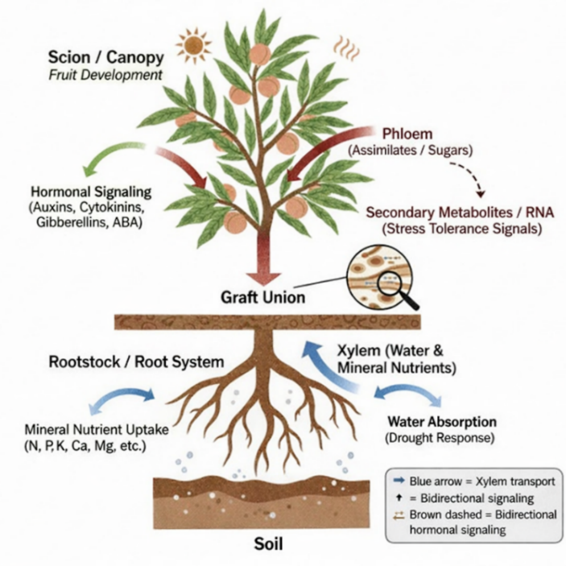
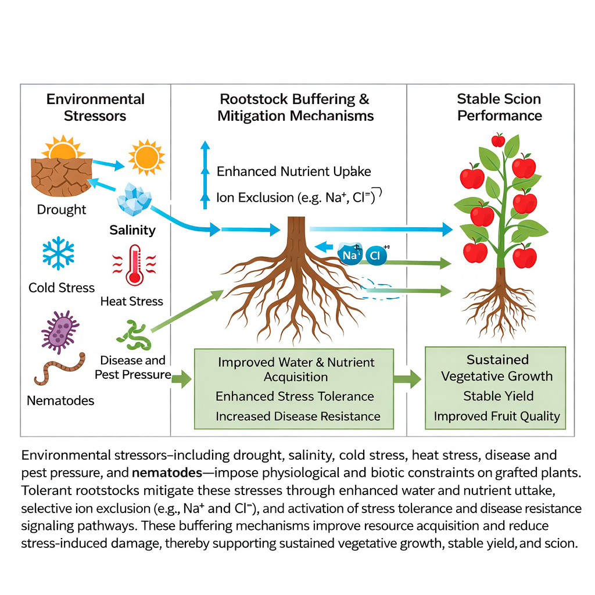
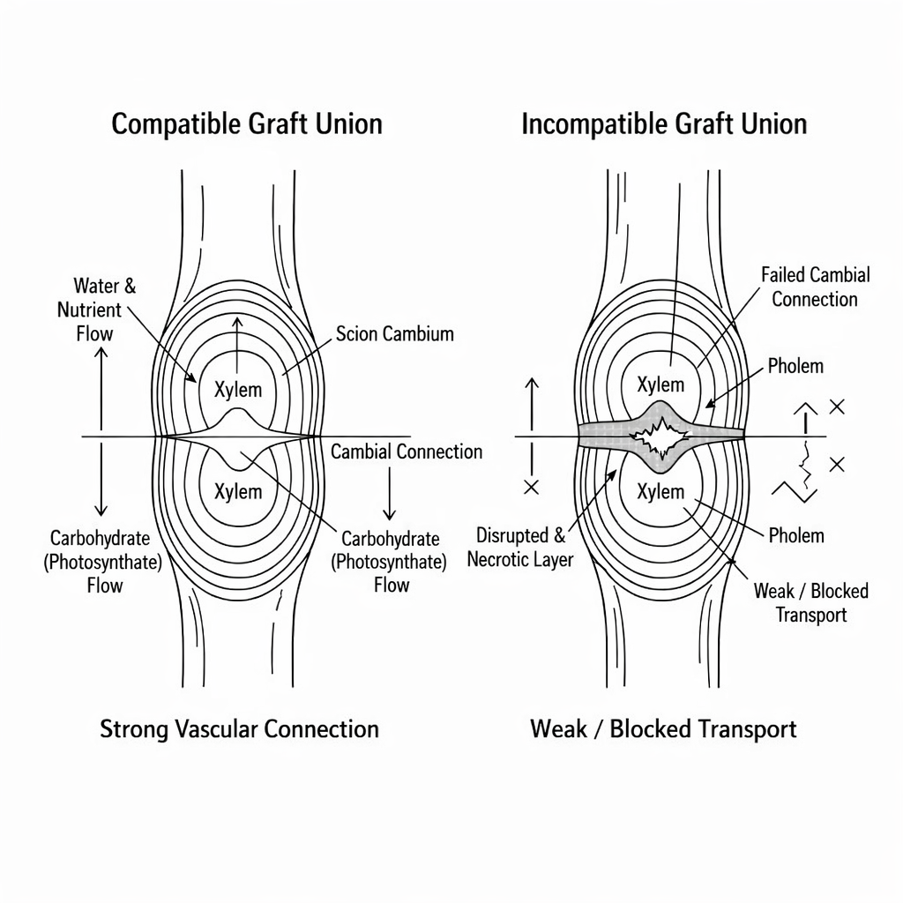
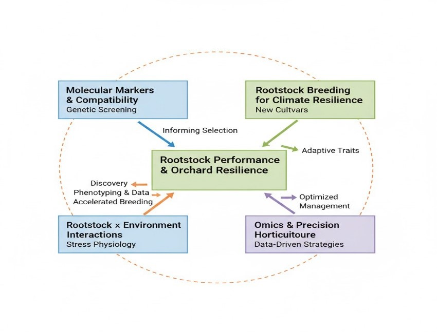

## Introduction

Rootstocks are also essential in contemporary fruit crop production, as they regulate the vigor, productivity, adaptability, and fruit quality [@Kumar2024]. Grafting in perennial crops enables growers to match the desirable fruiting qualities of elite scion cultivars with the adaptive and regulatory capabilities of selected rootstocks [@Dogra2018]. The practice has established itself as a pillar of intensive and sustainable horticultural systems, especially in situations of limited land, shifting climate, and mounting biotic and abiotic strains [@Xu2022a].

Rootstocks were traditionally used mainly to regulate the size of trees and to facilitate the easier management of the orchard. The initial uses concerning apple, pear, and citrus involved a reduction of vigor, increased early fruiting, and high density planting [@Salis2017]. The development of clonal rootstocks expanded their role to include growth management and primarily contributed to the establishment of consistent orchard performance, improved nutrient uptake, and enhanced resistance to soil-related constraints [@Sherif2020]. Breeding programs to help them develop resistance to significant diseases, nematodes, salinity, drought, and extreme temperatures have also engineered rootstocks. However, more recently, studies have emphasized the role of rootstocks in conferring quality related to fruits such as size, color, flavour, and nutritional value, and have shown that rootstocks have multifunctional functionality in fruit production systems [@Zhou2022].

Rootstocks are effective because they can modify the physiological and biochemical interactions between the roots and the scion. Rootstocks control absorption of water and nutrients, hormonal induction, and integrate partitioning, which influence vegetative growth, flowering, fruit set, and development [@Zrig2023]. The concentration of hormones, including auxins, cytokinins, gibberellins, and abscisic acid, synthesized by the rootstock or regulated by its concentration, is transported to the scion, where it affects the canopy architecture, reproductive and fruit performance, and quality [@Rouphael2018]. The interrelatedness of grafted plants can also be highlighted by the fact that rootstocks can alter the pattern of carbohydrates and genes in the scion [@Vittal2023]. Despite extensive research, scion responses to rootstocks are often crop-specific and influenced by environmental conditions, making rootstock selection a critical management decision [@Rasool2020]. This study examines these interactions in order to optimize the performance of orchards, achieve high fruit quality, and increase stress tolerance. The current review highlights the existing literature on the role of rootstocks in fruit crops, specifically their impact on fruit quality, reproductive traits, and scion-rootstock interactions. It also outlines the physiological processes that should underlie it and provides the direction of future research to help to make fruit production sustainable and climate-resilient. This comprehensive analysis aims to bridge knowledge gaps in understanding the complex molecular and physiological mechanisms governing rootstock-scion communication, thereby facilitating the development of improved grafting strategies for enhanced fruit quality and resilience.

## Classification and functions of rootstocks

The rootstocks in fruit crops are mostly categorized in terms of their method of propagation, their growth-regulating capacity, and their functional attributes [@Aziz2024]. The classification aids in the comprehension of the impact that various rootstocks have on the performance of scions, as well as assists growers and researchers in choosing appropriate rootstock scion combinations to use in a particular production system [@Sharma2019].

Rootstocks are classified into seedling and clonal depending on the method of propagation. Seedling rootstocks are sexually propagated, and they find extensive application in fruit crops, including mango, citrus, and stone fruits [@Kubar2023]. They tend to grow intensively, have a vast root structure, and have enhanced tolerance to dissimilar soil environments. Genetic variability of seedlings, however, can frequently result in a non-uniform tree size and non-uniform orchard performance [@Dogra2018]. Conversely, vegetatively propagated clonal rootstocks are genetically identical and offer predictable answers to tree vigour, bearing behaviour, and fruit quality. They are especially appropriate in high-density and precision orchards, as commonly adopted in the production of apples, pears, and grapes, because of their uniformity [@Bisht2024].

Rootstocks are also grouped based on the impact on the scion growth as dwarfing, semi-dwarfing, and vigorous (@tbl-econ). Dwarfing rootstocks minimize vegetative development, accelerate flowering and fruit availability, and enhance the performance of rootstock in yield efficiency, allowing more compact planting and managing the canopy [@Iglesias2024]. Balanced rootstocks semi-dwarfing give a regular balance between vegetative and reproductive development, whereas vigorous rootstocks are favored in marginal soil conditions or rain-fed systems where increased root-development and stress-tolerance are needed [@Reig2018].

Rootstocks have a variety of functions other than growth regulation, which are functional. One of the most important functions is vigour control; it affects canopy structure, light distribution, and the longevity of the orchard [@Gainza2015]. Rootstocks also play a critical role in abiotic stress resistance, such as salinity, drought, and low-temperature stress, through higher water uptake efficiency, ion transport, and the ability to modify stress-related hormonal signaling [@Santhi2020]. Moreover, numerous rootstocks offer resistance to soil-borne fungi and pests, including phytophthora, nematodes, and viral pathogens, to diminish reliance on chemical agents of control [@Rouphael2018]. The other significant role of rootstocks is that they affect the nutrient uptake and translocation. Rootstock differs in root structure and physiological processes that influence the space of essential macro- and micronutrient absorption and movement into the scion and eventually influence tree health, yield, and fruit [@Valverdi2021].

| Fruit crop | Rootstock type        | Growth habit   | Key functional roles                                      |
|------------|----------------------|----------------|-----------------------------------------------------------|
| Apple      | M9, M26              | Dwarfing       | Early bearing, high yield efficiency, improved fruit size |
| Apple      | MM106                | Semi-dwarfing  | Balanced vigor, adaptability to varied soils              |
| Citrus     | Trifoliate orange    | Vigorous       | Disease resistance, cold, and salinity tolerance          |
| Grape      | 110R, 1103P          | Vigorous       | Drought tolerance, deep root system                       |
| Mango      | Polyembryonic seedlings | Vigorous    | Uniform growth, adaptability to stress                    |
| Pear       | Quince A             | Dwarfing       | Reduced tree size, improved fruit quality                 |

: Classification and functional roles of rootstocks in major fruit crops {#tbl-econ}

## Influence of rootstocks on tree growth and bearing behavior

Rootstocks have an immense influence on tree development and bearing phenotypes in fruit crops due to the inhibitory effects they have on the vegetative growth, reproductive ratio, and long-term fruit bearing [@Basile2018]. Rootstocks vary in root system architecture, hydraulic conductivity, and hormonal signaling, which plants turn into different scion growth development patterns, which eventually determine canopy structure, fruiting patterns, and orchard performance [@Tworkoski2015].

### Vegetative growth and canopy architecture

A rootstock is mainly influential by controlling vegetative vigor, which defines the size of trees, the development of shoots, and canopy structures [@Ling2025b]. Dwarfing rootstocks inhibit the profligate development of vegetative growth by inhibiting the movement of water and nutrients, as well as the flux of hormones, especially auxins and cytokinins [@Khan2018]. This creates a reduction in the size of canopies and will have shorter internodes as well as even better distribution in the branches. Vigorous rootstocks, on the contrary, encourage more massive shoot growth and bigger canopies, which can be beneficial in both low-density and stress-prone soil conditions but can cause shading and less fruitful performance when not carefully handled [@Pal2017].

Canopy architecture only has a significant effect on light interception and distribution, which affect photosynthesis, flower bud differentiation, and the quality of fruit. Rootstock promoting moderate vigor supplies a good balance between vegetative growth and light penetration, hence overall orchard productivity [@Montesinos2021].

### Precocity and early bearing

Rootstocks influence the initiation of reproductive development or precocity, as it is often known. Dwarf and semi-dwarf rootstocks have been largely linked with early flowering and fruiting as opposed to vigorous seedling rootstocks [@Zhou2022]. Such early flowering is explained by the slowed vegetation growth, increased carbohydrate supply to the organs of reproduction, and positive hormonal signals. The elevation of cytokinin levels, which are carried by the rootstock to the scion, is thought to facilitate floral budding and fruit set [@Aloni2010]. The ability to bear precociously is a preferred practice in commercial orchards as it gives a quicker payoff in terms of economic value. Excessive precocity damages the tree structure and long-term productivity if early fruit loads are not handled properly by using supervised thinning and pruning techniques [@Hayat2022].

### Yield efficiency and alternate bearing

Rootstocks affect total yield as well as yield efficiency, which is often reported in terms of yield per unit of trunk cross-sectional area or canopy volume [@Scalisi2024]. Dwarfing rootstocks tend to have improved yield efficiency, as they are more effective in light use, less vegetative competition, and better assimilate partitioning to fruit [@Chu2025]. Rootstocks that facilitate moderate growth and stable carbohydrate reserves tend to suppress alternate bearing severity by facilitating steady flower bud development and fruit establishment across seasons [@Vittal2023]. Conversely, highly vigorous rootstocks can cause an increase in the alternate bearing by promoting vegetative growth at the expense of reproductive growth [@Milyaev2021].

### Longevity of the orchard

Rootstocks do not just influence the initial productive endeavors but also the sustainability and longevity of orchards as well. Good anchorage, disease resistance, and stress tolerance of rootstocks help to increase longevity of tree health and stable yields in the long term [@Ali2025]. Dwarfing rootstocks provide some benefits, such as early and efficient production; however, they might need intensive management and support mechanisms to guarantee endurance in the long term. Vigorous rootstocks, which take time to bear, can normally increase orchard life in less-than-ideal environments. Rootstocks are, in general, important in influencing the patterns of tree growth, the behavior of bearing, and orchard longevity [@Manzoor2020]. Proper rootstock choice is therefore one of the key factors in the attainment of a balance between early productivity, stability under low yield, and the long-term performance of the orchard [@Vahdati2021].

## Role of rootstocks in fruit quality attributes

Rootstocks are a key factor in defining fruit quality as they regulate physiological, biochemical, and developmental functions of the scion [@Ruiz2020]. They influence several essential quality parameters, which include: fruit size and weight, soluble solids (TSS) content, acidity, color formation, texture, shelf life, and nutritional makeup (e.g., vitamin C and phenolic content). These effects are important in understanding what rootstocks to choose to maximize both marketable fruit traits and post-harvest [@Shivran2023].

### Fruit size, weight, and soluble solids

Rootstock vigor and its uptake efficiency have a significant impact on the fruit size and weight. Medium to large uniform fruits are known to be produced by dwarfing and semi-dwarfing rootstocks because restricted vegetative growth causes increased assimilates going to fruits [@Biasuz2023]. Under certain conditions, vigorous rootstocks can yield larger fruit, yet with a greater range because of intense competition between vegetative growth and reproductive sinks [@Falchi2020]. Rootstocks also influence TSS, an important index of sweetness and flavor, in the same manner [@Lordan2020]. There are literature trends in several crops (Table 2) that demonstrate the overall application of dwarfing and semi-dwarfing rootstocks to increase the TSS levels in the apple, citrus, and mango crops, and that vigorous rootstocks could lead to slightly reduced sugar accumulation. The rootstock selection also regulates acidity, as it affects consumer preference and taste balance.

### Color development, texture, and shelf life

The color of the fruits is closely related to the canopy structure and light interception, which are under the control of vigor brought about by the rootstocks [@Lan2021]. Rootstocks that favor optimal canopy density support increased sun access to plants, resulting in high pigment plants and skin color. Rootstocks also affect the texture and firmness of fruits, which affects the shelf life and transportability [@Gong2022]. Semi-dwarfing rootstocks can lead to firmer fruit with a better storage life, and a vigorous rootstock can even give softer fruit should vegetative growth become dominant [@Lawrence2025].

### Nutritional quality

Rootstocks may influence vitamin, phenolic, and antioxidant concentration in fruits by adjusting the uptake of nutrients and resiliency under stress. Mango and apple are examples of clonal rootstock that have been linked with increased vitamin C and phenolic concentrations, which improve the nutritional and functional value of fruits [@Oustric2021]. A clear comparative summary of fruit quality characteristics of various rootstocks of apple, citrus, grape, and mango is provided in (@tbl-fruit). The table reveals trends that include increased TSS in dwarfing or semi- dwarfing rootstock, extended size of the fruit under vigorous rootstock, and acidic differences in different species [@Tietel2020]. This table summary will help readers to easily comprehend crop-specific rootstock impacts and make certain selections to apply them in practical horticultural practices.The combination of the table and radar chart will allow readers to quantify changes and evaluate multi-trait patterns orally, making the review even more understandable and effective.

| Crop   | Rootstock              | Fruit Size | TSS (%) | Acidity (%) | Key Reference          |
|--------|------------------------|------------|---------|-------------|------------------------|
| Apple  | M9 (dwarfing)          | Medium     | 14      | 0.6         | [@Shuttleworth2023]    |
| Apple  | MM106 (semi-vigorous)  | Large      | 12      | 0.5         | [@Yavari2022]          |
| Citrus | Trifoliate orange      | Medium     | 13      | 0.8         | [@Kim2012]             |
| Citrus | Rough lemon            | Large      | 11      | 1.0         | [@Goswami2013]         |
| Grape  | 110R (vigorous)        | Large      | 18      | 0.4         | [@Geier2008]           |
| Grape  | SO4 (vigorous)         | Medium     | 16      | 0.5         | [@DeMedeiros2025]      |
| Mango  | Clonal rootstock       | Large      | 16      | 0.3         | [@Simon2010]           |
| Mango  | Seedling rootstock     | Medium     | 14      | 0.4         | [@Jain2024]            |

: Effect of root stocks on fruit quality parameters {#tbl-fruit}

## Physiological and biochemical basis of scion–rootstock interactions

The physiological and biochemical pathways make this a complex network of processes that control the level of vigor, production, and quality of the fruits in scion-rootstock interactions [@Lu2020]. The rootstock is not simply a scaffolding system but a working control of water relations, mineral nutrition, hormonal communication, and long-range molecular communication [@Bell2020]. Combinations of those processes define scion growth dynamics, which in turn affect fruit development and adaptation to stressors.

### Water relations and hydraulic conductivity

Control of plant water relations is among the main ways through which rootstocks affect the performance of scions. Rootstocks vary greatly in root system structure, xylem structure, and hydraulic conductivity, and such differing traits directly influence water intake and conveyance into the scion [@Casagrande2021]. Rootstocks that are more hydraulically conductive tend to promote higher transpiration rates, stronger stomatal conductance, and greater vegetative development. Dwarfing or semi-dwarfing rootstocks, in their turn, tend to create hydraulic constraints limiting the flow of water, which leads to the low activity of scions [@Xu2021]. Hydraulic resistance can further adjust the transport of water at the graft union. Continuity changes in the water column could be affected by differences in vessel diameter, vessel density, and xylem connectivity between scion and rootstock [@Rossdeutsch2021]. In water-limited environments, scion drought resistance is improved similarly by rootstocks that efficiently use water and have a conservative water-use behavior, which preserves the water potential to the leaf and minimizes unnecessary transpiration. These abiotic stress-related changes are essential in supporting fruit development and quality mediated by this rootstock [@Villalobos2022].

### Mineral nutrition uptake and translocation

Rootstocks have high levels of control in the acquisition and translocation of mineral nutrients to the scion. Root morphology variability, root surface area, and membrane transporters are known to affect the uptake of important macro and micronutrients like nitrogen, potassium, calcium, magnesium, and iron [@Lynch2021]. Rootstocks that are suited to the specific soil conditions (e.g., calcareous soils or saline soils) may enhance the nutrient levels and avert physiological diseases in the scion. When absorbed, the nutrients should be actively carried to the tissues above the ground [@Biniam2021]. Rootstocks also affect xylem loading, phloem load, and nutrient partitioning between vegetative and reproductive organs. As an example, the better calcium translocation into developing fruits is related to lower cases of bitter pit and fruit firmness [@Larocca2025]. In the same way, the availability of nitrogen and potassium regulates fruit size, sugar accumulation, and acidity. In this way, the selection of rootstock receives the direct implication on fruit composition and postharvest quality [@Wang2025].

### Hormonal signaling between rootstock and scion

Scion-rootstock interactions occur via hormonal signaling, a key biochemical process. Various phytohormones are synthesized and exported by the roots, containing cytokinins, gibberellins, abscisic acid (ABA), and auxins, transported acropetally to the scion via the xylem [@Habibi2022]. These hormones coordinate the growth of the shoot, the expansion of leaves, flowering, fruit set, and stress.

The cytokinins synthesized in the rootstock stimulate the division of cells, retard the senescence of leaves, and increase sink strength in growing fruits. Dwarfing rootstocks are frequently linked to lower cytokinin flux, resulting in compact canopy construction and reproductive precocity [@Verma2024]. Gibberellins affect the internode growth and growth of fruits, and auxins affect the vascular differentiation and apical dominance at the graft union [@Jahed2023a]. ABA is also a major stress signal molecule, especially during drought. ABA produced by the rootstock can control stomatal closure in the scion, leading to less water loss and increased tolerance to stress [@Jiao2023]. These hormones and their interaction with each other are vital in determining scion development patterns and fruit development patterns.

### Gene expression and long-distance signaling

In addition to classical physiological mechanisms, recent reports have shown the role of long-range molecular signaling in the interactions between scions and rootstocks. Small fragments of RNA (mobile RNAs), proteins, and peptides have the ability to cross the graft union and affect the expression of genes in distant tissues [@JeynesCupper2023]. These signals potentially control developmental processes, stress response, and metabolic pathways in the scion. Rootstocks have the capability of causing alterations in the expression of scion gene concerning the production of hormones, transportation of nutrients, and stress-related responses [@Kapazoglou2021]. This is an emerging field, but it is becoming clear that transcriptional reprogramming induced by rootstock can add to long-term phenotypic stability and the capacity to adapt new environments in grafted plants [@Harris2023]. The integrated physiological and biochemical map of scion-rootstock interactions is depicted in (@fig-figure1). The rootstock processes the interaction of the soil environment, taking in water and nutrients, synthesizing, and sending hormonal signals to the scion, producing systemic signals that control fruit development [@Gautier2021]. The processes come all together at the scion level, where growth vigor, yield, and fruit quality characteristics like size, firmness, and stress resistance are determined [@Bu2025].

{#fig-figure1 width="384"}

## Rootstocks and abiotic and biotic stress tolerance

Rootstocks will play a crucial role in increasing the resilience of scions to abiotic and biotic stress. Rootstocks serve as a buffer by regulating nutrient and water uptake, physiological responses, and defense mechanisms to maintain a consistent level of growth, fruit production, and quality even in adverse environmental conditions [@VivesPeris2024].

### Drought and salinity tolerance

One of the key limitations to horticulture production is drought and salinity. Deep-rooted or extensive rootstock enhances the process of water acquisition and sustains hydraulic conductivity when water is insufficient [@Kumar2024]. Rootstocks that are salt-tolerant inhibit sodium intake or isolate the ions in vacuoles, shielding the scion against osmotic and ionic pressure. These adaptations assure photosynthetic characterization, flowering, and fruit set [@Shao2021]. The (@tbl-stress) provides a summary of biotic and abiotic-tolerant rootstocks in the major crops, and they are examples of such rootstocks. Drastic temperature changes may have devastating effects on the plant metabolism and growth. Cold-tolerant rootstocks increase frost resistance through stabilizing cell membranes and facilitating the accumulation of osmoprotectants [@Lee2023]. High heat levels enhance rootstocks that tolerate heat as they maintain transpiration and enzymatic functions in the presence of higher temperatures. The effects of these rootstocks have the benefit of sustaining scion growth and fruit development under unfavorable thermal environments, as schematically depicted in the stress buffering [@Hashem2023]. Rootstocks are used as an initial line of resistance to soil-borne pathogens and nematodes. The resistant rootstocks may restrict the invasion of the pathogen or evoke the systemic acquired resistance of the scion, eliminating the disease and avoiding vascular blockage [@Chen2024]. Rootstocks that are resistant to nematodes preserve nutrient and water movement, as root galling is inhibited, which preserves the scion vigor [@Thies2023].

| Stress     | Crop         | Rootstock        | Benefit                                      | Study References     |
|------------|--------------|------------------|----------------------------------------------|----------------------|
| Drought    | Grapevine    | 1103P, 140Ru     | Improved water-use efficiency                 | [@Labarga2023]       |
| Salinity   | Tomato       | Maxifort         | Na⁺ exclusion, sustained growth               | [@Sarkar2025]        |
| Cold       | Apple        | MM.106           | Membrane stability, reduced frost injury      | [@Jahed2023b]        |
| Heat       | Citrus       | Carrizo          | Thermotolerance, maintained photosynthesis    | [@Balfagon2018]      |
| Nematodes  | Tomato       | Nemaguard        | Resistance to root-knot nematodes             | [@ElSappah2019]      |
| Diseases   | Stone fruits | GF-677           | Resistance to Phytophthora and bacterial canker | [@Ling2025b]      |

: Stress-tolerant rootstocks and their associated abiotic and biotic resistance traits {#tbl-stress}

### Indirect effects on fruit quality under stress

Stress-tolerant rootstocks, in addition to survival and growth, result in the reliability of fruit quality during stress [@Feng2023]. Their stabilization of water and nutrient supply also maintains sugar accumulation, acidity, and secondary metabolite profiles [@Abdulaziz2017]. This buffering capacity reduces fruit size, fruit firmness, and fruit flavor variability, which guarantees predictable marketable quality [@Musacchi2018]. In the (@fig-figure2) illustrates the general process of stress mitigation by rootstock buffering, where all manners of abiotic and biotic stresses are mitigated to make scion performance stable. Environmental stressors, including drought, salinity, cold stress, heat stress, disease and pest pressure, and nematodes, impose physiological and biotic constraints on grafted plants. Tolerant rootstocks mitigate these stresses through enhanced water and nutrient uptake, selective ion exclusion (e.g., Na⁺ and Cl⁻), and activation of stress tolerance and disease resistance signaling pathways. These buffering mechanisms improve resource acquisition and reduce stress-induced damage, thereby supporting sustained vegetative growth, stable yield, and scion.

{#fig-figure2 width="384"}

## Compatibility issues and long-term orchard performance

One of the key factors that defines the longevity and performance of an orchard is graft compatibility. When two varieties are incompatible, this can result in a number of anatomical and physiological incompatibilities, which may impair tree performance [@Khanchana2024].

### Graft incompatibility: anatomical and physiological aspects

Graft incompatibility can be described as being either anatomical or physiological. Anatomical incompatibility occurs when there is a failure of alignment of the vascular tissues of the scion and rootstock, resulting in a poor union, bark incompatibility, and a structurally weak graft [@Loupit2020]. Physiological incompatibility, on the other hand, is not as easy to observe. Even if a successful graft union has been achieved, physiological incompatibility may result in a reduction in the performance of the grafted plant [@Moghadam2022].

### Symptoms and etiology

The symptoms appear gradually. Initial symptoms may be swelling, cracking, or discoloring of tissue at the graft union, slow growth, chlorosis of leaves, and irregular development of the tree canopy [@McCann2020]. Later, symptoms may appear as dieback of branches, reduction in fruiting, and sudden failure of structural integrity during stress [@Tipu2021]. Etiology involves genetic incompatibility, environmental stress, virus infection, and poor grafting techniques.

### Long-term yield decline

Even well-established grafts may experience long-term decline if there is incompatibility. Poor vascular connections compromise water and nutrient transport, resulting in reduced vigor and fruiting of the scion [@Frey2021]. Eventually, this may result in a reduction in yield, fruit size, and increased susceptibility to environmental stresses and diseases. Early recognition of compatibility issues is important for effective management [@Manik2019].

### Importance of compatibility screening

Compatibility screening is a vital component of rootstock and scion combination selection. Assays, trials, and anatomical studies can be employed to assess compatibility in a controlled environment, as opposed to a commercial setting [@Thompson2017]. Such a process reduces potential financial loss, facilitates uniform establishment, and optimizes long-term productivity [@Aydin2025]. The (@fig-figure3) demonstrates a clear visual differentiation of a graft union. The visual on the left shows a compatible union, as demonstrated by continuous vascular tissues, aligned cambium, and free water/nutrient transport. Conversely, the visual on the right shows an incompatible union, as demonstrated by disrupted vascular tissues, non-aligned cambium, and potential cracks in the interface. Such a visual representation demonstrates a direct correlation between anatomical alignment and physiological performance, thus emphasizing the significance of rootstock selection [@Coban2020].

{#fig-figure3 width="384"}

## Future prospects and research gaps

Significant advancements in rootstock science are being made possible through the application of molecular biology, precision horticulture, and breeding for climate change resilience [@Roberto2022]. One of the promising areas of research is the application of molecular markers for scion-rootstock compatibility. Molecular markers, also known as DNA markers, help predict scion-rootstock compatibility, which would greatly help in avoiding trial and error in nurseries [@Gomes2021]. Breeding of rootstocks for climate change also offers a major research frontier. As environmental stresses such as drought, salinity, heat, and cold become increasingly common, there is a pressing need to develop rootstocks that can protect scions against a range of environmental stresses [@Bernardo2025]. The application of traditional breeding coupled with genomic selection would help accelerate the development of multi-stress-tolerant rootstocks, ensuring maximum yields as well as fruit quality under different environmental conditions [@Mancosu2015]. The rootstock-environment interaction is a major research gap. The performance of a rootstock is highly dependent upon environmental factors, which include soil type, microclimate, and orchard management. Field trials of rootstocks under different environmental conditions are essential [@Gentile2022].

The application of omics techniques, including transcriptomics, metabolomics, and proteomics, along with precision horticulture techniques, including high-throughput phenotyping and real-time soil and plant monitoring, enables the acquisition of unprecedented knowledge regarding the role of rootstocks in response mechanisms [@BenLaouane2026]. The (@fig-figure4) shows the proposed conceptual roadmap for the advancement of rootstock research in the near future. The diagram places “Rootstock Performance & Orchard Resilience” at the core and demonstrates the relationship between the application of molecular markers, climate resilience, environment interactions, and omics/precision horticulture techniques for the improvement of scion stability and productivity. The arrows in the diagram indicate the direct and indirect relationships between the different research fields, including the relationship between the application of omics techniques and the application of climate resilience, and the relationship between the application of precision horticulture techniques and the application of environmental interactions. The diagram also highlights the interconnected relationships between the different research fields, demonstrating the complexity of the pathways from the application of the different techniques and the acquisition of knowledge regarding the improvement of horticultural productivity in the near future.

{#fig-figure4 width="384"}

## Conclusion

Rootstocks are key factors that determine the quality and quantity of the produced fruit as well as the performance of the orchard. The role of the rootstock is not limited to the provision of mechanical support to the scion. Rather, a dynamic regulator protects the scion from various stresses while maintaining its productivity. The performance of the rootstock is closely related to its physiological interactions with the scion. For instance, anatomical, biochemical, and hormonal compatibility are key to the efficiency of the rootstock. The compatibility of the scion and the rootstock determines the efficiency of the transport of water, nutrients, and metabolites. Incompatible interactions can lead to weak graft unions, progressive decline, and reduced productivity. As such, it is essential to comprehend these interactions at the molecular and phenotypic levels. The successful use of rootstocks is closely related to the crop and the region. The performance of the rootstock is influenced by environmental factors such as soil type and local stress pressures. As such, it is not possible to provide general guidelines for the use of rootstocks. The use of knowledge of the local conditions, stress tolerance, and compatibility is essential to ensure that the use of the rootstock is beneficial to the scion. In the near future, the use of knowledge from the advances made in the use of molecular markers, omics technology, and precision horticulture will provide the means to optimize the use of the rootstock as well as the prediction of stress tolerance. In conclusion, the strategic use of the rootstock is the key to the sustainability of high-quality fruit production. As such, it is imperative to acknowledge the pivotal role that the use of the rootstock plays in the horticulture sector.  

## References {.unnumbered}

::: {#refs}
<!-- References will be rendered here -->
:::



::: {.callout-important title="Publication & Reviewer Details"}
**Publication Information**

-   **Submitted:** *11 March 2026*\
-   **Accepted:** *06 April 2026*\
-   **Published (Online):** *08 April 2026*

------------------------------------------------------------------------

**Reviewer Information**

-   **Reviewer 1:**\
  **Dr. Jegan K P**  
  *Assistant Professor*  
  *Adhiparasakthi Horticultural College* 

-   **Reviewer 2:**\
    *Anonymous*
:::

::: {.callout-note appearance="simple"}

## Disclaimer/Publisher's Note  

The statements, opinions and data contained in all publications are solely those of the individual author(s) and contributor(s) and not of the publisher and/or the editor(s).  
The publisher and/or the editor(s) disclaim responsibility for any injury to people or property resulting from any ideas, methods, instructions or products referred to in the content.  

:::  

>© Copyright (2026): Author(s). The licensee is the journal publisher. This is an Open Access article distributed under the terms of the [Creative Commons Attribution-NonCommercial-NoDerivatives 4.0 International License](https://creativecommons.org/licenses/by-nc-nd/4.0/), which permits non-commercial use, sharing, and reproduction in any medium, provided the original work is properly cited and no modifications or adaptations are made. 
